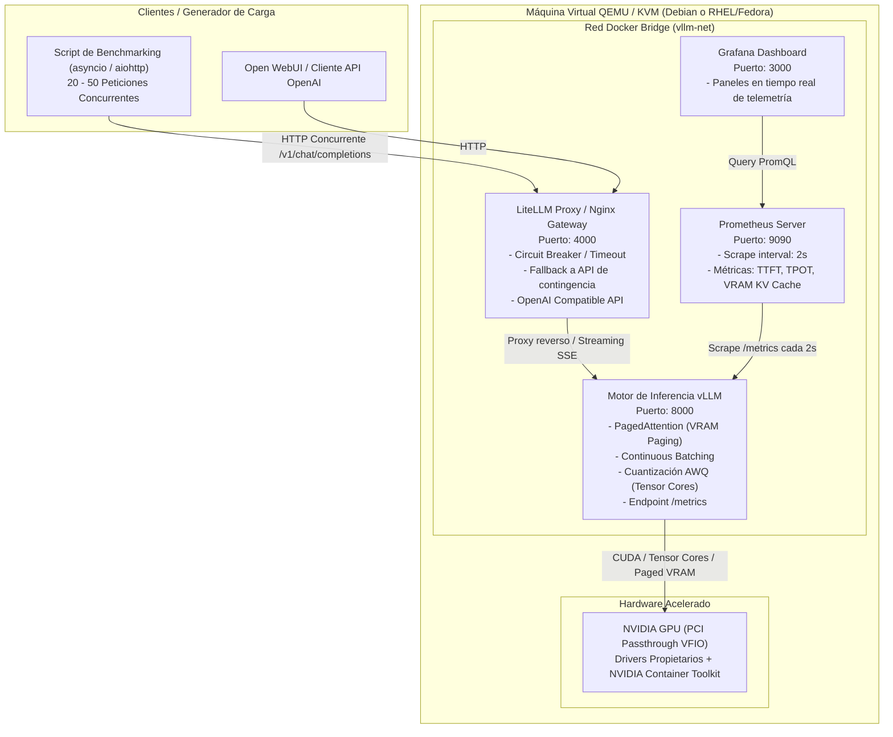

# Guía Técnica de Laboratorio: Inferencia Concurrente de Producción con vLLM

> **Documento de trabajo interno para el autor.**  
> Esta guía no está destinada al usuario final del blog, sino a servir como cuaderno de bitácora técnico, manual de despliegue paso a paso y arquitectura de referencia para montar el laboratorio en tu máquina virtual (QEMU/KVM) bajo **Debian** o **RHEL / Fedora**, probar la concurrencia real y recopilar datos para el artículo:  
> *"De Ollama a Producción: Desplegando vLLM con PagedAttention y métricas en tiempo real"*.

---

## 1. Visión General: ¿Por qué este salto técnico?

### El problema de Ollama en entornos concurrentes
Ollama (y por debajo `llama.cpp`) es una herramienta fantástica para uso monousuario, estaciones de trabajo locales y desarrollo rápido. Sin embargo, en un escenario empresarial o de servicio compartido donde entran decenas de peticiones HTTP simultáneas:
1. **Procesamiento secuencial o pseudo-concurrente:** Ollama encola las peticiones o ejecuta batches muy rígidos. Si un usuario pide una respuesta de 1.000 tokens y otro pide un resumen de 50 tokens, el segundo se queda esperando en cola hasta que el primero libera slots o el scheduler agota el tiempo.
2. **Fragmentación de memoria VRAM:** Los modelos tradicionales asignan memoria estática contigua para el **KV Cache** (Key-Value Cache) de cada sesión de chat. Esto desperdicia hasta un 60-80% de la VRAM por sobreasignación o genera OOM (*Out Of Memory*) prematuros.
3. **Cuantización GGUF vs AWQ/GPTQ:** El formato `.gguf` está optimizado para CPU y descargas rápidas, desquantizando a menudo en registros de propósito general. En producción sobre GPUs empresariales, buscamos formatos como **AWQ (Activation-aware Weight Quantization)** o **GPTQ**, diseñados específicamente para acelerar multiplicaciones de matrices (GEMM) en los **Tensor Cores** de NVIDIA sin penalizar el throughput concurrente.

### La solución: vLLM
vLLM es el motor de inferencia de referencia en la industria (adoptado por AWS, Anyscale, Red Hat y grandes proveedores de nube) gracias a dos innovaciones centrales:
- **PagedAttention:** Trata la VRAM de la GPU igual que la memoria virtual del kernel de Linux mediante tablas de páginas (bloques discretos de memoria no contiguos). La fragmentación interna se reduce a menos del 4%.
- **Continuous Batching (Iteration-level scheduling):** Las peticiones no esperan a que un lote completo termine. Si una secuencia de 20 tokens finaliza, ese slot se libera inmediatamente para una nueva petición entrante en la siguiente iteración de forward pass del modelo.

---

## 2. Arquitectura del Laboratorio



---

## 3. ¿Máquina Virtual (QEMU/KVM) o Despliegue Directo en el Host Fedora?

Tienes dos alternativas para montar este laboratorio. **Hacerlo directo en tu Fedora base es la opción más rápida, limpia y recomendada si no quieres lidiar con GPU Passthrough**:

### Opción 1: Directo en tu Host Fedora (Altamente Recomendado)
- **Ventajas:**
  - **Cero complicaciones de GPU Passthrough:** Te ahorras configurar IOMMU groups, módulos VFIO y el riesgo de quedarte sin pantalla en el host.
  - **Rendimiento nativo 100%:** Acceso directo a los Tensor Cores y PCI Express de tu GPU NVIDIA física.
  - **Aislamiento total:** Como todo corre dentro de contenedores (Docker/Podman), tu instalación de Fedora queda completamente limpia. Al terminar el proyecto, basta con hacer `docker compose down` o borrar la carpeta `~/vllm-production`.
  - **Validez técnica total:** Fedora es la base *upstream* de RHEL (Red Hat Enterprise Linux). A nivel de kernel, cgroups v2, SELinux y stack de contenedores, es idéntico a lo que encontrarías en un entorno corporativo.
- **Detalle crítico a tener en cuenta (VRAM del escritorio):**
  - Tu entorno de escritorio (GNOME Wayland/X11, navegador, etc.) consume típicamente entre 500 MB y 1.5 GB de VRAM.
  - Por ello, en el archivo `.env` ajusta `GPU_MEMORY_UTILIZATION=0.75` u `0.80` (en vez de `0.90`) para evitar que vLLM intente acaparar toda la memoria y choque con la sesión gráfica de tu pantalla.

### Opción 2: En Máquina Virtual QEMU/KVM (Debian o RHEL)
- **Requisito indispensable:** Exige **PCI Passthrough (VFIO)** para pasar la GPU física a la VM. Si no tienes una segunda GPU dedicada para la VM o estás en un portátil con gráfica conmutable, suele ser complejo de configurar.
- Solo tiene sentido si deseas simular un aislamiento de hypervisor estricto o probar distribuciones específicas sin tocar tu sistema operativo.

---

## 4. Instalación de Requisitos en el Sistema Operativo

A continuación tienes los comandos exactos organizados según la distribución que elijas para la VM.

---

### Opción A: Debian 12 (Bookworm) / Ubuntu 24.04 LTS

#### 1. Actualizar el sistema y dependencias base
```bash
sudo apt update && sudo apt upgrade -y
sudo apt install -y curl wget git jq build-essential linux-headers-$(uname -r) ca-certificates gnupg lsb-release
```

#### 2. Drivers NVIDIA (si tienes GPU Passthrough)
```bash
# En Debian 12 (requiere repo 'contrib' y 'non-free-firmware' en /etc/apt/sources.list)
sudo apt install -y nvidia-driver nvidia-smi nvidia-cuda-toolkit

# Reiniciar y comprobar que nvidia-smi responde
sudo reboot
nvidia-smi
```

#### 3. Instalar Docker Engine oficial
```bash
# Eliminar paquetes conflictivos
for pkg in docker.io docker-doc docker-compose podman-docker containerd runc; do sudo apt remove -y $pkg; done

# Clave GPG y repositorio oficial
sudo install -m 0755 -d /etc/apt/keyrings
curl -fsSL https://download.docker.com/linux/debian/gpg | sudo gpg --dearmor -o /etc/apt/keyrings/docker.gpg
sudo chmod a+r /etc/apt/keyrings/docker.gpg

echo \
  "deb [arch=$(dpkg --print-architecture) signed-by=/etc/apt/keyrings/docker.gpg] https://download.docker.com/linux/debian \
  $(. /etc/os-release && echo "$VERSION_CODENAME") stable" | \
  sudo tee /etc/apt/sources.list.d/docker.list > /dev/null

sudo apt update
sudo apt install -y docker-ce docker-ce-cli containerd.io docker-buildx-plugin docker-compose-plugin

# Añadir usuario al grupo docker
sudo usermod -aG docker $USER
newgrp docker
```

#### 4. Instalar NVIDIA Container Toolkit (para que Docker acceda a la GPU)
```bash
curl -fsSL https://nvidia.github.io/libnvidia-container/gpgkey | sudo gpg --dearmor -o /usr/share/keyrings/nvidia-container-toolkit-keyring.gpg \
  && curl -s -L https://nvidia.github.io/libnvidia-container/stable/deb/nvidia-container-toolkit.list | \
    sed 's#deb https://#deb [signed-by=/usr/share/keyrings/nvidia-container-toolkit-keyring.gpg] https://#g' | \
    sudo tee /etc/apt/sources.list.d/nvidia-container-toolkit.list

sudo apt update
sudo apt install -y nvidia-container-toolkit

# Configurar el runtime de Docker y reiniciar el daemon
sudo nvidia-ctk runtime configure --runtime=docker
sudo systemctl restart docker

# Test rápido de GPU en Docker
docker run --rm --gpus all nvidia/cuda:12.2.0-base-ubuntu22.04 nvidia-smi
```

---

### Opción B: RHEL 9 / Rocky Linux 9 / AlmaLinux 9 / Fedora

En entornos empresariales basados en Red Hat, el ecosistema utiliza `dnf`, `firewalld` y `SELinux`. Si usas Fedora, los pasos son prácticamente idénticos adaptando el repositorio.

#### 1. Actualizar sistema y habilitar EPEL / CRB (RHEL / Rocky / Alma)
```bash
# En RHEL / Rocky / AlmaLinux 9:
sudo dnf install -y epel-release
sudo dnf config-manager --set-enabled crb 2>/dev/null || sudo dnf config-manager --set-enabled powertools 2>/dev/null
sudo dnf update -y
sudo dnf install -y git curl wget tar jq kernel-devel-$(uname -r) kernel-headers-$(uname -r) gcc gcc-c++ make

# En Fedora (no requiere EPEL):
# sudo dnf update -y && sudo dnf install -y git curl wget tar jq kernel-devel kernel-headers gcc gcc-c++ make
```

#### 2. Drivers NVIDIA (vía repositorio oficial de CUDA)
```bash
# Para RHEL 9 / Rocky 9:
sudo dnf config-manager --add-repo https://developer.download.nvidia.com/compute/cuda/repos/rhel9/x86_64/cuda-rhel9.repo
sudo dnf clean all
sudo dnf module install -y nvidia-driver:latest-dkms

# Para Fedora (ejemplo Fedora 40):
# sudo dnf config-manager --add-repo https://developer.download.nvidia.com/compute/cuda/repos/fedora40/x86_64/cuda-fedora40.repo
# sudo dnf install -y akmod-nvidia xorg-x11-drv-nvidia-cuda

# Reiniciar y validar
sudo reboot
nvidia-smi
```

#### 3. Instalar Docker CE en RHEL / Fedora
*(Nota: RHEL promueve Podman, pero para orquestar stacks complejos con Docker Compose y `nvidia-container-toolkit`, Docker CE es el estándar en laboratorio MLOps).*

```bash
# Añadir repo Docker CE
sudo dnf config-manager --add-repo https://download.docker.com/linux/centos/docker-ce.repo # Funciona en RHEL/Rocky/Alma
# En Fedora: sudo dnf config-manager --add-repo https://download.docker.com/linux/fedora/docker-ce.repo

sudo dnf install -y docker-ce docker-ce-cli containerd.io docker-buildx-plugin docker-compose-plugin
sudo systemctl enable --now docker
sudo usermod -aG docker $USER
```

#### 4. Instalar NVIDIA Container Toolkit
```bash
curl -s -L https://nvidia.github.io/libnvidia-container/stable/rpm/nvidia-container-toolkit.repo | \
  sudo tee /etc/yum.repos.d/nvidia-container-toolkit.repo

sudo dnf install -y nvidia-container-toolkit
sudo nvidia-ctk runtime configure --runtime=docker
sudo systemctl restart docker

# Test
docker run --rm --gpus all nvidia/cuda:12.2.0-base-ubuntu22.04 nvidia-smi
```

#### 5. Configuración de SELinux y Firewall (Puntos clave de SysAdmin en RHEL)
En RHEL/Fedora, **SELinux** suele bloquear el acceso de contenedores a carpetas locales o puertos sin la etiqueta de contexto adecuada:
```bash
# Permitir que contenedores gestionen cgroups (necesario para el runtime de GPU)
sudo setsebool -P container_manage_cgroup 1

# Si montamos volúmenes locales en docker-compose, en docker-compose.yml usaremos la flag :Z
# o aplicamos contexto de contenedor a la carpeta del proyecto:
# sudo chcon -Rt container_file_t ~/vllm-production

# Abrir puertos en firewalld para acceder desde la LAN / Host:
sudo firewall-cmd --permanent --add-port=4000/tcp # Gateway / LiteLLM
sudo firewall-cmd --permanent --add-port=8000/tcp # vLLM directo (si se quiere exponer)
sudo firewall-cmd --permanent --add-port=9090/tcp # Prometheus
sudo firewall-cmd --permanent --add-port=3000/tcp # Grafana
sudo firewall-cmd --reload
```

---

## 5. Estructura del Proyecto en el Filesystem

Crearemos la estructura de trabajo en `~/vllm-production`:

```
~/vllm-production/
├── .env
├── docker-compose.yml
├── prometheus/
│   └── prometheus.yml
├── litellm/
│   └── config.yaml
├── grafana/
│   └── provisioning/
│       ├── datasources/
│       │   └── datasource.yml
│       └── dashboards/
│           ├── dashboards.yml
│           └── vllm-dashboard.json
└── scripts/
    ├── benchmark_concurrency.py
    └── requirements.txt
```

Comandos para inicializarla:
```bash
mkdir -p ~/vllm-production/{prometheus,litellm,grafana/provisioning/datasources,grafana/provisioning/dashboards,scripts,models_cache}
cd ~/vllm-production
```

---

## 6. Archivos de Configuración del Despliegue

### 6.1. Variables de Entorno (`~/vllm-production/.env`)
```bash
# Modelo recomendado para 12-16GB VRAM (cuantizado en AWQ, óptimo para producción)
# Opciones populares:
# - Qwen/Qwen2.5-7B-Instruct-AWQ (muy equilibrado y rápido)
# - casperhansen/llama-3-8b-instruct-awq
# - TheBloke/Mistral-7B-Instruct-v0.2-AWQ
MODEL_ID=Qwen/Qwen2.5-7B-Instruct-AWQ

# Token de Hugging Face (opcional, solo requerido para modelos gateados como Llama 3 oficial)
HF_TOKEN=

# Parámetros de Inferencia vLLM
MAX_MODEL_LEN=4096
GPU_MEMORY_UTILIZATION=0.90
MAX_NUM_SEQS=64
```

---

### 6.2. Configuración de Prometheus (`~/vllm-production/prometheus/prometheus.yml`)
vLLM expone nativamente un endpoint `/metrics` en formato compatible con Prometheus en el puerto 8000.

```yaml
global:
  scrape_interval: 2s     # Intervalo corto para capturar spikes de latencia y saturación
  evaluation_interval: 2s

scrape_configs:
  - job_name: 'vllm'
    metrics_path: '/metrics'
    static_configs:
      - targets: ['vllm:8000']
        labels:
          engine: 'vllm'
          model: 'qwen2.5-7b-awq'

  - job_name: 'litellm'
    metrics_path: '/metrics'
    static_configs:
      - targets: ['litellm:4000']
        labels:
          service: 'llm-gateway'
```

---

### 6.3. Gateway de Resiliencia y Fallback: LiteLLM Proxy (`~/vllm-production/litellm/config.yaml`)
En producción, no se debe exponer directamente el servidor de inferencia sin una capa de resiliencia. **LiteLLM Proxy** actúa como reverse proxy con:
- Enrutamiento y balanceo.
- **Circuit breaker** y timeouts configurables.
- **Fallback silencioso:** Si vLLM devuelve un error (500, 503 por sobrecarga de peticiones o timeout), LiteLLM reenvía la petición a una API de respaldo (otra instancia local, o una API externa).
- Compatible 100% con la API de OpenAI.

```yaml
model_list:
  # Modelo primario apuntando a nuestro motor vLLM local
  - model_name: production-model
    litellm_params:
      model: openai/Qwen/Qwen2.5-7B-Instruct-AWQ
      api_base: http://vllm:8000/v1
      api_key: "token-local-vllm"
      request_timeout: 30 # Timeout para evitar colgar al cliente

  # Modelo de fallback (contingencia) en caso de saturación o caída del primario
  # Puede ser un modelo secundario local o un proveedor externo
  - model_name: fallback-backup
    litellm_params:
      model: openai/gpt-4o-mini # O una segunda instancia vLLM con modelo ligero
      api_key: "dummy-key-o-real"

router_settings:
  routing_strategy: "latency-based-routing"
  timeout: 30
  fallbacks:
    - "production-model": ["fallback-backup"]
  num_retries: 2
  allowed_fails: 3
  cooldown_time: 15 # Segundos antes de reintentar el modelo primario tras abrir circuito

general_settings:
  master_key: "sk-production-admin-key"
```

---

### 6.4. Configuración de Datasource en Grafana (`~/vllm-production/grafana/provisioning/datasources/datasource.yml`)
```yaml
apiVersion: 1

datasources:
  - name: Prometheus
    type: prometheus
    access: proxy
    url: http://prometheus:9090
    isDefault: true
    editable: false
```

---

### 6.5. Orquestador Docker Compose (`~/vllm-production/docker-compose.yml`)

```yaml
version: '3.8'

services:
  # 1. MOTOR DE INFERENCIA DE PRODUCCIÓN (vLLM)
  vllm:
    image: vllm/vllm-openai:latest
    container_name: vllm-engine
    restart: unless-stopped
    environment:
      - HUGGING_FACE_HUB_TOKEN=${HF_TOKEN}
      - VLLM_LOGGING_LEVEL=INFO
    volumes:
      - ./models_cache:/root/.cache/huggingface:Z # :Z para compatibilidad SELinux en RHEL/Fedora
    ports:
      - "8000:8000"
    command: >
      --model ${MODEL_ID}
      --quantization awq
      --dtype half
      --gpu-memory-utilization ${GPU_MEMORY_UTILIZATION}
      --max-model-len ${MAX_MODEL_LEN}
      --max-num-seqs ${MAX_NUM_SEQS}
      --block-size 16
      --port 8000
    deploy:
      resources:
        reservations:
          devices:
            - driver: nvidia
              count: all
              capabilities: [gpu]
    networks:
      - vllm-net
    healthcheck:
      test: ["CMD", "curl", "-f", "http://localhost:8000/health"]
      interval: 10s
      timeout: 5s
      retries: 10
      start_period: 60s

  # 2. PROXY DE RED, RESILIENCIA Y CIRCUIT BREAKER (LiteLLM)
  litellm:
    image: ghcr.io/berriai/litellm:main-latest
    container_name: litellm-gateway
    restart: unless-stopped
    volumes:
      - ./litellm/config.yaml:/app/config.yaml:ro,Z
    ports:
      - "4000:4000"
    command: ["--config", "/app/config.yaml", "--port", "4000"]
    depends_on:
      vllm:
        condition: service_healthy
    networks:
      - vllm-net

  # 3. OBSERVABILIDAD: RECOLECTOR DE TELEMETRÍA (Prometheus)
  prometheus:
    image: prom/prometheus:latest
    container_name: prometheus-telemetry
    restart: unless-stopped
    volumes:
      - ./prometheus/prometheus.yml:/etc/prometheus/prometheus.yml:ro,Z
      - prometheus-data:/prometheus:Z
    ports:
      - "9090:9090"
    command:
      - '--config.file=/etc/prometheus/prometheus.yml'
      - '--storage.tsdb.path=/prometheus'
      - '--web.console.libraries=/usr/share/prometheus/console_libraries'
      - '--web.console.templates=/usr/share/prometheus/consoles'
    networks:
      - vllm-net

  # 4. OBSERVABILIDAD: VISUALIZACIÓN EN TIEMPO REAL (Grafana)
  grafana:
    image: grafana/grafana:latest
    container_name: grafana-dashboard
    restart: unless-stopped
    environment:
      - GF_SECURITY_ADMIN_USER=admin
      - GF_SECURITY_ADMIN_PASSWORD=admin
      - GF_USERS_ALLOW_SIGN_UP=false
    volumes:
      - ./grafana/provisioning:/etc/grafana/provisioning:ro,Z
      - grafana-data:/var/lib/grafana:Z
    ports:
      - "3000:3000"
    depends_on:
      - prometheus
    networks:
      - vllm-net

networks:
  vllm-net:
    driver: bridge

volumes:
  prometheus-data:
  grafana-data:
```

---

## 7. Desglose Teórico-Práctico de los Parámetros de vLLM

Estos son los argumentos que vas a explicar y dominar en el post para demostrar nivel de MLOps / SysAdmin frente al típico usuario de Ollama:

| Parámetro | Valor en Lab | Qué hace internamente | Por qué importa en Producción |
| :--- | :--- | :--- | :--- |
| `--quantization awq` | `awq` | Cuantización basada en las activaciones críticas de los pesos a 4 bits. | A diferencia de GGUF (que desquantiza en CPU o genera overhead en cálculo por lotes), AWQ utiliza kernels W4A16 ejecutados directamente sobre los **Tensor Cores** de la GPU, manteniendo la precisión de FP16 casi al 99% con velocidad de inferencia multiplicada. |
| `--gpu-memory-utilization` | `0.90` | Porcentaje de VRAM asignado a vLLM (90%). | vLLM divide este espacio en: 1) Pesos del modelo fijos, 2) **Pool de KV Cache paginada**. Un 90% deja un 10% de margen al kernel de CUDA para no provocar crash de memoria. |
| `--block-size` | `16` | Tamaño de página para **PagedAttention** (16 tokens por bloque). | Igual que las páginas de 4KB en el kernel de Linux. Permite alocar memoria dinámica para peticiones sin requerir bloques contiguos de VRAM. |
| `--max-num-seqs` | `64` | Máximo número de secuencias que pueden ejecutarse concurrentemente en un único batch. | Activa el **Continuous Batching**. Si entran 40 peticiones, se calculan en paralelo en lugar de encolarse. |
| `--max-model-len` | `4096` | Límite máximo de contexto (prompt + generación). | Limita el tamaño máximo de tabla de páginas asignable a un solo usuario, evitando que un prompt excesivamente largo monopolice toda la VRAM. |

---

## 8. Generador de Carga Concurrente (Demostración de Estrés)

Para comprobar de forma empírica la diferencia entre Ollama y vLLM, creamos un script en Python que lanza 20 y 50 peticiones simultáneas utilizando llamadas asíncronas (`asyncio` + `aiohttp`).

Guarda este script en `~/vllm-production/scripts/benchmark_concurrency.py`:

```python
#!/usr/bin/env python3
"""
Benchmark de Concurrencia para Servidores de Inferencia LLM
Compara comportamiento ante ráfagas concurrentes de peticiones.
"""

import asyncio
import time
import aiohttp
import statistics
import argparse

PROMPT = "Explica en tres párrafos técnicos qué es la memoria virtual y cómo se gestionan las páginas de memoria en el kernel de Linux."

async def send_request(session, url, model, headers, req_id):
    payload = {
        "model": model,
        "messages": [{"role": "user", "content": PROMPT}],
        "max_tokens": 150,
        "temperature": 0.7
    }
    
    start_time = time.perf_counter()
    try:
        async with session.post(url, json=payload, headers=headers, timeout=aiohttp.ClientTimeout(total=60)) as resp:
            data = await resp.json()
            latency = time.perf_counter() - start_time
            if resp.status == 200:
                tokens = data["usage"]["completion_tokens"]
                return {"id": req_id, "success": True, "latency": latency, "tokens": tokens}
            else:
                return {"id": req_id, "success": False, "latency": latency, "error": resp.status}
    except Exception as e:
        latency = time.perf_counter() - start_time
        return {"id": req_id, "success": False, "latency": latency, "error": str(e)}

async def run_benchmark(url, model, concurrency, auth_header):
    headers = {"Content-Type": "application/json"}
    if auth_header:
        headers["Authorization"] = f"Bearer {auth_header}"

    print(f"\n=======================================================")
    print(f"🚀 Iniciando Benchmark: {concurrency} peticiones CONCURRENTES")
    print(f"Target: {url} | Modelo: {model}")
    print(f"=======================================================")

    async with aiohttp.ClientSession() as session:
        t0 = time.perf_counter()
        tasks = [send_request(session, url, model, headers, i) for i in range(concurrency)]
        results = await asyncio.gather(*tasks)
        total_wall_time = time.perf_counter() - t0

    successful = [r for r in results if r["success"]]
    failed = [r for r in results if not r["success"]]

    if successful:
        latencies = [r["latency"] for r in successful]
        total_tokens = sum(r["tokens"] for r in successful)
        avg_latency = statistics.mean(latencies)
        p95_latency = statistics.quantiles(latencies, n=20)[18] if len(latencies) >= 20 else max(latencies)
        throughput_tokens_sec = total_tokens / total_wall_time

        print(f"\n📊 RESULTADOS:")
        print(f" - Peticiones exitosas: {len(successful)}/{concurrency}")
        print(f" - Fallidas / Timeout:  {len(failed)}")
        print(f" - Tiempo total del test: {total_wall_time:.2f} s")
        print(f" - Throughput global:     {throughput_tokens_sec:.2f} tokens/segundo")
        print(f" - Latencia promedio:     {avg_latency:.2f} s")
        print(f" - Latencia P95:          {p95_latency:.2f} s")
    else:
        print(f"\n❌ Todas las peticiones fallaron. Errores: {[r.get('error') for r in failed]}")

if __name__ == "__main__":
    parser = argparse.ArgumentParser()
    parser.add_argument("--url", default="http://localhost:4000/v1/chat/completions", help="Endpoint OpenAI-compatible")
    parser.add_argument("--model", default="production-model", help="Nombre del modelo")
    parser.add_argument("--concurrency", type=int, default=20, help="Número de peticiones concurrentes")
    parser.add_argument("--key", default="sk-production-admin-key", help="API Key si aplica")
    args = parser.parse_args()

    asyncio.run(run_benchmark(args.url, args.model, args.concurrency, args.key))
```

Dependencias para ejecutar el script:
```bash
pip install aiohttp
```

### Cómo ejecutar la comparativa:
1. **Prueba contra vLLM (concurrente):**
   ```bash
   python3 ~/vllm-production/scripts/benchmark_concurrency.py --concurrency 20 --url http://localhost:4000/v1/chat/completions --model production-model
   ```
2. **Prueba contra Ollama (si lo tienes levantado en tu puerto 11434):**
   ```bash
   python3 ~/vllm-production/scripts/benchmark_concurrency.py --concurrency 20 --url http://localhost:11434/v1/chat/completions --model llama3.1:8b --key ""
   ```
*Observarás cómo vLLM resuelve las 20 peticiones agrupadas en lotes simultáneos, mientras que Ollama las procesa en serie incrementando la latencia del percentil 95 a cifras inasumibles.*

---

## 9. Observabilidad y Telemetría: Métricas Clave de vLLM en Prometheus

Cuando abras Prometheus (`http://<IP-VM>:9090`) o Grafana (`http://<IP-VM>:3000`), estas son las métricas reales que expone el endpoint `/metrics` de vLLM y que debes capturar para el artículo:

### 1. TTFT (Time To First Token)
- **Métrica PromQL:** `histogram_quantile(0.95, sum(rate(vllm:time_to_first_token_seconds_bucket[5m])) by (le))`
- **Significado:** El tiempo transcurrido desde que la petición entra al servidor hasta que la GPU procesa el prompt (fase de **Prefill**) y genera el primer token. Mide la reactividad del sistema ante nueva carga.

### 2. TPOT (Time Per Output Token / Inter-Token Latency)
- **Métrica PromQL:** `histogram_quantile(0.95, sum(rate(vllm:time_per_output_token_seconds_bucket[5m])) by (le))`
- **Significado:** El tiempo promedio entre cada token sucesivo generado (fase de **Decode**). Si esta métrica se mantiene estable aun cuando la concurrencia sube de 5 a 30 usuarios, significa que el Continuous Batching está funcionando de manera óptima.

### 3. Utilización del KV Cache (`gpu_cache_usage_factor`)
- **Métrica PromQL:** `vllm:gpu_cache_usage_factor`
- **Significado:** Un valor entre `0.0` y `1.0` que indica el porcentaje de bloques de PagedAttention ocupados en la VRAM.
  - Si llega a `1.0`, vLLM entra en estado de saturación: empezará a pausar peticiones o mover secuencias a la cola de espera (`vllm:num_requests_waiting`).

### 4. Peticiones en Ejecución vs en Espera
- **Métrica PromQL:**
  - En ejecución: `vllm:num_requests_running`
  - En cola: `vllm:num_requests_waiting`
  - Preemptadas: `vllm:num_requests_swapped`

---

## 10. Checklist de Puesta en Marcha

1. [ ] VM configurada con CPU y RAM adecuada (+ GPU Passthrough si aplica).
2. [ ] Docker Engine y NVIDIA Container Toolkit instalados y probados con `nvidia-smi` dentro de un contenedor.
3. [ ] Reglas de Firewall (`firewalld` o `ufw`) y SELinux verificadas.
4. [ ] Archivos creados en `~/vllm-production/` (`.env`, `docker-compose.yml`, `prometheus.yml`, `config.yaml`).
5. [ ] Levantar el stack:
   ```bash
   cd ~/vllm-production
   docker compose up -d
   ```
6. [ ] Monitorizar logs de arranque de vLLM (descarga del modelo e inicialización de PagedAttention):
   ```bash
   docker compose logs -f vllm
   ```
7. [ ] Comprobar healthcheck:
   ```bash
   curl http://localhost:8000/health
   ```
8. [ ] Ejecutar benchmark de carga concurrente y capturar pantallas de Grafana y terminal.

---

## 11. Estructura y Narrativa para el Artículo del Blog

Cuando redactes el borrador definitivo para publicarlo en `src/content/blog/`, esta es la estructura recomendada para enganchar tanto a administradores de sistemas como a responsables de selección técnica:

1. **El gancho:** "Ollama nos enamoró a todos en el HomeLab, pero el día que 10 scripts o usuarios consultan a la vez, la infraestructura colapsa. ¿Por qué ocurre esto a nivel de kernel y memoria de GPU?"
2. **La autopsia del problema:**
   - La fragmentación de memoria tradicional del KV Cache.
   - El cuello de botella del batching estático.
3. **La solución de ingeniería:**
   - PagedAttention explicado con la analogía de la paginación de memoria virtual del kernel de Linux (tabla de páginas, marcos de página, ausencia de fragmentación externa).
   - Continuous Batching: la analogía de un ascensor inteligente frente a un autobús que no arranca hasta que todos los asientos están ocupados.
   - AWQ frente a GGUF: ejecución directa en Tensor Cores para operaciones masivas de matrices.
4. **La infraestructura en acción:**
   - Despliegue con Docker Compose en Linux empresarial (Debian / RHEL).
   - Configuración de resiliencia con Gateway (timeouts, circuit breaker).
5. **Datos y métricas empíricas (el plato fuerte):**
   - Gráfico comparativo de latencia bajo 1 vs 10 vs 30 peticiones concurrentes.
   - Paneles de Grafana con TTFT, TPOT y uso de KV Cache.
6. **Conclusiones y lecciones aprendidas:**
   - Cuándo seguir usando Ollama (prototipado, un solo usuario, máquinas modestas).
   - Cuándo dar el salto a vLLM (servicios multi-usuario, agentes concurrentes, microservicios empresariales).

---

## 12. Cómo capitalizar este proyecto en tu Currículum y LinkedIn

Una vez montado el laboratorio y redactado el artículo:

### En el Currículum Vitae (CV):
> **Inferencia LLM de Alto Rendimiento & MLOps:**  
> *"Diseño y despliegue de stack de inferencia concurrente de modelos de lenguaje con vLLM y Docker en entornos Linux empresariales (Debian/RHEL). Optimización de asignación de VRAM mediante PagedAttention, aceleración con cuantización AWQ en Tensor Cores y telemetría de rendimiento en tiempo real (TTFT, TPOT, saturación de KV Cache) instrumentada con Prometheus y Grafana."*

### En LinkedIn / Portafolio:
- Publica un carrusel o post con:
  - 1 captura del gráfico de Grafana durante el test de 30 peticiones concurrentes.
  - 1 diagrama conceptual comparando la cola de Ollama vs el Continuous Batching de vLLM.
  - Enlace directo a tu post en `blog.jrodriiguezg.link`.
- El mensaje clave: **"No solo sé consumir una API de IA; sé desplegar, optimizar, aislar y monitorizar la infraestructura que sostiene modelos en producción con alta concurrencia."**
