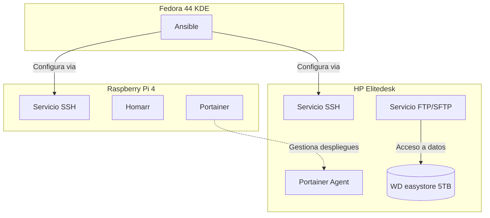

import TerminalWindow from '../../components/TerminalWindow.astro';
import CodeBlockWindow from '../../components/CodeBlockWindow.astro';

## Introducción
Después de en las entradas anteriores ver qué servicios uso para gestionar toda la parte lógica de red ahora es el momento de ver cómo gestiono toda la infraestructura, cuando hablo de gestión me refiero a administración de los servidores, monitorización del estado de cada uno de los servicios, monitorización de los contenedores, de los sistemas de manera independiente, etc. En esta primera parte de este bloque de gestión os enseñaré como administro cada servidor de manera independiente así como los contenedores docker que los tengo unificados en una consola.

El diagrama a nivel lógico de este bloque es el siguiente:

Aquí ya no seguimos ningún orden cada servicio actua en unas cosas y tiene un trabajo.

Si esta es vuestra primera vez leyendo este blog, os invito a ver el resto de entradas aquí: 

- [**Introducción a mi HomeLab - Puesta en marcha y primeros pasos**](/blog/introduccion-al-homelab/)
- [**Bloque de Red I - Dominios**](/blog/bloque-de-red-I)
- [**Bloque de Red II - Servicios**](/blog/bloque-de-red-ii-servicios/)
- [**Bloque de Gestión I - Administración**](/blog/bloque-de-gestion-I-administracion/)
- **Bloque de Gestión II - Monitorización**
- **Bloque de Servicios**
- **Retoques, copias de seguridad y extras**

> Los *compose* que publique aquí estarán adaptados para desplegarse de manera independiente sin estar en el mismo *stack* de red

## Portainer
### ¿Que es portainer?
Es una herramienta ligera de interfaz gráfica de usuario que permite gestionar y desplegar contenedores sin necesidad de usar la línea de comandos. Funciona como un panel de control web centralizado para plataformas de contenedores como Docker, Docker Swarm y Kubernetes

### ¿Que es un contenedor?
Es una unidad de software ligera y estandarizada que empaqueta el código de una aplicación, sus herramientas y todas sus dependencias. Esto permite que la aplicación se ejecute de forma rápida, aislada y sin problemas en cualquier entorno, ya sea una computadora portátil o un servidor en la nube. Las principales ventajas de usar contenedores son: 
- **Portabilidad**: Los contenedores eliminan el problema de "funciona en mi máquina pero no en producción". Se ejecutan exactamente igual independientemente del sistema operativo anfitrion.
- **Aislamiento**: Permiten empaquetar una aplicación y ejecutarla de forma autónoma. Puedes tener múltiples contenedores en una misma máquina sin que interfieran entre sí.
- **Eficiencia**:A diferencia de las máquinas virtuales tradicionales, los contenedores comparten el kernel con el anfitrion, lo que los hace increíblemente rápidos y requiere menos recursos.

### ¿Si desde aquí puedes monitorear por qué está en administración?
Es cierto que portainer permite monitorear el estado de los contenedores y de los mismo nodos en los que estan estos, pero la herramienta se creo para simplificar el despliegue de contenedores sobre todo para los usuarios que no estan tan acostumbrados a usar la terminal o la ven ahun como algo que da miedo. Yo uso bastante la terminal y puedo asegurar que no le tengo miedo, pero si que es cierto que gestionar contenedores docker en una terminal en una tablet o un movil es algo tedioso y bastante poco optimo, entonces uso portainer en su lugar.

### Despliegue
La infraestructura de portainer se compone en un servidor principal y uno o varios agentes, el servidor principal sirve la consola de administracion, y gestiona todo de manera centralizada y estos agentes se instalan en cada nodo dsiponible y mandar al servidor principal la informacion que requiera (son puentes de union). Para portainer (opcional) debemos mapear un directorio en el que se almacena la configuracion `/data`, mantendremos el directorio que hemos usado anteriormente `docker` y creamos en el el subdirectorio de portainer y dentro de este el de data.
```bash 
mkdir ~/docker/portainer && mkdir ~/docker/portainer/data
```
### Docker Compose 
<CodeBlockWindow title="docker-compose.yaml">
```yaml 
services:
  portainer:
    image: portainer/portainer-ce:latest #Imagen comunity podemos poner portainer-ee para la businnes
    container_name: portainer # Nombre del contenedor 
    restart: unless-stopped
    ports:
      - "9000:9000" # Puertos a mapear uno para la interfaz web y otro para la comunciacion con los agentes
      - "8000:8000"
    volumes:
      - /var/run/docker.sock:/var/run/docker.sock:ro # Importante mapeamos el socket de docker en el contenedor con permiso de lectura
      - ~/docker/portainer/data:/data # Aqui van los datos carpeta que hemos creado antes
```
</CodeBlockWindow>
Una vez desplegado, accedemos a la interfaz web en `http://IP_DEL_SERVIDOR:9000` y nos pedirá crear un usuario administrador. Desde ahí podemos añadir los nodos que queremos gestionar, en mi caso tengo la Raspberry Pi como servidor principal y el HP Elitedesk como nodo agent.

## Homarr
### ¿Qué es Homarr?
Es un dashboard personalizable y de código abierto que sirve como panel de control centralizado para todos los servicios desplegados en el homelab. Básicamente es la página de inicio de toda la infraestructura, desde donde se puede acceder a cada servicio con un solo clic.

La filosofía de Homarr es tener una vista general de todo lo que tenemos desplegado, su estado y acceso rápido. Es como un escritorio virtual para tu homelab.

### ¿Por qué uso Homarr?
Antes de Homarr usaba una simple página HTML con enlaces, pero se volvió tedioso ir actualizándola cada vez que desplegaba un servicio nuevo. Homarr permite añadir tarjetas de forma sencilla y, lo más importante, muestra el estado de cada servicio en tiempo real, así sé si algo se ha caído sin tener que entrar en cada aplicación.

### Despliegue
Para Homarr creamos la carpeta de configuración dentro del directorio `docker`:
```bash
mkdir ~/docker/homarr && mkdir ~/docker/homarr/appdata
```

### Docker Compose
<CodeBlockWindow title="docker-compose.yaml">
```yaml
services:
  homarr:
    container_name: homarr
    image: ghcr.io/homarr-labs/homarr:latest
    restart: unless-stopped
    volumes:
      - /var/run/docker.sock:/var/run/docker.sock # Permite a Homarr leer el estado de otros contenedores
      - ./homarr/appdata:/appdata # Persistencia de la configuracion local
    environment:
      - SECRET_ENCRYPTION_KEY=TU_CLAVE
    ports:
      - '7575:7575' # Expone el puerto 7575 del contenedor en el puerto 7575 de tu equipo
```
</CodeBlockWindow>

Para generar la *SECRET_ENCRYPTION_KEY* podemos usar `openssl rand -hex 32` 


<TerminalWindow title="jrodriiguezg@rpi4:~/docker/homarr">
  ```text
  jrodriiguezg@rpi4:~/docker/homarr$ docker compose up -d
  [+] Running 2/2
   ✔ homarr Pulled                                                                                              12.3s
   ✔ Container homarr Started                                                                                    0.3s
  jrodriiguezg@rpi4:~/docker/homarr$
  ```
</TerminalWindow>

Una vez levantado, accedemos a `http://IP_DEL_SERVIDOR:7575` y nos aparecerá la interfaz de Homarr donde podremos ir añadiendo tarjetas para cada servicio que tengamos desplegado.

## SSH
### ¿Qué es SSH?
**SSH** (Secure Shell) es un protocolo de red criptográfico que permite ejecutar comandos de forma remota sobre un sistema de manera segura. Es la forma en la que yo gestiono todos mis servidores, ya que al estar en la red local no necesito moverme del sitio.

### ¿Por qué es importante en un homelab?
Sin SSH no podría administrar los servidores de manera cómoda. Toda la configuración, actualización de paquetes, revisión de logs y casi cualquier tarea administrativa se hace a través de una conexión SSH. Es la herramienta base de todo administrador de sistemas.

### Configuración
SSH viene preinstalado en la mayoría de distribuciones Linux, pero es recomendable hacer una configuración básica para mejorar la seguridad. Lo primero es cambiar el puerto por defecto (22) y desactivar el login como root:
<TerminalWindow title="SSH config">
```bash
sudo nano /etc/ssh/sshd_config

# Buscamos y modificamos las siguientes líneas:

Port 2222                    # Puerto personalizado
PermitRootLogin no           # No permitir login como root
PasswordAuthentication no    # Solo autenticación por clave

#Después reiniciamos el servicio:
sudo systemctl restart sshd

# Conexión desde el cliente
# Para conectarse desde otro equipo Linux o macOS:

ssh -p 2222 usuario@IP_DEL_SERVIDOR


# Si usamos Windows, podemos usar **PuTTY** o la terminal integrada de PowerShell:
ssh -p 2222 usuario@IP_DEL_SERVIDOR
```
</TerminalWindow>


## Ansible
### ¿Qué es Ansible?
Es una herramienta de automatización de configuración y orquestación de infraestructura. Permite definir el estado deseado de los servidores mediante *playbooks* escritos en **YAML** y ejecutarlos de forma remota sobre múltiples máquinas simultáneamente.

### ¿Para qué lo uso?
En mi caso lo uso para tareas repetitivas como actualizaciones de sistema, instalación de paquetes, creación de usuarios o cualquier otra configuración que necesite aplicar de manera uniforme en todos los servidores. En vez de conectarme a cada uno y ejecutar los mismos comandos, escribo un playbook y lo ejecuto contra todos a la vez.

### ¿Qué es un playbook?
Es un archivo **YAML** que define un conjunto de tareas (*tasks*) que Ansible debe ejecutar en los hosts (servidores) que indiquemos. Cada tarea usa un *módulo* que es el encargado de realizar una acción concreta, como instalar un paquete, copiar un archivo o ejecutar un comando.

### Instalación
Ansible se instala con:
```bash
sudo apt install ansible
```

### Estructura básica
Para organizar los playbooks, lo habitual es crear una estructura de carpetas:
```bash
mkdir ~/ansible/{playbooks,inventory,roles}
```

El archivo de **inventario** define los servidores que vamos a gestionar:
<CodeBlockWindow title="inventory">
```ini
[servidores]
rpi4 ansible_host=192.168.1.100 ansible_user=jrodriiguezg
hp ansible_host=192.168.1.101 ansible_user=jrodriiguezg
```
</CodeBlockWindow>

### Playbook de ejemplo
Un playbook básico para actualizar todos los servidores:
<CodeBlockWindow title="actualizar.yaml">
```yaml
---
- name: Actualizar todos los servidores
  hosts: servidores
  become: yes
  tasks:
    - name: Actualizar cache de paquetes
      apt:
        update_cache: yes
        cache_valid_time: 3600

    - name: Actualizar paquetes
      apt:
        upgrade: dist

    - name: Limpiar cache de paquetes
      apt:
        autoremove: yes
```
</CodeBlockWindow>
Para ejecutarlo:
```bash
ansible-playbook -i inventory/hosts playbooks/actualizar.yaml
```

### Ventajas
- No necesita agente instalado en los serviores objetivo (usa SSH).
- Los playbooks son declarativos, es decir, describes el estado que quieres y Ansible se encarga de alcanzarlo.
- Es idempotente, ejecutar el mismo playbook dos veces no causa problemas, ya que solo aplica los cambios necesarios.

## FTP/SFTP
### ¿Qué es FTP/SFTP?
**FTP** (File Transfer Protocol) es un protocolo diseñado para la transferencia de archivos entre un cliente y un servidor. **SFTP** (SSH File Transfer Protocol) es una variante segura que cifra tanto los comandos como los datos, funcionando sobre una conexión SSH.

En mi caso uso SFTP para acceder a los archivos del disco externo de 5TB desde otros dispositivos de la red, como por ejemplo para copiar películas o música sin tener que conectarme por SSH y usar comandos.

### ¿Por qué SFTP y no FTP?
FTP envía los datos (incluyendo usuario y contraseña) en texto plano, lo que lo hace inseguro en cualquier red. SFTP cifra toda la comunicación, por lo que es la opción recomendada siempre que sea posible.

### Despliegue
Para el servicio FTP/SFTP uso `vsftpd`, que es uno de los servidores FTP más usados en Linux por su estabilidad y seguridad. A diferencia del resto de servicios, este no lo tengo en contenedor Docker sino instalado directamente en el sistema.

La instalación en Debian es sencilla:
```bash
sudo apt install vsftpd
```

### Configuración
Editamos el archivo de configuración:
<TerminalWindow title="FTP Conf">
```bash
sudo nano /etc/vsftpd.conf


# Las configuraciones más importantes son:

listen=YES                    # Escuchar en IPv4
listen_ipv6=NO                # Desactivar IPv6
anonymous_enable=NO           # No permitir acceso anónimo
local_enable=YES              # Permitir usuarios locales
write_enable=YES              # Permitir escritura
chroot_local_user=YES         # Aislar usuarios en su directorio home
allow_writeable_chroot=YES    # Permitir escritura en el directorio raíz del usuario
pasv_enable=YES               # Habilitar modo pasivo
pasv_min_port=40000           # Puerto mínimo del rango pasivo
pasv_max_port=40100           # Puerto máximo del rango pasivo


# Después reiniciamos el servicio:

sudo systemctl restart vsftpd
sudo systemctl enable vsftpd

# Para conectarse desde un cliente como **FileZilla**, **WinSCP** o desde la terminal:

sftp -P 22 jrodriiguezg@192.168.1.101
```
</TerminalWindow>
Desde la interfaz gráfica de FileZilla solo hay que rellenar los campos con la IP, el usuario, la contraseña y el puerto **22**.

## Final
Hasta aquí la primera parte del bloque de gestión. Hemos visto cómo administro cada servidor de manera independiente, desde **Portainer** para la gestión de contenedores, pasando por **Homarr** como panel de control centralizado, **SSH** como base de acceso remoto, **Ansible** para la automatización de tareas y **SFTP** para la transferencia de archivos.

En la siguiente entrada veremos la parte de monitorización, donde explicaré cómo superviso el estado de los servicios, contenedores y servidores en tiempo real.

Si tenéis alguna duda o sugerencia, la podéis dejar en los comentarios.


