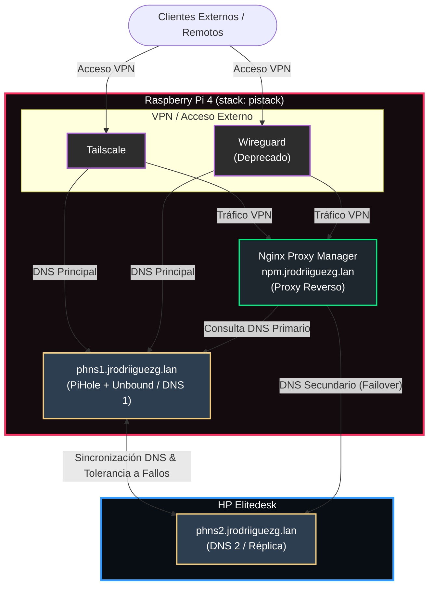

## Introducción
Bueno, esto es una continuación de mi anterior post en el que explicaba cómo está configurado el bloque de red de cara a *Internet*, dejando como punto y aparte el servicio *cloudflared*, que es el conector entre mi infraestructura local y los servidores de *Cloudflare* que dan al exterior (*Internet*).

Como iréis viendo, este bloque se compone de varios servicios que he ordenado de menos a más (al decir de menos a más me refiero de más fuera de la red a más dentro), aunque este orden es relativo y también va de más importante a menos. 

En el primer post de esta serie enseñé mi diagrama lógico completo. Hoy vamos a centrarnos en estos servicios: 



Se pueden ver en la imagen los servicios que corresponden al bloque de red. Como todo ha sido desplegado usando *Docker*, iré poniendo aquí todos los archivos con sus explicaciones de qué hace cada cosa por si queréis replicar el despliegue.

Si esta es vuestra primera vez leyendo este blog, os invito a ver el resto de entradas aquí: 

- [**Introducción a mi HomeLab - Puesta en marcha y primeros pasos**](/blog/introduccion-al-homelab/)
- [**Bloque de Red I - Dominios**](/blog/bloque-de-red-I)
- [**Bloque de Red II - Servicios**](/blog/bloque-de-red-ii-servicios/)
- **Bloque de Gestión I - Administración**
- **Bloque de Gestión II - Monitorización**
- **Bloque de Servicios**
- **Retoques, copias de seguridad y extras**

> Los *compose* que publique aquí estarán adaptados para desplegarse de manera independiente sin estar en el mismo *stack* de red

## Nginx Proxy Manager
Este es el segundo servicio si seguimos el orden de más externos a más internos, y también es de vital importancia para no depender ni recordar todos los puertos de todos los servicios (también actúa como filtro de las solicitudes del exterior).

#### ¿Qué es NPM?
Es una herramienta que proporciona una interfaz gráfica para configurar y gestionar un proxy inverso, más exactamente *Nginx*.
Podemos verlo como el portero de mi *homelab*: recibe una petición y la enruta de manera silenciosa al contenedor que aloja el servicio.


#### ¿Qué es un proxy?
Es un programa informático que actúa como intermediario entre un dispositivo y un servidor final. Cuando se envía una solicitud a un contenido, esta se dirige primero al *proxy* y es él quien procesa y enruta la petición al destino.
Permite ocultar la IP del cliente, filtrar el acceso a cierto contenido, mejorar la velocidad mediante *caché*, etc.

#### ¿Cómo se despliega?
Para el despliegue de este y de todos los servicios que vayamos viendo, yo recomiendo crear una carpeta que unifique todos los **docker-compose.yaml** y todas las carpetas de configuración de una manera ordenada. Por ejemplo, yo uso una carpeta **docker** en la raíz del *home* del usuario de mi *homelab*, pero esta decisión depende de cada uno; luego, para cada servicio creo una carpeta dentro de la anterior para separar sus archivos.

En este despliegue se mapean dos carpetas, una para los *datos* y otra para los *certificados*. Es recomendable crear las carpetas antes de desplegar el contenedor; podemos usar el siguiente comando:
```bash 
mkdir docker/npm && mkdir -p docker/npm/{data,letsencrypt}
```
*Este comando creará la carpeta **npm** dentro de **docker** y luego las dos que se mapean desde el contenedor.*


#### Docker Compose
Todos los archivos usados en los despliegues se encuentran unificados, tanto los archivos adaptados como los originales que usé yo; aunque aquí están de igual manera, pero con la explicación:
```yaml
nginx-proxy-manager: 
    image: jc21/nginx-proxy-manager:latest # Imagen de despliegue
    container_name: nginx-proxy-manager # Nombre del contenedor
    restart: unless-stopped # Esto indica que el contenedor siempre vuelva a iniciar a no ser que esté detenido
    network_mode: "host" # Usamos la red en modo host, para no tener que mapear puertos
    volumes:
      - ./docker/npm/data:/data # Mapeamos la carpeta data a la carpeta que hemos creado antes
      - ./docker/npm/letsencrypt:/letsencrypt # Mapeamos la carpeta letsencrypt a la carpeta que hemos creado antes
```

Este es el contenido del fichero **docker-compose.yaml**. Una vez lo tengamos, solo deberemos ejecutar el comando `docker compose up -d` y con `docker ps` podemos ver si ha arrancado.

#### Configuraciones y uso


## Pi-hole y Unbound
Estos dos servicios son los terceros más importantes, sobre todo a nivel de resolución interna de la red; porque sin ellos (sobre todo Pi-hole), ya que se encarga de resolver los dominios que hay indicados en el NPM.
#### ¿Qué es Pi-hole?

Es un bloqueador de anuncios y rastreadores a nivel de red. Funciona como un "portero" que filtra el tráfico de Internet de todo antes de que carguen la publicidad, mejorando la velocidad, la privacidad y la seguridad de la red doméstica.

#### ¿Cómo funcionan sus listas de bloqueo?
Funcionan como una lista negra de control de acceso. En vez de filtrar el contenido de una página web cuando ya se está descargando, Pi-hole intercepta el tráfico en el DNS.

Las listas de bloqueo son simples archivos de texto que contienen miles de direcciones web (dominios) conocidos por servir publicidad, rastreadores, virus o estafas.

Cuando una página web solicita la dirección IP de un dominio, Pi-hole compara si ese dominio está en sus listas y, si está, detiene la solicitud.


#### ¿Dónde puedo encontrar listas de bloqueo?
Se encuentran en repositorios web gestionados por la comunidad, normalmente *GitHub*, aunque hay otros como: 

- **The Firebog**
- **OISD**
- **HaGeZi DNS Blocklists**

#### Pequeño tour por la interfaz
Yo, aunque tengo bastantes listas de bloqueo, no suelen bloquear mucho, ya que las páginas en las que se encuentra este tipo de contenido malicioso o no accedo a ellas o las bloqueo mediante extensiones del navegador. La interfaz tiene bastantes cosas, por lo que solo enseñaré las que me parecen más importantes; un tour completo es algo que me podéis pedir en los comentarios.


Lo primero es el panel principal (*dashboard*), que muestra un resumen de todas las solicitudes que se han hecho, las que se han bloqueado, el total de dominios en listas y unas gráficas de actividad por horas.


Después tenemos la pestaña *querys*, donde podemos ver las solicitudes DNS que se han hecho y a qué dominio, así como si se han o no bloqueado.


En la pestaña listas, tenemos las listas de *hosts* que hemos configurado y desde aquí es desde donde se configuran más listas y se activan o desactivan.


Y ya finalmente, lo que yo más uso: el DNS (Local DNS Settings). Aquí declaro el dominio interno y la IP donde está, aunque todo apunta al NPM, ya que es él quien hace la redirección.


### unbound
#### ¿Qué es Unbound?
Es un servidor DNS validador, recursivo y de alto rendimiento. En el contexto de redes domésticas y servidores como Pi-hole, se utiliza para eliminar por completo la necesidad de depender de servidores DNS de terceros (como Google 8.8.8.8 o Cloudflare 1.1.1.1), aumentando la privacidad y seguridad.


#### ¿DNS Recursivo?
Es un servidor que actúa como intermediario encargado de buscar la dirección IP de una página web cuando intentamos acceder a ella. Funciona como una carrera de relevos: cuando hacemos una consulta DNS, por ejemplo, en un navegador, esta va siguiendo una serie de pasos que hace el servidor DNS, preguntando a diferentes servidores para ver dónde está la IP del servidor.


#### Despliegue de Pi-hole y Unbound
Estos servicios pueden ser desplegados por separado, pero ya que en mi caso van juntos, el *compose* desplegará ambos. El mapeo de carpetas de estos servicios no es necesario, ya que no se suelen tocar mucho sus ficheros; pero si quisiéramos mapear, lo haríamos como en el servicio anterior dentro de una carpeta **docker**:
```bash 
mkdir docker/pihole && mkdir -p docker/pihole/{unbound,etc,dnsmasq.d}
```
#### Docker Compose
```yaml
version: '3.8'

services:
  unbound:
    image: mvance/unbound-rpi:latest
    container_name: unbound
    restart: unless-stopped
    network_mode: host
    volumes:
      - /pihole/unbound:/opt/unbound/etc/unbound

  pihole:
    image: pihole/pihole:latest
    container_name: pihole
    restart: unless-stopped
    network_mode: host
    depends_on:
      - unbound
    environment:
      TZ: Europe/Madrid
      WEBPASSWORD: "CLAVE_SEGURA" # Cambiar esto por la contraseña
      PIHOLE_DNS_: "127.0.0.1#5335" # Apuntamos a unbound aquí
      DNSSEC: "true"
      DNSMASQ_LISTENING: "all"
      WEB_PORT: "8080"
    volumes:
      - /etc:/etc/pihole
      - /dnsmasq:/etc/dnsmasq.d
    cap_add:
      - NET_ADMIN
```
#### Configuraciones
La única configuración aquí, que en verdad es opcional pero nos asegura que todo funcione mejor, sería bajar el fichero **root.hints**, que guarda la ubicación de los servidores **root**:
```bash 
sudo wget https://www.internic.net/domain/named.root -O /pihole/unbound/root.hints
```

Para comprobar que todo funciona, podemos hacer un `dig` al puerto en el que está *unbound* para ver si resuelve, o al puerto en el que está *Pi-hole*:
```bash 
# Dig a Unbound
dig @127.0.0.1 -p 5335 jrodriiguezg.link

# Dig a Pi-hole
dig @127.0.0.1 -p 53 jrodriiguezg.link
```
*(Hacer esto desde el servidor donde se alojan estos servicios, no desde el cliente).*

#### Replicación (phns2)
Yo dispongo de un segundo servidor *Pi-hole* en un host diferente para que, si el primero deja de responder, el segundo le coja el relevo. Esto lo he hecho con una herramienta que clona la base de datos automáticamente mediante *cron*; la herramienta es la siguiente: [Gravity Sync](https://github.com/vmstan/gravity-sync).


## Tailscale / Wireguard
Estos dos servicios no afectan al funcionamiento de la red; son simplemente para tener acceso a la infraestructura desde fuera de la red local, pero como si estuviera en ella. En el caso de *Wireguard*, a día de hoy ya no se usa, por lo que no voy a explicar mucho y solo os daré el *docker-compose*. Saltando directamente a explicar *Tailscale*.
### Wireguard
Yo no usé *Wireguard* directamente, sino que usé *wg-easy*, que nos da una interfaz web para crear los clientes de *Wireguard*.
#### Docker Compose 
```yaml
version: '3.8'

services:
  wireguard:
    image: ghcr.io/wg-easy/wg-easy:latest
    container_name: wireguard
    restart: unless-stopped
    # Funciona directamente sobre la red del host
    network_mode: host
    environment:
      WG_HOST: "AQUI_IP_PUBLICA" # Si no tenemos IP pública wireguard no funcionará
      PASSWORD_HASH: 'HASH_DE_CONTRASEÑA'
      WG_DEFAULT_DNS: "127.0.0.1" # DNS que va a usar wireguard
      WG_DEFAULT_ADDRESS: "10.8.0.x" # Rango de IPs de wireguard
      PORT: 51821
      WG_PORT: 51820 # Este puerto se debe abrir en el router
    volumes:
      - /docker/wireguard:/etc/wireguard
      - /lib/modules:/lib/modules:ro 
    cap_add:
      - NET_ADMIN
      - SYS_MODULE
    sysctls:
      - net.ipv4.ip_forward=1
      - net.ipv4.conf.all.src_valid_mark=1
```
> Para generar el hash de la contraseña necesitamos *bcrypt*; podemos generarlo con una imagen de *Docker* y el siguiente comando: `docker run --rm -it python:alpine sh -c "pip install bcrypt && python -c \"import bcrypt; print(bcrypt.hashpw(b'AQUI_LA_CONTRASEÑA', bcrypt.gensalt(12)).decode())\""`, cambiando **AQUI_LA_CONTRASEÑA** por la contraseña.


### Tailscale 
#### ¿Qué es?
Es una herramienta que nos permite crear VPNs de malla de forma fácil. A diferencia de los protocolos VPN tradicionales que requieren un servidor, con *Tailscale* los dispositivos se conectan directamente entre sí sin depender de un servidor. A nivel bajo, usa el protocolo *Wireguard* para el cifrado y transmisión de datos.

#### ¿Qué es una VPN?
Es una tecnología que permite crear una conexión segura y cifrada entre varios dispositivos, creando entre ellos una red privada.

#### Configuración y despliegue 
El despliegue es bastante simple, ya que es de los pocos paquetes que se instalan a nivel de sistema sin usar *Docker*. Tendríamos que dirigirnos al *dashboard* de *Tailscale* y crearnos una cuenta en [login.tailscale.com](https://login.tailscale.com/); una vez allí, pulsamos en *Add Device* para añadir un servidor o un cliente.


Si pulsamos en **Servidor**, nos pedirá una serie de datos, como: 
- **Ephemeral**: Si queremos que al desconectarse el servidor, este desaparezca de la red.
- **Use as exit node**: Si queremos que todo el tráfico de red salga por este nodo.
- **Reusable**: Para que la clave API se pueda usar en más dispositivos.
- **Auth Key Expiration**: Esto es para darle caducidad a la API (si caduca, el dispositivo sigue funcionando).

Después, solo pulsamos en **Generate Install Script**:


Y nos devolverá un script como el siguiente, que tenemos que copiar y pegar en nuestra terminal:


#### Configuración de clientes 
Para los clientes, el proceso es más de lo mismo, pero pulsaremos en **Client device** en vez de **Linux server**.
Ya depende del SO a usar, la página nos dará un enlace de descarga y la guía de instalación y configuración.


Y hasta aquí este tercer post, saludos a quien lo lea.

Próximamente entraremos en el bloque de administración