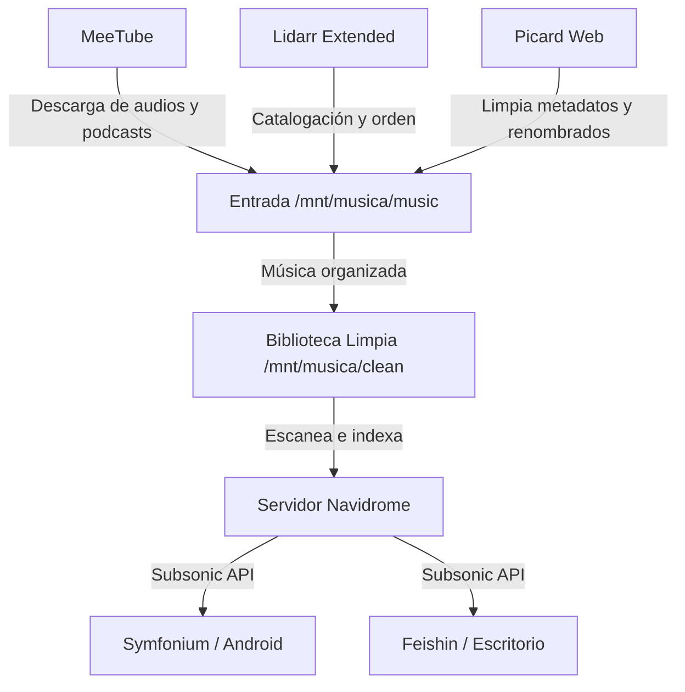

import TerminalWindow from '../../components/TerminalWindow.astro';
import CodeBlockWindow from '../../components/CodeBlockWindow.astro';

## Introducción

Las plataformas de streaming tradicionales nos han acostumbrado a la comodidad de tener millones de canciones a un clic. Sin embargo, las subidas constantes de precios, la pérdida de licencias de nuestros álbumes favoritos y la falta de control sobre nuestros datos me hicieron replantearme el modelo actual. ¿Y si pudiera tener esa misma comodidad pero siendo dueño absoluto de mi biblioteca musical?

En esta entrada os explico detalladamente cómo he montado mi propio ecosistema de música autoalojado en mi HomeLab. Este sistema no solo me permite reproducir música en cualquier lugar mediante clientes modernos, sino que también gestiona las discografías de forma automatizada y organiza las etiquetas de metadatos de mi colección.

---

## La Base del Almacenamiento

Para sostener una biblioteca musical que responda con rapidez a múltiples peticiones simultáneas, cuento con un disco de estado sólido NVMe dedicado exclusivamente a almacenamiento de multimedia en mi servidor **HP Elitedesk**:

<TerminalWindow title="user@elitedesk:~$ lsblk">
```text
user@elitedesk:~$ lsblk /dev/nvme0n1
NAME        MAJ:MIN RM   SIZE RO TYPE MOUNTPOINTS
nvme0n1     259:0    0 476,9G  0 disk 
└─nvme0n1p1 259:1    0 476,9G  0 part /mnt/musica
```
</TerminalWindow>

Dentro de este punto de montaje `/mnt/musica/` mantengo organizados mis datos de la siguiente forma:

<TerminalWindow title="user@elitedesk:~$ ls /mnt/musica/">
```text
user@elitedesk:~$ ls /mnt/musica/
clean flac MSUser  music  
```
</TerminalWindow>

Para este proyecto nos interesan dos carpetas clave:
1. `/mnt/musica/music`: La carpeta de paso o "bandeja de entrada" para la música copiada o descargada que no tiene etiquetas ni metadatos limpios.
2. `/mnt/musica/clean`: La biblioteca musical definitiva, estructurada rigurosamente por Artista/Álbum una vez procesada.

El flujo lógico de procesamiento y streaming es el siguiente:



---

## 1. El Servidor Central: Navidrome

El núcleo de todo el sistema es **Navidrome**. Es un servidor de streaming de música ultraligero escrito en Go que destaca por su velocidad y bajo consumo de recursos. La mayor ventaja de Navidrome es su compatibilidad nativa con la **API de Subsonic**, lo que abre la puerta a utilizar decenas de clientes modernos.

Mapeamos el volumen de música apuntando en modo solo lectura (`:ro`) a nuestra biblioteca limpia para que Navidrome solo se dedique a indexar y reproducir los audios estructurados:

<CodeBlockWindow title="docker-compose.yaml">
```yaml
services:
  navidrome:
    image: deluan/navidrome:latest
    container_name: navidrome
    ports:
      - "4533:4533"
    environment:
      ND_SCANSCHEDULE: "1h" # Frecuencia de escaneo automático de la biblioteca
      ND_LOGLEVEL: "info"
      ND_SESSIONTIMEOUT: "24h"
      ND_BASEURL: ""
    volumes:
      - ~/docker/navidrome/data:/data # Datos de configuración de Navidrome
      - /mnt/musica/clean:/music:ro # Biblioteca de música organizada (Solo lectura)
    restart: unless-stopped
```
</CodeBlockWindow>

---

## 2. Descarga de Audios y Contenido Propio con MeeTube

Para añadir contenido de audio personalizado (como podcasts independientes, directos de larga duración de YouTube, o pistas de audio con licencias libres/Creative Commons), utilizo **MeeTube**. Es una herramienta web basada en `yt-dlp` que me permite gestionar descargas individuales de vídeo y audio de manera cómoda desde una interfaz limpia.

> **Nota de uso responsable:** Esta utilidad está destinada exclusivamente a la descarga y almacenamiento local de material libre de derechos, copias de seguridad de audios propios o contenido licenciado bajo Creative Commons.

<CodeBlockWindow title="docker-compose.yaml">
```yaml
services:
  meetube:
    image: auttaja/meetube:latest
    container_name: meetube
    ports:
      - "8081:8081"
    volumes:
      - ~/docker/meetube/config:/config
      - /mnt/musica/music:/downloads # Descarga directa en la bandeja de entrada "sucia"
    restart: unless-stopped
```
</CodeBlockWindow>

---

## 3. Etiquetado de Metadatos con Picard Web

Para que una biblioteca musical se sienta verdaderamente profesional, las etiquetas (nombres de canciones, artistas, carátulas y fechas) deben ser impecables. Para esto utilizo **MusicBrainz Picard**, pero ejecutado en formato web en el HomeLab gracias al proyecto **Picard Web** de *Aandree5*.

Mapeamos todo el disco `/mnt/musica` al directorio `/music` dentro del contenedor para poder leer los archivos de la carpeta "sucia" y guardarlos ya catalogados en la carpeta "limpia".

<CodeBlockWindow title="docker-compose.yaml">
```yaml
services:
  picard-web:
    image: aandree5/picard-web:latest
    container_name: picard-web
    ports:
      - "8080:5000" # Puerto de acceso web a Picard Web
    volumes:
      - ~/docker/picard/config:/picard-web
      - /mnt/musica/music:/music
      - /mnt/musica/clean:/clean # Acceso a todo nuestro disco de música (music y clean)
    restart: unless-stopped
```
</CodeBlockWindow>

Con Picard Web (accediendo a `http://IP_DE_MI_SERVIDOR:8080`), escaneo los archivos dentro de `/music/music`, los asocio a la base de datos abierta de MusicBrainz para rellenar los metadatos oficiales y las carátulas, y configuro el renombrador para que desplace los archivos terminados a `/music/clean` estructurados de forma organizada.

---

## 4. Gestión e Indexación de Discografías con Lidarr Extended

Para tener un control integral de qué álbumes o lanzamientos me faltan de mis artistas favoritos, utilizo **Lidarr Extended**. Lidarr actúa como un indexador de discografías que consulta metadatos de lanzamientos musicales y gestiona colecciones locales de copias de seguridad. 

Utilizando scripts adicionales de su versión *Extended*, Lidarr me ayuda a buscar portadas faltantes de alta resolución y mantener organizada la base de datos de lanzamientos de mis discos en local.

<CodeBlockWindow title="docker-compose.yaml">
```yaml
services:
  lidarr-extended:
    image: randomninjaatc/lidarr-extended:latest
    container_name: lidarr-extended
    environment:
      - PUID=1000
      - PGID=1000
      - TZ=Europe/Madrid
    volumes:
      - ~/docker/lidarr/config:/config
      - /mnt/musica:/mnt/musica # Mapeo del disco para su análisis
      - ~/downloads:/downloads # Directorio temporal de descargas de respaldo
    ports:
      - "8686:8686"
    restart: unless-stopped
```
</CodeBlockWindow>

---

## 5. Clientes Subsonic

Al usar la API de Subsonic en Navidrome, disponemos de una flexibilidad excelente para reproducir nuestra música limpia en cualquier cliente:

- **Móvil (Symfonium en Android)**: Mi reproductor favorito. Cuenta con transcodificación en tiempo real, soporte nativo de Android Auto, guardado en caché inteligente para reproducir sin conexión y soporte para formatos sin pérdida como FLAC. Es de pago pero merece la pena pagarlo

- **Escritorio (Feishin)**: Un cliente multiplataforma muy similar a la interfaz clásica de Spotify.


## Conclusión

Autoalojar tu biblioteca de música te devuelve el control sobre tu colección. Separar el flujo entre música sin procesar (`/mnt/musica/music`) y biblioteca limpia (`/mnt/musica/clean`) nos ayuda a mantener una base de datos impecable en Navidrome.

Si tenéis dudas sobre la configuración del script de Picard o los mapeos del disco NVMe, podéis dejarlas abajo en la sección de comentarios.
