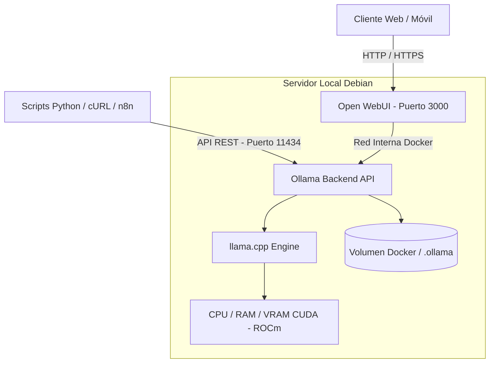

import TerminalWindow from '../../components/TerminalWindow.astro';
import CodeBlockWindow from '../../components/CodeBlockWindow.astro';

## Introducción

En los últimos años, las herramientas basadas en Inteligencia Artificial generativa se han integrado de lleno en nuestro flujo diario de trabajo, ya sea para consultar dudas de administración de sistemas, redactar scripts de automatización o analizar código. Sin embargo, la inmensa mayoría de los usuarios recurre por inercia a soluciones de terceros como OpenAI (ChatGPT) o Anthropic (Claude).

Aunque estas plataformas cloud son cómodas, depender exclusivamente de sus APIs externas presenta inconvenientes serios que en un HomeLab debemos replantearnos:

1. **Privacidad de datos**: Cualquier fragmento de código, log de sistema o archivo personal que enviemos viaja a servidores ajenos sobre los que no tenemos control.
2. **Costes por uso**: Si integramos modelos en scripts automatizados de vigilancia o procesamiento de texto diario, la factura del consumo por tokens se puede disparar.
3. **Dependencia de la conexión y disponibilidad**: Si la API sufre caídas, degradación del servicio o cambios en sus políticas de uso, nuestras herramientas locales dejan de funcionar.
4. **Límites de tasa y filtrado de consultas**: Restricciones de peticiones por minuto y alineamiento arbitrario sobre el contenido procesado.

En esta entrada os voy a explicar cómo he montado un ecosistema completo de IA generativa autoalojada en mi propio servidor. Utilizaremos **Ollama** como motor de inferencia y **Open WebUI** como interfaz gráfica centralizada, todo empaquetado en contenedores **Docker** sobre Debian.

---

## ¿Qué es Ollama y por qué es el estándar en entornos autoalojados?

Para quienes no lo conozcan, **Ollama** es una herramienta open-source diseñada para empaquetar, gestionar y ejecutar modelos de lenguaje masivos (LLMs) en local. Por debajo utiliza la arquitectura de `llama.cpp`, lo que le permite cuantizar los modelos (reducir su tamaño en memoria mediante formatos como GGUF) y aprovechar al máximo las instrucciones de CPU (AVX2, AVX-512) o aceleración por GPU (CUDA en NVIDIA o ROCm en AMD).

La gran ventaja de Ollama radica en su sencillez: abstrae toda la complejidad de compilar bibliotecas C++ o configurar entornos virtuales de Python. Expone una API REST limpia en el puerto `11434` que imita la propia API de OpenAI, lo que nos permite conectar cualquier cliente o script existente sin reescribir código.

---

## Requisitos de Hardware y Elección del Modelo

Uno de los mitos habituales es pensar que se necesita un cluster de tarjetas gráficas de miles de euros para ejecutar un LLM local. La realidad es que depende enteramente del tamaño del modelo (medido en miles de millones de parámetros, como 3B, 8B o 14B) y de la cantidad de memoria (RAM o VRAM) disponible en nuestros equipos.

En mi caso, para pruebas ligeras en la Raspberry Pi 4B podemos ejecutar modelos diminutos en CPU, mientras que en el servidor principal **HP Elitedesk** podemos mover modelos de 7B u 8B parámetros de manera bastante fluida.

A continuación os dejo una tabla comparativa según el hardware disponible:

| Tamaño del Modelo | Parámetros Típicos | VRAM Recomendada (GPU) | RAM Mínima (CPU) | Modelos Representativos | Casos de Uso Recomendados |
| :--- | :--- | :--- | :--- | :--- | :--- |
| **Ultraligero** | 1B - 3B | 2 GB - 4 GB | 8 GB | Llama 3.2 1B/3B, Qwen 2.5 1.5B | SBCs (Raspberry Pi), tareas de texto sencillas, traducción |
| **Medio** | 7B - 8B | 6 GB - 8 GB | 16 GB | Llama 3.1 8B, DeepSeek R1 8B, Mistral 7B | Asistencia en programación, resumen de logs, agentes de texto |
| **Avanzado** | 14B - 32B | 16 GB - 24 GB | 32 GB | Qwen 2.5 14B, DeepSeek R1 14B/32B | Razonamiento complejo, refactorización de código amplio |
| **Profesional** | 70B+ | > 40 GB | > 64 GB | Llama 3.3 70B, Qwen 2.5 72B | Servidores dedicados multi-GPU |

> **Nota sobre cuantización:** Los modelos que descargamos por defecto en Ollama vienen en cuantización `Q4_K_M` (4 bits). Esto significa que un modelo de 8 mil millones de parámetros solo ocupa unos 4.7 GB de memoria, manteniendo más del 95% de la precisión del modelo original de 16 bits.

---

## Arquitectura de la Infraestructura

El flujo lógico que configuraremos separa el motor de inferencia (Ollama) de la interfaz de usuario (Open WebUI), permitiendo que la API de Ollama quede disponible tanto para la web como para scripts de automatización en la red local.



---

## Despliegue paso a paso con Docker Compose

Fieles a la metodología que usamos en el resto del HomeLab, desplegaremos el servicio mediante Docker Compose para mantener los datos aislados en la carpeta `~/docker`.

### 1. Creación del directorio de trabajo

Nos conectamos a nuestro servidor por SSH y preparamos las carpetas de persistencia:

<TerminalWindow title="jrodriiguezg@elitedesk:~$">
```bash
jrodriiguezg@elitedesk:~$ mkdir -p ~/docker/ollama/data
jrodriiguezg@elitedesk:~$ mkdir -p ~/docker/open-webui/data
jrodriiguezg@elitedesk:~$ cd ~/docker/ollama
```
</TerminalWindow>

### 2. Configuración del docker-compose.yaml

Creamos el archivo `docker-compose.yaml` dentro de la carpeta `~/docker/ollama/`:

<CodeBlockWindow title="docker-compose.yaml">
```yaml
services:
  ollama:
    image: ollama/ollama:latest
    container_name: ollama
    restart: unless-stopped
    ports:
      - "11434:11434"
    volumes:
      - ~/docker/ollama/data:/root/.ollama
    # Si dispones de GPU NVIDIA o AMD ROCm, revisa la sección inferior para activar el passthrough hardware.

  open-webui:
    image: ghcr.io/open-webui/open-webui:main
    container_name: open-webui
    restart: unless-stopped
    ports:
      - "3000:8080"
    environment:
      - OLLAMA_BASE_URL=http://ollama:11434
      - WEBUI_SECRET_KEY=clave_secreta_para_sesiones
    volumes:
      - ~/docker/open-webui/data:/app/backend/data
    depends_on:
      - ollama
```
</CodeBlockWindow>

---

## Aceleración por GPU: NVIDIA (CUDA) vs AMD (ROCm)

Si tu servidor dispone de tarjeta gráfica dedicada, es imprescindible configurar el passthrough de la GPU al contenedor de Ollama para multiplicar por 10 la velocidad de inferencia (generación de tokens/segundo).

### Opción A: GPU NVIDIA con CUDA

Requiere tener instalado `nvidia-container-toolkit` en la máquina anfitriona (Debian). Añadimos la sección `deploy` a nuestro servicio en el `docker-compose.yaml`:

<CodeBlockWindow title="Soporte NVIDIA CUDA">
```yaml
  ollama:
    image: ollama/ollama:latest
    container_name: ollama
    # ...
    deploy:
      resources:
        reservations:
          devices:
            - driver: nvidia
              count: all
              capabilities: [gpu]
```
</CodeBlockWindow>

### Opción B: GPU AMD con ROCm

Si utilizas una tarjeta gráfica AMD Radeon (por ejemplo, RX 6000/7000 series o tarjetas de servidor/workstation AMD), Ollama cuenta con soporte nativo para **ROCm**. 

A diferencia de NVIDIA, el passthrough en Docker para tarjetas AMD no requiere un toolkit propietario, sino mapear directamente los dispositivos de renderizado del kernel Linux (`/dev/kfd` y `/dev/dri`) y añadir los grupos del sistema (`video` y `render`):

<CodeBlockWindow title="Soporte AMD ROCm">
```yaml
  ollama:
    image: ollama/ollama:rocm # O la imagen estándar ollama/ollama:latest
    container_name: ollama
    # ...
    devices:
      - "/dev/kfd:/dev/kfd"
      - "/dev/dri:/dev/dri"
    group_add:
      - "video"
      - "render"
    # Opcional para tarjetas AMD de consumo no soportadas oficialmente de forma directa (p. ej. RX 6600/6700):
    # environment:
    #   - HSA_OVERRIDE_GFX_VERSION=10.3.0 # Usar 10.3.0 para RDNA2 o 11.0.0 para RDNA3
```
</CodeBlockWindow>

> **Truco para gráficas AMD de consumo:** Si tu tarjeta AMD Radeon es de gama doméstica y Ollama no detecta la aceleración ROCm por defecto, definir la variable de entorno `HSA_OVERRIDE_GFX_VERSION=10.3.0` (para arquitecturas RDNA2) o `HSA_OVERRIDE_GFX_VERSION=11.0.0` (para RDNA3) fuerza a la capa ROCm a tratar la tarjeta como un modelo profesional compatible.

---

### 3. Arranque de los contenedores

Una vez configurado el `docker-compose.yaml` según nuestro hardware, levantamos el stack con el comando habitual:

<TerminalWindow title="jrodriiguezg@elitedesk:~/docker/ollama">
```bash
jrodriiguezg@elitedesk:~/docker/ollama$ docker compose up -d
[+] Running 3/3
 ✔ Network ollama_default     Created                                                                    0.1s
 ✔ Container ollama           Started                                                                    0.4s
 ✔ Container open-webui       Started                                                                    0.6s
```
</TerminalWindow>

---

## Gestión y Descarga de Modelos

Con los contenedores corriendo, el motor de Ollama está activo pero aún no tiene ningún modelo descargado en su biblioteca local. Podemos descargarlos mediante la terminal o directamente desde la interfaz de Open WebUI.

### Comandos de gestión desde la CLI

Para bajar modelos directamente desde la línea de comandos ejecutamos `docker exec`:

- **Descargar un modelo equilibrado para uso general (Llama 3.2)**:
<TerminalWindow title="Descarga de Llama 3.2">
```bash
docker exec -it ollama ollama pull llama3.2
```
</TerminalWindow>

- **Descargar un modelo optimizado para razonamiento y lógica (DeepSeek R1 8B)**:
<TerminalWindow title="Descarga de DeepSeek R1">
```bash
docker exec -it ollama ollama pull deepseek-r1:8b
```
</TerminalWindow>

- **Listar modelos almacenados en el disco**:
<TerminalWindow title="jrodriiguezg@elitedesk:~$ docker exec -it ollama ollama ls">
```text
NAME             ID           SIZE     MODIFIED
llama3.2:latest  a80c4f17acd5 2.0 GB   2 hours ago
deepseek-r1:8b   0a8c26691341 4.9 GB   1 hour ago
```
</TerminalWindow>

- **Probar una consulta rápida directamente en terminal**:
<TerminalWindow title="Prueba interactiva">
```bash
docker exec -it ollama ollama run llama3.2 "Escribe un script en Bash para hacer backup de /etc"
```
</TerminalWindow>

---

## Integración y Consumo de la API en Scripts

Una de las utilidades más potentes de tener Ollama en nuestro servidor es poder consumirlo desde scripts en Python o herramientas de automatización.

Como Ollama expone un endpoint compatible con la API de OpenAI en `http://IP_DEL_SERVIDOR:11434/v1`, podemos reutilizar cualquier librería existente.

A continuación os muestro un ejemplo en Python para automatizar consultas desde nuestro equipo:

<CodeBlockWindow title="test_ollama.py">
```python
from openai import OpenAI

# Conectamos con el endpoint local de Ollama en nuestro servidor
client = OpenAI(
    base_url="http://192.168.1.101:11434/v1",
    api_key="ollama" # La API Key no es requerida por Ollama pero la librería la exige
)

response = client.chat.completions.create(
    model="deepseek-r1:8b",
    messages=[
        {
            "role": "system", 
            "content": "Eres un asistente técnico especializado en administración de servidores Linux y Debian."
        },
        {
            "role": "user", 
            "content": "¿Cuáles son los comandos recomendados para diagnosticar un cuello de botella en I/O de disco?"
        }
    ]
)

print(response.choices[0].message.content)
```
</CodeBlockWindow>

---

## Proxy de modelos: Enrutamiento inteligente con Lemoe (l3mcore)

Si ya tienes Ollama y Open WebUI funcionando, puedes potenciar tu infraestructura añadiendo mi propia herramienta **Lemoe** (cuyo núcleo es `l3mcore`). 

Lemoe no reemplaza a Ollama, sino que actúa como un **proxy intermediario inteligente**. Se encarga de recibir las peticiones de Open WebUI o de cualquier otro cliente y las enruta automáticamente hacia el modelo local más idóneo en cada momento según el tipo de tarea.

Lemoe crea automáticamente un entorno virtual seguro de Python y gestiona las dependencias sin ensuciar los paquetes de tu servidor. Para más detalles puedes consultar la [documentación oficial](https://lemoe.link/) o el [repositorio en GitHub](https://github.com/lemoelink/l3mcore).

### Instalación Rápida (Recomendada)

El instalador automático descargará el repositorio y configurará el entorno en un solo paso (requiere Python 3.10 o superior). Puedes usar `wget` o `curl`:

<CodeBlockWindow title="Usando wget">
```bash
wget -qO- https://raw.githubusercontent.com/lemoelink/l3mcore/refs/heads/master/setup.sh | bash
```
</CodeBlockWindow>

<CodeBlockWindow title="Usando curl">
```bash
curl -sSL https://raw.githubusercontent.com/lemoelink/l3mcore/refs/heads/master/setup.sh | bash
```
</CodeBlockWindow>

Una vez terminada la instalación, el script habrá preparado un entorno aislado `venv`. Para iniciar el servidor solo tienes que acceder al directorio y lanzar el script de inicio:

<TerminalWindow title="Iniciar Lemoe">
```bash
cd LeMoE
./start.sh
```
</TerminalWindow>

El servidor estará disponible en tu red a través del puerto `11435` (`http://IP_DEL_SERVIDOR:11435`).

### Instalación Manual (Git Clone)

Si prefieres tener más control y clonar el repositorio manualmente:

<TerminalWindow title="Clonado manual">
```bash
git clone https://github.com/lemoelink/l3mcore.git
cd l3mcore
./setup.sh
./start.sh
```
</TerminalWindow>

Ambos métodos dejarán el servidor de Lemoe funcionando y listo para servir modelos locales en tu red.

---

## Acceso Remoto Seguro con Tailscale

Al igual que explicamos en anteriores entregas del blog con el resto de servicios del HomeLab, no debemos abrir puertos de nuestro servidor hacia Internet en el router.

Para acceder a **Open WebUI** (`http://IP_LOCAL:3000`) desde el portátil fuera de casa o desde el teléfono móvil, utilizaremos **Tailscale**:

1. Nos aseguramos de tener el servicio de Tailscale corriendo en el servidor Debian:
<TerminalWindow title="jrodriiguezg@elitedesk:~$ tailscale status">
```text
100.115.20.45   elitedesk            jrodriiguezg@ linux   -
```
</TerminalWindow>
2. Accedemos directamente introduciendo la IP privada de la red Tailnet: `http://100.115.20.45:3000`.

De esta forma mantenemos toda la infraestructura totalmente privada, cifrada punto a punto y protegida de accesos no autorizados.

---

## Final

Desplegar Ollama y Open WebUI en nuestro HomeLab demuestra que es perfectamente posible disponer de herramientas avanzadas de Inteligencia Artificial sin regalar nuestros datos ni depender de suscripciones mensuales a servicios en la nube.

Separar la arquitectura en contenedores Docker independientes nos permite actualizar los modelos o cambiar la interfaz gráfica en el futuro sin romper la configuración del sistema.

En siguientes entradas veremos cómo conectar este stack de Ollama con un sistema de **RAG (Retrieval-Augmented Generation)** para que el LLM pueda consultar la documentación de nuestro propio servidor.

Si tenéis cualquier duda sobre los requisitos de memoria o la configuración del `docker-compose.yaml` (ya sea con NVIDIA CUDA o AMD ROCm), podéis dejarla abajo en la sección de comentarios.
