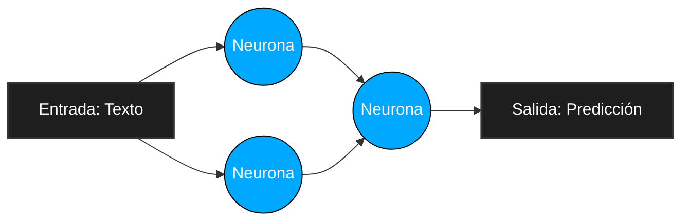
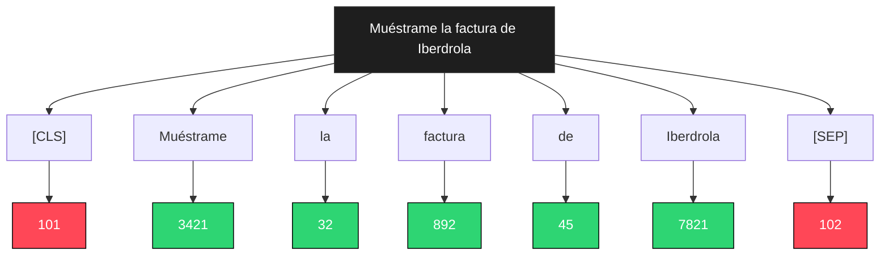
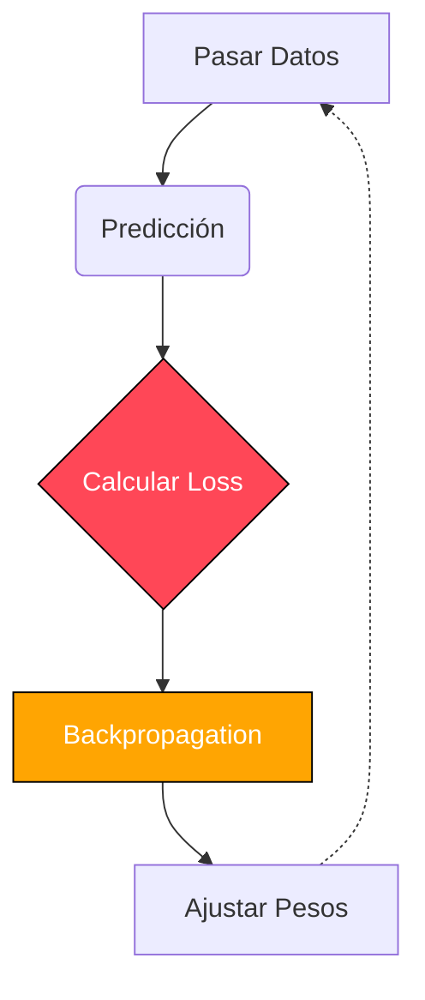

# Introducción

En los últimos años, la **Inteligencia Artificial** ha pasado de ser un concepto de ciencia ficción a una herramienta cotidiana. Sin embargo, para la mayoría de las personas, el proceso de "entrenar una IA" sigue siendo algo que ven como complejo y solo a la altura de los gigantes tecnológicos.

En este artículo, voy a explicar paso a paso cómo entrené los modelos de IA que forman el núcleo del proyecto **LEMoE** (Light Easy Mix Of Experts). Y lo voy a hacer de una forma técnica, profunda, pero accesible para todos. Da igual si eres un ingeniero de software experimentado o si simplemente tienes curiosidad por saber cómo una máquina aprende a entender el lenguaje humano: este artículo es para ti.

---

## 1. ¿Pero qué es la IA?

Antes de entrar en el código y las matemáticas, debemos entender lo más importante: **qué es realmente un modelo de Inteligencia Artificial**. Cuando leemos las noticias o foros de internet, a menudo nos dicen que la IA "piensa" o "entiende". La realidad es mucho más fascinante (y matemática).

Un modelo de **Procesamiento de Lenguaje Natural** (NLP, por sus siglas en inglés) no es más que una función matemática gigante. Recibe números como entrada, realiza millones de cálculos de matrices y devuelve números como salida. La "magia" reside en cómo estructuramos esa función y, sobre todo, en cómo ajustamos los números internos (llamados **pesos** o *weights*) para que la salida tenga sentido.



### 1.1. Arquitecturas Base: No creamos, solo entrenamos

Para LEMoE, no construí una red neuronal desde cero absoluto. Eso requeriría presupuestos de millones de dólares y granjas de servidores llenas de tarjetas gráficas funcionando durante meses. En su lugar, utilizamos una técnica llamada **Transfer Learning** (Aprendizaje Transferido).

Partimos de modelos ya existentes de código abierto, concretamente los basados en la arquitectura de **Transformers** (como BERT o DeBERTa). Estos modelos ya han sido entrenados por gigantes tecnológicos (como Google o Microsoft) leyendo terabytes de texto de Internet. Como resultado, estos "modelos base" ya conocen la gramática, la sintaxis y el vocabulario del lenguaje humano. Nuestro trabajo no es enseñarles a hablar, sino enseñarles a realizar una tarea muy específica: **entender y clasificar consultas en el ecosistema LEMoE**.

A este proceso de "especialización" lo llamamos **Fine-Tuning** (Ajuste Fino).

---

## 2. El oro del siglo XXI: LOS DATOS

Hay un dicho en la ciencia de datos que es una ley inmutable: **Garbage In, Garbage Out** (Basura entra, basura sale). Si intentamos entrenar el modelo de IA más avanzado del mundo con datos de mala calidad, obtendremos un modelo inútil.

La IA no "aprende sola" por arte de magia viendo vídeos de YouTube. Aprende gracias a ejemplos humanos bien estructurados.

### 2.1. Recolección y Anotación

Para que el modelo **LEMoE PPC** (Pipeline para Clasificación) supiera exactamente qué hacer, tuve que crear un **Dataset** (Conjunto de datos). Esto implica horas de trabajo humano. Recopilé cientos, miles de frases que representaban las interacciones típicas que un usuario tendría con el sistema.

### 2.2. El formato JSONL

Las máquinas no leen hojas de Excel fácilmente en tiempo de ejecución. El estándar de la industria para entrenar modelos de lenguaje es el formato **JSONL** (JSON Lines).

En un archivo JSONL, cada línea de texto es un objeto de JSON independiente. Esto es crucial porque permite que el ordenador procese archivos muy grandes línea por línea, sin tener que cargar gigabytes de datos en la memoria RAM simultáneamente.

Un ejemplo de nuestro dataset se ve así:

```json
{"text": "Enséñame la factura de Iberdrola", "label": "1"}
{"text": "¿Va a llover mañana en Madrid?", "label": "0"}
{"text": "Muéstrame la factura con el proveedor de internet", "label": "1"}
```

Este dataset busca filtrar la intención de entrada del usuario para saber si está solicitando al sistema que le busque un documento o no. Por ello se ha entrenado con pares de números, **0** o **1**, donde `0` es que no es búsqueda de documento y `1` es que sí.

Para el modelo **LEMoE Query Distiller** (que se encarga de extraer palabras clave en lugar de clasificar la frase entera), el formato de datos es aún más complejo. Utiliza lo que se llama **Token Classification** (Clasificación de Tokens), donde cada palabra individual de la frase recibe una etiqueta propia, donde `1` es una palabra válida y `0` es inválida. Por ejemplo: 

| Muéstrame | la | factura | de | Iberdrola | de | marzo | del | año | 2022 |
| :---: | :---: | :---: | :---: | :---: | :---: | :---: | :---: | :---: | :---: |
| 0 | 0 | 1 | 0 | 1 | 0 | 1 | 0 | 1 | 1 |

---

## 3. El idioma de las máquinas: La Tokenización

Aquí es donde mucha gente se pierde, pero es fundamental. Las redes neuronales no saben qué es una "A" o una "B". **Solo entienden números.**

Por tanto, no podemos pasarle la frase *"Muéstrame la factura de Iberdrola"* directamente al modelo. Tenemos que traducirla a su idioma mediante un proceso llamado **Tokenización**.

### 3.1. Rompiendo las palabras

Un "Tokenizer" (Tokenizador) toma una frase y la divide en pequeños fragmentos llamados **tokens**. A veces un token es una palabra entera, a veces es la raíz de una palabra, y a veces es solo una letra.

Por ejemplo, la palabra "incomprensible" podría dividirse en tres tokens: `["in", "comprens", "ible"]`. 
Esto se hace utilizando algoritmos como **BPE** (Byte-Pair Encoding) o **WordPiece**, que aprenden estadísticamente cuáles son los fragmentos de palabras más comunes en un idioma.

### 3.2. De tokens a números (IDs)

Una vez dividida la frase, el Tokenizer busca cada fragmento en su diccionario interno (vocabulario) y lo sustituye por un número identificador (ID).

Así, nuestra frase *"Muéstrame la factura de Iberdrola"* podría convertirse en la secuencia numérica: `[101, 3421, 32, 892, 45, 7821, 102]`




Los números `101` y `102` suelen ser tokens especiales invisibles que le indican al modelo dónde empieza (`[CLS]`) y dónde termina (`[SEP]`) la frase.

### 3.3. Padding y Attention Masks

Las tarjetas gráficas (GPUs) son como fábricas matemáticas que adoran trabajar en paralelo. Para ser eficientes, procesan las frases en "bloques" o "lotes" (*batches*). 
Pero, ¿qué pasa si en un lote tenemos una frase de 5 tokens y otra de 20 tokens? Las matemáticas de matrices exigen que las frases tengan la **misma cantidad de tokens**.

La solución es el **Padding** (Relleno). Añadimos tokens de relleno (normalmente el número `0`) a las frases cortas para que todas midan lo mismo. 
Y para que la IA no se confunda y empiece a intentar entender esos ceros de relleno, le pasamos una segunda lista llamada **Attention Mask** (Máscara de Atención): una lista de `1`s y `0`s que le dice a la IA: *"presta atención a estos números, pero ignora estos otros porque son solo para rellenar"*.

---

## 4. Empieza el entranamiento: El Fine-Tuning

Ahora tenemos nuestros datos en formato matemático. Es hora de encender la maquinaria

El núcleo del modelo es una red neuronal Transformer. Imagínemos una caja llena de millones de ruedas giratorias (los parámetros). Para nuestros modelos LEMoE, hablamos de más de 100 millones de estos diales.

### 4.1. Forward Pass (El Intento)


Durante el entrenamiento, tomamos un lote de frases (ya convertidas a números) y
las pasamos por la red neuronal. A esto se le llama **Forward Pass**.
En las primeras iteraciones, las ruedas giratorias están configuradas de forma casi
aleatoria. La red neuronal procesa los números y da una respuesta. Al principio,
la respuesta es completamente incorrecta. Podría decir que la frase *"¿Qué hora
es?"* es un 1.

### 4.2. La Función de Pérdida (Loss)

Aquí entra en juego el "profesor". Comparamos la respuesta que ha dado la IA con
la respuesta correcta (la etiqueta que escribimos a mano en el archivo JSONL).
Utilizamos una fórmula matemática llamada **Función de Pérdida** (Loss Function)
para calcular exactamente qué tan equivocada estaba la IA. Si la predicción es
muy mala, el Loss será un número alto. Si es casi perfecta, el Loss será un
número muy cercano a cero.

Nuestro objetivo durante todo el entrenamiento es que este numero baje.




### 4.3. Backpropagation (Aprendiendo del error)

Aquí es donde ocurre la verdadera magia del Machine Learning: la **Retropropagación** (Backpropagation). 

**La analogía de la Orquesta:**
Imagina que eres el director de una orquesta de 100 millones de músicos (parámetros o "ruedas giratorias") que están tocando una sinfonía, pero al principio tocan al azar y suena fatal. Ese sonido fatal es tu *Loss* o Error. ¿Cómo sabes exactamente quién ha tocado una nota desafinada para pedirle que la corrija si hay 100 millones de personas tocando a la vez?

Usando cálculo diferencial (derivadas y la regla de la cadena matemática), el algoritmo rastrea el error hacia atrás, desde el sonido final hasta el instrumento de cada músico. Esto nos permite calcular matemáticamente **qué grado de culpa** tiene exactamente CADA UNA de las 100 millones de ruedas en el error final. A este cálculo de culpa se le llama calcular el **Gradiente**.

**El Descenso del Gradiente (Gradient Descent):**
Una vez que sabemos quién se ha equivocado y en qué proporción, usamos el algoritmo de *Gradient Descent*. 

Imagina que estás en una montaña con niebla densa y quieres llegar al valle más bajo (donde el error es cero). Solo puedes sentir la pendiente del suelo bajo tus pies. Si sientes que el suelo baja hacia tu derecha, das un pasito hacia la derecha. El algoritmo hace esto matemáticamente en 100 millones de dimensiones.

En combinación con un Optimizador avanzado (como **AdamW**), el modelo le dice a cada rueda: *"Tú tenías mucha culpa del error y estabas muy alto, gírate hacia la izquierda un 2%. Tú tenías poca culpa, muévete a la derecha un 0.05%"*. 

Giramos cada rueda una fracción milimétrica en la dirección correcta. El tamaño exacto de ese "pasito" que damos en la montaña es el **Learning Rate** (Tasa de aprendizaje) del que hablamos antes. Si damos un paso enorme, podríamos saltarnos el valle; si damos pasos de hormiga, tardaremos años en aprender.

### 4.4. Épocas (Epochs)

Este proceso (Tomar un ejemplo -> Intentar adivinar -> Calcular error -> Ajustar diales) ocurre **millones de veces**.

Cuando el modelo ha visto todo el dataset completo una vez, decimos que ha completado una **Época** (*Epoch*). Para los modelos de LEMoE, normalmente entrenamos durante 3 a 5 épocas. Si entrenamos demasiadas épocas, corremos el riesgo de **Overfitting** (Sobreajuste), que es cuando el modelo memoriza las respuestas exactas del dataset pero pierde la capacidad de entender frases nuevas que nunca ha visto.

---

## 5. La Realidad del Hardware y las Matemáticas

En el código real, gracias a la librería `transformers` de **HuggingFace**, toda esta complejidad matemática monumental se resume en unas pocas líneas de código.

```python
from transformers import Trainer, TrainingArguments

# Configuramos cómo va a aprender nuestro modelo
training_args = TrainingArguments(
    output_dir="./resultados",          # Dónde se guardará el modelo una vez entrenado
    num_train_epochs=5,                 # Veces que el modelo leerá el dataset al completo
    per_device_train_batch_size=16,     # Frases que procesará de golpe (tamaño del lote)
    learning_rate=2e-5,                 # Tamaño de los "pasos" matemáticos al aprender (0.00002)
    fp16=True,                          # Activa la precisión matemática de 16 bits (más rápido)
)

# Unimos el modelo, los datos y las reglas de aprendizaje
trainer = Trainer(
    model=mi_modelo_transformer,        # La arquitectura base (ej. DeBERTa o BERT)
    args=training_args,                 # Las reglas de entrenamiento que definimos arriba
    train_dataset=dataset_tokenizado,   # Los datos (frases ya convertidas a números/tokens)
)

# ¡Iniciamos el motor y los cálculos matemáticos masivos!
trainer.train()
```

Parece fácil, ¿verdad? Pero la ejecución requiere **fuerza bruta computacional**.

### 5.1. Entrenando en una RTX 5070

Para este proyecto, el entrenamiento se realizó localmente en un portátil equipado con una GPU **NVIDIA RTX 5070**. Aunque es una tarjeta potente para videojuegos, en el mundo de la IA es hardware modesto (las empresas usan clústeres de gráficas NVIDIA H100 que cuestan decenas de miles de dólares cada una).

Para lograr entrenar un modelo de más de **100 millones de parámetros** en una tarjeta gráfica de portátil sin quedarnos sin memoria de vídeo (*VRAM Out Of Memory*), tuve que usar varias técnicas de optimización:

1. **FP16 (Precisión Mixta de 16 bits) y alternativas:** Normalmente, los cálculos en ordenadores se hacen en formato de coma flotante de 32 bits (**FP32**). Esto significa que cada número ocupa mucha memoria y es excesivamente preciso (ej. 0.123456789). Para entrenar modelos de IA, descubrí que no necesito tanta precisión decimal. Al configurar `fp16=True`, la tarjeta gráfica realiza los cálculos usando números de 16 bits. Esto reduce a la mitad el consumo de memoria RAM de vídeo (VRAM) y duplica la velocidad de los cálculos matemáticos, ya que los *Tensor Cores* de las gráficas NVIDIA modernas están diseñados específicamente para volar en FP16.

    **Otras configuraciones posibles:**
    *   **BF16 (Bfloat16):** Creado por Google ("Brain Float"), es similar a FP16 pero con un rango dinámico más amplio. Es menos propenso a errores matemáticos de "desbordamiento" (overflow). Las tarjetas gráficas de última generación (como la serie RTX 3000/4000) lo soportan nativamente con `bf16=True`. Es el estándar de oro actual para entrenamiento.
    *   **FP32 (32 bits):** Es la precisión completa tradicional. Hoy en día casi no se usa para entrenar modelos NLP masivos porque es muy lento y consume el doble de VRAM sin aportar mejoras notables en la "inteligencia" final de la IA.
    *   **INT8 (8 bits):** Es el uso de números enteros puros del 0 al 255. Aunque tradicionalmente solo se usaba para ejecutar el modelo ya entrenado (Inferencia), técnicas modernas como *QLoRA* permiten entrenar los modelos utilizando directamente matemáticas de 8 bits, permitiendo meter modelos colosales en gráficas baratas.

2.  **Gradient Accumulation (Acumulación de Gradientes):** Para que una IA aprenda de forma estable, necesitamos pasarle un "Lote global" o "Batch Size" considerable de ejemplos en cada paso. Por ejemplo, supongamos que nuestro modelo óptimo requiere que entrenemos procesando **32 frases a la vez**. El problema es que si intentamos cargar 32 frases y todas sus multiplicaciones de matrices simultáneamente en una modesta RTX 5070 de 8GB, la memoria colapsará y el programa se cerrará.

    **La solución matemática:** Si nuestra tarjeta solo tiene memoria física para procesar lotes muy pequeños, por ejemplo, **4 frases a la vez** (`per_device_train_batch_size=4`), procesamos esas 4 frases y calculamos sus errores matemáticos (gradientes), pero **NO** actualizamos las "ruedas" del modelo todavía. Simplemente acumulamos esos errores. 
    
    Repetimos este proceso **8 veces** (`gradient_accumulation_steps=8`).
    
    *El cálculo es el siguiente:* `4 frases x 8 iteraciones = 32 frases en total`.
    Una vez hemos acumulado los errores de las 8 repeticiones, AHORA SÍ realizamos la actualización y giramos las ruedas de la IA. A ojos de las matemáticas, el resultado es **idéntico** a tener un servidor gigante capaz de procesar 32 frases de golpe, logrando entrenar modelos masivos evadiendo por completo las limitaciones de VRAM.

---

## 6. Ingeniería Pura: De la investigación a Producción

Una vez terminado el `trainer.train()`, tenemos un modelo inteligente. Pero hay un problema: es un **monstruo gigante y pesado**.

El modelo final guardado con PyTorch es un archivo enorme (a menudo más de 400 MB) que requiere instalar librerías pesadas y, preferiblemente, una tarjeta gráfica para ejecutarse lo suficientemente rápido cuando un usuario le habla al sistema LEMoE.

Para un sistema que pretendemos que funcione en tiempo real y que pueda desplegarse en servidores modestos o incluso localmente sin gráficas potentes, necesitamos aplicar ingeniería de optimización. Y aquí es donde las cosas se ponen realmente interesantes.

### 6.1. Exportación ONNX: Congelando el Cerebro

PyTorch es fantástico para entrenar porque es un entorno dinámico. El grafo computacional (el camino que siguen los números a través de la red neuronal) se construye sobre la marcha en cada iteración. Pero para "Inferencia" (usar el modelo), este dinamismo es lento y consume recursos innecesarios.

El primer paso es exportar el modelo a **ONNX** (Open Neural Network Exchange). Al exportarlo a ONNX, tomamos la red neuronal dinámica y la "horneamos" en un grafo matemático completamente estático. El ordenador ahora tiene un mapa precalculado exacto de las operaciones que debe realizar, sin tener que pensar en cómo construirlas. Solo este paso ya acelera drásticamente el modelo.

```python
from optimum.onnxruntime import ORTModelForSequenceClassification

# Exportación del modelo a formato estático ONNX
ort_model = ORTModelForSequenceClassification.from_pretrained(
    "./mi_modelo_pytorch", 
    export=True
)
ort_model.save_pretrained("./modelo_onnx")
```

### 6.2. Cuantización INT8: Aplastando la Red Neuronal

Incluso en formato ONNX, las "ruedas" o parámetros del modelo siguen siendo números decimales flotantes (por ejemplo, `0.45321`). Procesar matemáticas con decimales es costoso para los procesadores normales (CPUs).

La técnica definitiva que utilicé para LEMoE es la **Cuantización a INT8**.

¿Qué significa esto? Tomamos esos millones de parámetros decimales flotantes (FP32) y los forzamos, mediante algoritmos de agrupamiento estadístico, a encajar en números enteros simples del 0 al 255 (enteros de 8 bits o INT8).

Esencialmente, estamos comprimiendo la "resolución" matemática del cerebro de la IA.

```python
from optimum.onnxruntime.configuration import AutoQuantizationConfig
from optimum.onnxruntime import ORTQuantizer

# 1. Preparamos la herramienta que aplastará el modelo estático
quantizer = ORTQuantizer.from_pretrained(ort_model)

# 2. Definimos la configuración matemática de compresión. 
# (Usamos AVX2 para que vuele en procesadores normales Intel/AMD)
qconfig = AutoQuantizationConfig.avx2(is_static=False)

# 3. ¡Ejecutamos la Cuantización masiva a INT8!
quantizer.quantize(
    save_dir="./modelo_onnx_quantized",   # Carpeta destino para el modelo ultraligero
    quantization_config=qconfig           # Pasamos las reglas matemáticas definidas
)
```

**Los resultados de esta cuantización son brutales:**
1.  **Tamaño del archivo:** El peso del modelo se divide por cuatro. Pasamos de
un archivo de 400 MB a uno de apenas 100 MB.
2.  **Uso de memoria RAM:** Al ejecutarse, consume muchísima menos memoria del
sistema.
3.  **Velocidad de Inferencia:** Los procesadores normales (CPUs) modernos
tienen instrucciones especiales (como AVX2) que pueden realizar multiplicaciones
masivas de números enteros INT8 muchísimo más rápido que matemáticas de
decimales flotantes.

¿Hay una desventaja? Al perder precisión decimal, el modelo pierde un porcentaje
minúsculo de precisión en sus predicciones. Sin embargo, para las tareas de
LEMoE (clasificación de secuencias y extracción de tokens), la pérdida de
precisión suele ser inferior al 1% o 2%, una compensación más que aceptable por
multiplicar la velocidad de ejecución y permitir su uso sin hardware
especializado.

---

## 7. La Evaluación: ¿Cómo sabemos que funciona?

Una vez entrenado el modelo, le pasamos estas frases que nunca antes ha visto. Si el modelo es capaz de clasificarlas correctamente, sabemos que realmente ha "aprendido" los conceptos subyacentes y no se ha limitado a memorizar el archivo de entrenamiento.

Utilizamos métricas estándar de la industria:
- **Accuracy (Precisión Global):** El porcentaje bruto de veces que el modelo acertó (Ej. 95%).
- **F1-Score:** El *Accuracy* por sí solo puede ser muy engañoso. Imagina que en nuestro dataset de prueba de 100 frases, 99 son comandos de luces y solo 1 es de alarma. Si el modelo se vuelve "perezoso" y decide predecir SIEMPRE "comando de luces" sin analizar la frase, acertará 99 de 100 veces, logrando un 99% de *Accuracy*. ¡Parecería un genio, pero en realidad es un modelo inútil porque nunca jamás detectará una alarma!

    Aquí es donde entra el **F1-Score**. Es una métrica estricta (matemáticamente, la media armónica entre la *Precisión* y la *Exhaustividad*) que penaliza severamente a los modelos perezosos. Para que el F1-Score sea alto (ej. 95%), el modelo está obligado a acertar correctamente en **todas** las categorías, por muy pocos ejemplos que haya de una de ellas. Un buen F1-Score nos garantiza que el modelo realmente entiende la diferencia entre todos los comandos, solucionando el peligroso problema de las "clases desbalanceadas".

---

## Conclusión

Entrenar un modelo de **Inteligencia Artificial** para el proyecto LEMoE fue un viaje fascinante desde la teoría hasta la optimización en producción. Pasamos de recoger datos en bruto, a transformarlos en matrices matemáticas, exprimir el hardware gráfico mediante cálculo diferencial, y finalmente aplicar ingeniería de optimización extrema (ONNX y Cuantización) para que el modelo resultante sea ligero, ágil y desplegable en cualquier parte.

No se trata de magia. Es estadística aplicada, cálculo multivariable, álgebra lineal y mucha, mucha ingeniería de software y hardware trabajando en perfecta sincronía.

Si has llegado hasta aquí y te pica la curiosidad, te tengo una buena noticia: no me he guardado nada en secreto. 
He publicado todo el código fuente, los Jupyter Notebooks paso a paso que utilicé, e instrucciones detalladas en mi repositorio de GitHub para que tú mismo puedas replicar este proceso en Google Colab o en tu propio ordenador de forma totalmente gratuita.

¡Te invito a explorar el código, romperlo, experimentar con él y empezar a entrenar tus propios modelos!

**[Visita mi repositorio en GitHub](https://github.com/jrodriiguezg/train-notebooks)**

*¿Tienes dudas o te ha gustado el artículo? ¡Déjame un comentario en Instagram o conéctate conmigo en LinkedIn!*

---

## Entendiendo la Atención (Attention Mechanism)

Para aquellos que quieran profundizar aún más, es imposible hablar de Transformers sin hablar del mecanismo de "Atención".
En los modelos de la generación anterior (como los RNN o LSTM), el ordenador leía la frase de izquierda a derecha, palabra por palabra. El problema es que al llegar al final de una frase larga, a la red neuronal "se le olvidaba" el contexto del principio.

El paper *"Attention Is All You Need"* (2017) de Google cambió el mundo. Introdujo el mecanismo de **Auto-Atención** (*Self-Attention*).
En lugar de leer secuencialmente, el Transformer analiza todas las palabras de la frase al mismo tiempo. Para cada palabra, calcula matemáticamente una "puntuación de relevancia" con TODAS las demás palabras de la frase.

Si tenemos la frase: *"El banco del parque estaba mojado porque llovía sobre él"*.
Cuando el modelo procesa la palabra "él", el mecanismo de atención le otorga una puntuación matemática gigantesca a "banco", entendiendo el contexto gramatical instantáneamente gracias a las multiplicaciones de matrices de Queries, Keys y Values.

### Matemáticas de la Atención:

`Attention(Q, K, V) = softmax((Q * K^T) / sqrt(d_k)) * V`

1.  **Q (Queries):** Lo que estoy buscando.
2.  **K (Keys):** Lo que yo ofrezco.
3.  **V (Values):** El significado real que transmito.

Es este mecanismo el que permite que nuestros modelos LEMoE entiendan el contexto exacto de una orden, diferenciando comandos complejos casi como un humano.

## Cómo elegir el Batch Size y Learning Rate

El arte oscuro del *Fine-Tuning* a menudo se reduce a elegir hiperparámetros.
- **Batch Size (Tamaño del Lote):** Define cuántos ejemplos pasamos a la vez antes de ajustar los pesos. Lotes grandes estabilizan el aprendizaje pero requieren inmensa VRAM. Lotes pequeños caben en la memoria pero pueden hacer que el modelo "rebote" erráticamente durante el entrenamiento. Usamos 16 o 32 mediante gradient accumulation.
- **Learning Rate (Tasa de Aprendizaje):** El factor más crítico. Define el tamaño del "paso" que damos al ajustar los diales (Backpropagation). Si es muy grande (ej. `1e-2`), daremos pasos gigantescos y el modelo nunca encontrará el punto óptimo (el mínimo de la función de pérdida). Si es muy pequeño (ej. `1e-6`), el modelo tardará milenios en aprender. Para hacer Fine-Tuning sobre modelos basados en DeBERTa, un learning rate en torno a `2e-5` a `5e-5` es el "sweet spot" mágico. Utilizar **Weight Decay** (0.01) junto con el optimizador AdamW también fue vital para evitar el sobreajuste.

## Extracción de Entidades (NER)

Mientras que el modelo PPC clasifica secuencias enteras, el Query Distiller usa **NER** (*Named Entity Recognition*).
A nivel de código, esto cambia la capa final (la cabeza) de la red neuronal. En lugar de una capa que aplasta todos los tokens en un solo vector de probabilidades, el modelo NER mantiene la dimensionalidad de cada token individual y aplica una función Softmax o clasificación Binaria sobre CADA token por separado.

Es decir, si la frase tiene 10 tokens, el modelo escupe 10 predicciones independientes al mismo tiempo. Durante el entrenamiento de LEMoE Query Distiller, nos enfrentamos al problema de los sub-tokens (cuando el Tokenizador rompe una palabra en dos pedazos). Tuvimos que escribir funciones de alineamiento de etiquetas que asignaran el valor `-100` a los fragmentos secundarios para que la función de pérdida (*Cross-Entropy Loss*) los ignorara matemáticamente y no penalizara a la red por ellos.

## ¿Por qué ONNX Runtime y no TensorRT?

Existen múltiples frameworks de inferencia optimizada, siendo TensorRT de NVIDIA uno de los reyes en términos de velocidad pura en GPUs. Sin embargo, para LEMoE, la meta era la universalidad. **ONNX Runtime** permite ejecutar el modelo no solo en GPUs NVIDIA, sino también en procesadores x86 (Intel/AMD) usando instrucciones AVX2, en chips ARM (como los Apple Silicon o Raspberry Pi), e incluso en aceleradores especializados (NPUs). Esta flexibilidad hace que el ecosistema LEMoE sea agnóstico del hardware en el que se despliega.

## Log de Entrenamiento Real

Para ilustrar de forma práctica cómo se ve esto en la pantalla de un ingeniero de Machine Learning, aquí expongo un volcado simplificado de lo que la consola arroja durante un proceso de entrenamiento de 5 épocas, observando la convergencia de la función de Loss.

```text
=========================================================================================
[INFO] Loading dccuchile/bert-base-spanish-wwm-cased
[INFO] Tokenizer loaded successfully. Vocab size: 31002
[INFO] Initializing Trainer with mixed precision (fp16=True)
=========================================================================================
Epoch 1/5
-----------------------------------------------------------------------------------------
Step   10 / 1500 | Loss: 2.1450 | Learning Rate: 1.95e-5 | Time: 00:00:15
Step   50 / 1500 | Loss: 1.8321 | Learning Rate: 1.80e-5 | Time: 00:01:10
Step  100 / 1500 | Loss: 1.4023 | Learning Rate: 1.65e-5 | Time: 00:02:15
Step  200 / 1500 | Loss: 0.9512 | Learning Rate: 1.40e-5 | Time: 00:04:30
Step  300 / 1500 | Loss: 0.6105 | Learning Rate: 1.15e-5 | Time: 00:06:45
[Eval] Epoch 1 Validation - Loss: 0.5892 | Accuracy: 0.812 | F1: 0.795
-----------------------------------------------------------------------------------------
Epoch 2/5
-----------------------------------------------------------------------------------------
Step  400 / 1500 | Loss: 0.4501 | Learning Rate: 1.05e-5 | Time: 00:08:50
Step  500 / 1500 | Loss: 0.3204 | Learning Rate: 9.50e-6 | Time: 00:10:55
Step  600 / 1500 | Loss: 0.2815 | Learning Rate: 8.00e-6 | Time: 00:13:00
[Eval] Epoch 2 Validation - Loss: 0.3012 | Accuracy: 0.915 | F1: 0.908
-----------------------------------------------------------------------------------------
Epoch 3/5
-----------------------------------------------------------------------------------------
Step  700 / 1500 | Loss: 0.2105 | Learning Rate: 6.50e-6 | Time: 00:15:15
Step  800 / 1500 | Loss: 0.1802 | Learning Rate: 5.50e-6 | Time: 00:17:20
Step  900 / 1500 | Loss: 0.1555 | Learning Rate: 4.50e-6 | Time: 00:19:25
[Eval] Epoch 3 Validation - Loss: 0.1985 | Accuracy: 0.952 | F1: 0.949
-----------------------------------------------------------------------------------------
Epoch 4/5
-----------------------------------------------------------------------------------------
Step 1000 / 1500 | Loss: 0.1205 | Learning Rate: 3.50e-6 | Time: 00:21:40
Step 1100 / 1500 | Loss: 0.1052 | Learning Rate: 2.50e-6 | Time: 00:23:45
Step 1200 / 1500 | Loss: 0.0985 | Learning Rate: 1.50e-6 | Time: 00:25:50
[Eval] Epoch 4 Validation - Loss: 0.1520 | Accuracy: 0.965 | F1: 0.963
-----------------------------------------------------------------------------------------
Epoch 5/5
-----------------------------------------------------------------------------------------
Step 1300 / 1500 | Loss: 0.0805 | Learning Rate: 1.00e-6 | Time: 00:28:05
Step 1400 / 1500 | Loss: 0.0752 | Learning Rate: 5.00e-7 | Time: 00:30:10
Step 1500 / 1500 | Loss: 0.0710 | Learning Rate: 0.00e+0 | Time: 00:32:15
[Eval] Epoch 5 Validation - Loss: 0.1405 | Accuracy: 0.968 | F1: 0.967
-----------------------------------------------------------------------------------------
[INFO] Training completed. Best validation metric found at Epoch 4.
[INFO] Saving model to ./lemoeppc_1
=========================================================================================
```

Observa cómo el valor `Loss` (Pérdida) comienza alto (2.14) y va descendiendo a medida que el modelo ajusta sus parámetros y aprende de sus errores. Simultáneamente, las métricas de Validación (Evaluación en datos no vistos) como el `Accuracy` aumentan del 81% inicial a un impresionante 96.8% al final.

Es imperativo notar que en la Época 5, el Loss de entrenamiento siguió bajando a `0.0710`, pero el Loss de Validación se quedó estancado o ligeramente subió en comparación a la Época 4. Esto es un ligero indicio temprano de **Overfitting** (sobreajuste), razón por la cual los sistemas modernos de entrenamiento guardan el punto de control (*Checkpoint*) de la Época 4 como el modelo definitivo a utilizar en producción.
