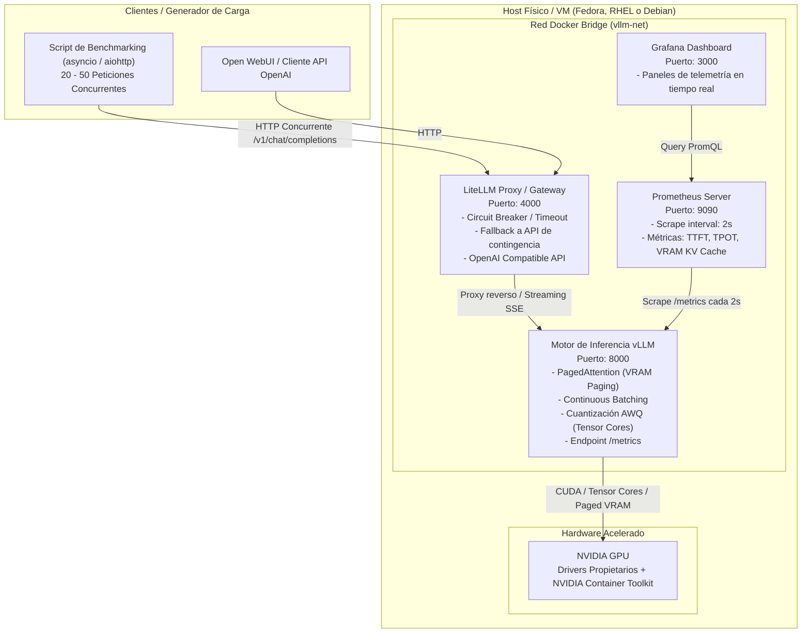

import TerminalWindow from '../../components/TerminalWindow.astro';
import CodeBlockWindow from '../../components/CodeBlockWindow.astro';

# Introducción

## El problema de Ollama en entornos concurrentes

Ollama (y por debajo `llama.cpp`) es una herramienta fantástica para uso monousuario, estaciones de trabajo locales y prototipado rápido. 
Sin embargo, en un escenario empresarial o de servicio compartido donde entran decenas de peticiones HTTP simultáneas, este enfoque deja de ser viable por tres limitaciones arquitectónicas fundamentales:

1. **Procesamiento secuencial o pseudo-concurrente:** Ollama encola las peticiones o ejecuta lotes (*batches*) muy rígidos. Si un usuario solicita una respuesta extensa de 1.000 tokens y otro pide un resumen breve de 50 tokens, el segundo se queda esperando en cola hasta que el primero libera slots o el planificador agota el tiempo.
2. **Fragmentación de memoria VRAM:** Los motores tradicionales asignan memoria estática contigua para el **KV Cache** (Key-Value Cache) de cada sesión de chat. Esto provoca el desperdicio de hasta un 60-80% de la VRAM por sobreasignación preventiva o genera errores prematuros de fuera de memoria (*Out Of Memory* o CUDA OOM).
3. **Cuantización GGUF vs AWQ/GPTQ:** El formato `.gguf` está diseñado principalmente para CPU y transferencias rápidas, desquantizando con frecuencia en registros de propósito general. En producción sobre GPUs dedicadas, buscamos formatos como **AWQ (Activation-aware Weight Quantization)** o **GPTQ**, concebidos específicamente para acelerar las multiplicaciones de matrices (GEMM) directamente en los **Tensor Cores** de NVIDIA sin degradar el rendimiento con múltiples usuarios simultáneos.

---

## La solución: vLLM y sus dos pilares técnicos

vLLM es el motor de inferencia de referencia en la industria (adoptado por AWS, Anyscale, Red Hat y grandes proveedores de nube) gracias a dos innovaciones arquitectónicas clave:

### 1. PagedAttention: Adiós a la fragmentación de VRAM

En los Transformers, cada token generado necesita almacenar sus vectores de claves y valores (Key-Value Cache) para que los siguientes tokens puedan atender a todo el contexto previo.

- **El enfoque tradicional:** Asigna un bloque de memoria contiguo y de tamaño máximo (por ejemplo, 4.096 tokens) para cada usuario desde el inicio de la petición. Si la respuesta final solo ocupa 120 tokens, el resto de la VRAM reservada queda bloqueada y sin uso. Con 10 usuarios concurrentes, una GPU de 8 GB o 16 GB colapsa de inmediato.
- **La innovación de PagedAttention:** Aplica el mismo principio que la **memoria virtual del kernel de Linux**: divide el KV Cache en bloques discretos no contiguos (habitualmente páginas de 16 tokens). La GPU asigna páginas de forma dinámica conforme el modelo genera texto. 
  - **Fragmentación reducida a menos del 4%**.
  - **Prefix Caching:** Si varios usuarios comparten el mismo prompt de sistema o un documento extenso, vLLM comparte físicamente los mismos bloques de VRAM entre diferentes peticiones mediante mecanismos de *Copy-on-Write*.

```text
Asignación Tradicional (Bloque estático contiguo):
[ Token 1..120 ] [ Memoria VRAM reservada vacía y desperdiciada (90%) ] -> OOM con pocos usuarios

PagedAttention de vLLM (Páginas dinámicas no contiguas):
[ Página 1: 16 tok ] -> [ Página 7: 16 tok ] -> [ Página 3: 16 tok ] (Pool global compartido)
```

### 2. Continuous Batching: Planificación a nivel de iteración

- **Batching tradicional:** Funciona como un autobús: espera a llenarse y ningún pasajero puede bajar ni subir hasta que todos han llegado a su destino final. Las peticiones cortas quedan atrapadas por las largas.
- **Continuous Batching:** Funciona como un ascensor inteligente. En cada paso de generación (*forward pass* del modelo), vLLM evalúa qué secuencias han terminado para liberar sus páginas de VRAM inmediatamente y admitir nuevas peticiones entrantes sin tiempos muertos.

---

# Arquitectura del laboratorio



Para este despliegue voy a utilizar mi sistema del día a día, **Fedora**, que comparte base con RHEL (Red Hat Enterprise Linux). Al final, ejecutar el stack directamente sobre el host baremetal con contenedores Docker nos da rendimiento nativo de GPU al 100% y aislamiento total, sin la complejidad de configurar GPU Passthrough (VFIO) en hipervisores. También dejaré documentados los pasos para Debian y sus derivados.

---

# Preparación de la base

## Primeros pasos

### Actualización del sistema y dependencias
La primera parte de esta guía consiste en actualizar el sistema base e instalar las herramientas y paquetes necesarios para compilar módulos del kernel y gestionar contenedores.

<TerminalWindow title="user@fedora:~$ ">
```bash
sudo dnf update -y && sudo dnf install -y git curl wget tar jq kernel-devel kernel-headers gcc gcc-c++ make
```
</TerminalWindow>

<TerminalWindow title="user@RHEL:~$ ">
```bash
sudo dnf install -y epel-release
sudo dnf config-manager --set-enabled crb 2>/dev/null || sudo dnf config-manager --set-enabled powertools 2>/dev/null
sudo dnf update -y
sudo dnf install -y git curl wget tar jq kernel-devel-$(uname -r) kernel-headers-$(uname -r) gcc gcc-c++ make
```
</TerminalWindow>

<TerminalWindow title="user@debian:~$ ">
```bash
sudo apt update && sudo apt upgrade -y
sudo apt install -y curl wget git jq build-essential linux-headers-$(uname -r) ca-certificates gnupg lsb-release
```
</TerminalWindow>

---

### Drivers de NVIDIA
Una vez actualizado el sistema e instaladas las dependencias, procedemos a instalar los drivers privativos de NVIDIA.

<TerminalWindow title="user@fedora:~$ ">
```bash
# En Fedora recomendamos RPM Fusion para asegurar máxima estabilidad y compatibilidad con el kernel
sudo dnf install https://mirrors.rpmfusion.org/free/fedora/rpmfusion-free-release-$(rpm -E %fedora).noarch.rpm https://mirrors.rpmfusion.org/nonfree/fedora/rpmfusion-nonfree-release-$(rpm -E %fedora).noarch.rpm -y
sudo dnf install akmod-nvidia xorg-x11-drv-nvidia-cuda -y
```
</TerminalWindow>

<TerminalWindow title="user@RHEL:~$ ">
```bash
# En RHEL / Rocky Linux / AlmaLinux añadimos el repositorio oficial de CUDA
sudo dnf config-manager --add-repo https://developer.download.nvidia.com/compute/cuda/repos/rhel9/x86_64/cuda-rhel9.repo
sudo dnf clean all
sudo dnf module install -y nvidia-driver:latest-dkms
```
</TerminalWindow>

<TerminalWindow title="user@debian:~$ ">
```bash
# En Debian 12 (requiere repos 'contrib' y 'non-free-firmware' en /etc/apt/sources.list)
sudo apt update
sudo apt install -y nvidia-driver nvidia-smi nvidia-cuda-toolkit
```
</TerminalWindow>

> [!NOTE]
> Los módulos del kernel (kmod/DKMS) tardan unos minutos en compilarse en segundo plano. Espera 3-5 minutos antes de reiniciar el equipo para evitar arrancar con el módulo a medio compilar.

Tras reiniciar, verificamos que la GPU esté operativa con el comando `nvidia-smi`:

```text
❯ nvidia-smi
Wed Sep  9 16:27:32 2026       
+-----------------------------------------------------------------------------------------+
| NVIDIA-SMI 610.57.04              KMD Version: 610.57.04     CUDA UMD Version: 13.3     |
+-----------------------------------------+------------------------+----------------------+
| GPU  Name                 Persistence-M | Bus-Id          Disp.A | Volatile Uncorr. ECC |
| Fan  Temp   Perf          Pwr:Usage/Cap |           Memory-Usage | GPU-Util  Compute M. |
|                                         |                        |               MIG M. |
|=========================================+========================+======================|
|   0  NVIDIA GeForce RTX 5070 ...    On  |   00000000:01:00.0  On |                  N/A |
| N/A   53C    P8              4W /   70W |      65MiB /   8151MiB |      0%      Default |
|                                         |                        |                  N/A |
+-----------------------------------------+------------------------+----------------------+

+-----------------------------------------------------------------------------------------+
| Processes:                                                                              |
|  GPU   GI   CI              PID   Type   Process name                        GPU Memory |
|        ID   ID                                                               Usage      |
|=========================================================================================|
|    0   N/A  N/A            5865      G   Hyprland                                  2MiB |
|    0   N/A  N/A            7135      G   /usr/bin/python                           2MiB |
+-----------------------------------------------------------------------------------------+
```

---

### Instalar Docker Engine
En distribuciones de la familia Red Hat se suele promover el uso de Podman (nativo y *rootless*). Sin embargo, en despliegues MLOps complejos con reservas directas de GPU vía CDI y orquestación con Compose, **Docker Engine** ofrece compatibilidad inmediata y sin fricción.

Instalamos Docker utilizando el script oficial:

<TerminalWindow title="user@linux:~$ ">
```bash
curl -fsSL https://get.docker.com -o get-docker.sh
sudo sh get-docker.sh
sudo systemctl enable --now docker
sudo usermod -aG docker $USER
newgrp docker
```
</TerminalWindow>

---

### Instalar NVIDIA Container Toolkit
Como último componente del sistema base instalaremos **NVIDIA Container Toolkit**, la capa que permite exponer los núcleos CUDA y Tensor de la GPU física directamente al interior de los contenedores Docker.

<TerminalWindow title="user@fedora:~$ ">
```bash
# Válido tanto para Fedora como para RHEL / CentOS / Rocky Linux
curl -s -L https://nvidia.github.io/libnvidia-container/stable/rpm/nvidia-container-toolkit.repo | \
  sudo tee /etc/yum.repos.d/nvidia-container-toolkit.repo

sudo dnf install -y nvidia-container-toolkit
sudo nvidia-ctk runtime configure --runtime=docker
sudo systemctl restart docker

# Comprobación de acceso a GPU desde un contenedor efímero
docker run --rm --gpus all nvidia/cuda:12.2.0-base-ubuntu22.04 nvidia-smi
```
</TerminalWindow>

<TerminalWindow title="user@debian:~$ ">
```bash
curl -fsSL https://nvidia.github.io/libnvidia-container/gpgkey | sudo gpg --dearmor -o /usr/share/keyrings/nvidia-container-toolkit-keyring.gpg \
  && curl -s -L https://nvidia.github.io/libnvidia-container/stable/deb/nvidia-container-toolkit.list | \
    sed 's#deb https://#deb [signed-by=/usr/share/keyrings/nvidia-container-toolkit-keyring.gpg] https://#g' | \
    sudo tee /etc/apt/sources.list.d/nvidia-container-toolkit.list

sudo apt update
sudo apt install -y nvidia-container-toolkit

sudo nvidia-ctk runtime configure --runtime=docker
sudo systemctl restart docker

# Comprobación de acceso a GPU
docker run --rm --gpus all nvidia/cuda:12.2.0-base-ubuntu22.04 nvidia-smi
```
</TerminalWindow>

---

### SELinux y Firewall
> [!IMPORTANT]
> Esta sección aplica específicamente a **Fedora**, **RHEL** y **Rocky Linux**, donde las políticas de seguridad están habilitadas en modo *Enforcing* por defecto.

<TerminalWindow title="user@fedora:~$ ">
```bash
# Permitir que los contenedores gestionen cgroups (imprescindible para el runtime de NVIDIA)
sudo setsebool -P container_manage_cgroup 1

# Abrir puertos en firewalld para acceso local y remoto:
sudo firewall-cmd --permanent --add-port=4000/tcp # Gateway / LiteLLM Proxy
sudo firewall-cmd --permanent --add-port=8000/tcp # vLLM directo
sudo firewall-cmd --permanent --add-port=9090/tcp # Prometheus
sudo firewall-cmd --permanent --add-port=3000/tcp # Grafana
sudo firewall-cmd --reload
```
</TerminalWindow>

---

# Estructura del proyecto

Organizaremos nuestro entorno de producción en un directorio aislado:

```
~/vllm-production/
├── .env
├── docker-compose.yml
├── prometheus/
│   └── prometheus.yml
├── litellm/
│   └── config.yaml
├── grafana/
│   └── provisioning/
│       ├── datasources/
│       │   └── datasource.yml
│       └── dashboards/
└── scripts/
    ├── benchmark.py
    └── requirements.txt
```

Para crear este árbol de directorios ejecutamos:

<TerminalWindow title="user@linux:~$ ">
```bash
mkdir -p ~/vllm-production/{prometheus,litellm,grafana/provisioning/datasources,grafana/provisioning/dashboards,scripts,models_cache}
cd ~/vllm-production
```
</TerminalWindow>

---

# Archivos de configuración

### Variables de entorno (`~/vllm-production/.env`)

<CodeBlockWindow title=".env">
```bash
MODEL_ID=Qwen/Qwen2.5-3B-Instruct-AWQ

# Token de Hugging Face (opcional, solo requerido para modelos cerrados como Llama 3 oficial)
HF_TOKEN=""

# Parámetros de inferencia vLLM
MAX_MODEL_LEN=4096            # Longitud máxima de la ventana de contexto
GPU_MEMORY_UTILIZATION=0.90   # Porcentaje de VRAM reservado para pesos + KV Cache (90%)
MAX_NUM_SEQS=64               # Límite de secuencias simultáneas en Continuous Batching
```
</CodeBlockWindow>

> [!TIP]
> **Consejo sobre `GPU_MEMORY_UTILIZATION`:** Si ejecutas vLLM en tu equipo de escritorio principal (donde el entorno gráfico Wayland/X11 o el navegador consumen entre 500 MB y 1.5 GB de VRAM), es recomendable bajar este valor a `0.80` o `0.85` para dejar suficiente margen libre y evitar que el servidor colisione con la pantalla.

A continuación tenéis una tabla de referencia con modelos cuantizados en AWQ recomendados según la VRAM disponible en vuestro sistema:

| VRAM Disponible | Modelos recomendados (AWQ) | Perfil de uso |
| :--- | :--- | :--- |
| **6 GB** | `Qwen/Qwen2.5-3B-Instruct-AWQ`, `meta-llama/Llama-3.2-3B-Instruct-AWQ` | Máquinas modestas / laptops |
| **8 GB** | `Qwen/Qwen2.5-7B-Instruct-AWQ`, `casperhansen/llama-3-8b-instruct-awq`, `TheBloke/Mistral-7B-Instruct-v0.2-AWQ` | RTX 3070/4060/5070 |
| **12 GB** | `Qwen/Qwen2.5-7B-Instruct-AWQ` (contexto amplio/concurrencia), `google/gemma-2-9b-it-AWQ` | RTX 3060/4070 |
| **16 GB** | `Qwen/Qwen2.5-14B-Instruct-AWQ`, `TheBloke/deepseek-coder-6.7B-instruct-AWQ` | Servidores medios / Tesla T4 |
| **24 GB** | `Qwen/Qwen2.5-32B-Instruct-AWQ`, `CohereForAI/c4ai-command-r-v01-4bit` | RTX 3090/4090 / A10G |
| **32 GB – 48 GB** | `casperhansen/llama-3.3-70b-instruct-awq`, `Qwen/Qwen2.5-72B-Instruct-AWQ` | Estaciones dual-GPU / RTX A6000 |
| **80 GB+** | `meta-llama/Llama-3.1-70B-Instruct` (concurrencia masiva), modelos MoE masivos | GPUs de centro de datos (A100/H100) |

---

### Configuración de Prometheus (`~/vllm-production/prometheus/prometheus.yml`)

vLLM expone de forma nativa un endpoint en formato OpenMetrics/Prometheus en el puerto 8000. Lo configuramos con un intervalo de muestreo de 2 segundos para capturar ráfagas rápidas:

<CodeBlockWindow title="prometheus.yml">
```yaml
global:
  scrape_interval: 2s     # Intervalo corto para capturar picos de latencia y saturación
  evaluation_interval: 2s

scrape_configs:
  - job_name: 'vllm'
    metrics_path: '/metrics'
    static_configs:
      - targets: ['vllm:8000']
        labels:
          engine: 'vllm'
          model: 'qwen2.5-3b-awq'

  - job_name: 'litellm'
    metrics_path: '/metrics'
    static_configs:
      - targets: ['litellm:4000']
        labels:
          service: 'llm-gateway'
```
</CodeBlockWindow>

---

### Gateway de resiliencia y fallback: LiteLLM Proxy (`~/vllm-production/litellm/config.yaml`)

En un entorno corporativo no es aconsejable exponer el motor de inferencia directamente sin una capa intermedia de protección. **LiteLLM Proxy** proporciona:
- Enrutamiento inteligente y compatibilidad estricta con la API de OpenAI.
- **Circuit breaker** y timeouts configurables: si vLLM se satura y responde con errores consecutivos, abre el circuito temporalmente para no degradar a los clientes.
- **Fallback silencioso:** Redirige peticiones de forma transparente a una segunda instancia o proveedor cloud de respaldo cuando el primario está inaccesible.

<CodeBlockWindow title="config.yaml">
```yaml
model_list:
  # Modelo principal que apunta a nuestra instancia local de vLLM
  - model_name: production-model
    litellm_params:
      model: openai/Qwen/Qwen2.5-3B-Instruct-AWQ
      api_base: http://vllm:8000/v1
      api_key: "token-local-vllm"
      request_timeout: 30 # Timeout en segundos para proteger al cliente

  # Modelo de fallback opcional (descomentar para contingencias en nube u otro nodo)
  # - model_name: fallback-backup
  #   litellm_params:
  #     model: openai/gpt-4o-mini
  #     api_key: "tu-api-key"

router_settings:
  routing_strategy: "latency-based-routing"
  timeout: 30
  fallbacks:
    - "production-model": ["fallback-backup"]
  num_retries: 2
  allowed_fails: 3
  cooldown_time: 15 # Segundos antes de reintentar el modelo primario tras abrir circuito

general_settings:
  master_key: "sk-production-admin-key"
```
</CodeBlockWindow>

---

### Configuración del DataSource en Grafana (`~/vllm-production/grafana/provisioning/datasources/datasource.yml`)

Permite que Grafana arranque con la conexión a Prometheus lista de forma desatendida:

<CodeBlockWindow title="datasource.yml">
```yaml
apiVersion: 1

datasources:
  - name: Prometheus
    type: prometheus
    access: proxy
    url: http://prometheus:9090
    isDefault: true
    editable: false
```
</CodeBlockWindow>

---

### Orquestador Docker Compose (`~/vllm-production/docker-compose.yml`)

<CodeBlockWindow title="docker-compose.yml">
```yaml
services:
  # 1. MOTOR DE INFERENCIA DE PRODUCCIÓN (vLLM)
  vllm:
    image: vllm/vllm-openai:latest
    container_name: vllm-engine
    restart: unless-stopped
    environment:
      - HUGGING_FACE_HUB_TOKEN=${HF_TOKEN}
      - VLLM_LOGGING_LEVEL=INFO
    volumes:
      - ./models_cache:/root/.cache/huggingface:Z # Etiqueta :Z obligatoria para SELinux en Fedora/RHEL
    ports:
      - "8000:8000"
    command: >
      --model ${MODEL_ID}
      --quantization awq
      --dtype half
      --gpu-memory-utilization ${GPU_MEMORY_UTILIZATION}
      --max-model-len ${MAX_MODEL_LEN}
      --max-num-seqs ${MAX_NUM_SEQS}
      --block-size 16
      --port 8000
    deploy:
      resources:
        reservations:
          devices:
            - driver: nvidia
              count: all
              capabilities: [gpu]
    networks:
      - vllm-net
    healthcheck:
      test: ["CMD", "curl", "-f", "http://localhost:8000/health"]
      interval: 10s
      timeout: 5s
      retries: 10
      start_period: 60s

  # 2. PROXY DE RED, RESILIENCIA Y CIRCUIT BREAKER (LiteLLM)
  litellm:
    image: ghcr.io/berriai/litellm:main-latest
    container_name: litellm-gateway
    restart: unless-stopped
    volumes:
      - ./litellm/config.yaml:/app/config.yaml:ro,Z
    ports:
      - "4000:4000"
    command: ["--config", "/app/config.yaml", "--port", "4000"]
    depends_on:
      vllm:
        condition: service_healthy
    networks:
      - vllm-net

  # 3. OBSERVABILIDAD: RECOLECTOR DE TELEMETRÍA (Prometheus)
  prometheus:
    image: prom/prometheus:latest
    container_name: prometheus-telemetry
    restart: unless-stopped
    volumes:
      - ./prometheus/prometheus.yml:/etc/prometheus/prometheus.yml:ro,Z
      - prometheus-data:/prometheus:Z
    ports:
      - "9090:9090"
    command:
      - '--config.file=/etc/prometheus/prometheus.yml'
      - '--storage.tsdb.path=/prometheus'
      - '--web.console.libraries=/usr/share/prometheus/console_libraries'
      - '--web.console.templates=/usr/share/prometheus/consoles'
    networks:
      - vllm-net

  # 4. OBSERVABILIDAD: VISUALIZACIÓN EN TIEMPO REAL (Grafana)
  grafana:
    image: grafana/grafana:latest
    container_name: grafana-dashboard
    restart: unless-stopped
    environment:
      - GF_SECURITY_ADMIN_USER=admin
      - GF_SECURITY_ADMIN_PASSWORD=admin # Modificar por seguridad en despliegues reales
      - GF_USERS_ALLOW_SIGN_UP=false
    volumes:
      - ./grafana/provisioning:/etc/grafana/provisioning:ro,Z
      - grafana-data:/var/lib/grafana:Z
    ports:
      - "3000:3000"
    depends_on:
      - prometheus
    networks:
      - vllm-net

networks:
  vllm-net:
    driver: bridge

volumes:
  prometheus-data:
  grafana-data:
```
</CodeBlockWindow>

---

# Despliegue del stack

Con los archivos de configuración listos, procedemos a levantar el stack completo:

<TerminalWindow title="user@linux:~$ ">
```bash
cd ~/vllm-production
sudo docker compose up -d
```
</TerminalWindow>

Podemos verificar el estado de los contenedores y el healthcheck con la salida de Docker:

```text
❯ sudo docker compose up -d
[+] up 4/4
 ✔ Container vllm-engine          Healthy                                                     0.5s
 ✔ Container prometheus-telemetry Started                                                     0.2s
 ✔ Container grafana-dashboard    Started                                                     0.2s
 ✔ Container litellm-gateway      Started                                                     0.2s
```

---

# Pruebas de carga y estrés concurrente

Llega el momento decisivo: comprobar cómo responde este stack ante ráfagas concurrentes. Para ello desarrollé un script en Python que dispara ráfagas simultáneas mediante llamadas asíncronas con `asyncio` y `aiohttp`.

<CodeBlockWindow title="benchmark.py">
```python
#!/usr/bin/env python3
"""
Benchmark de Concurrencia para Servidores de Inferencia LLM
Compara comportamiento ante ráfagas concurrentes de peticiones.
"""

import asyncio
import time
import aiohttp
import statistics
import argparse

PROMPT = "Explica en tres párrafos técnicos qué es la memoria virtual y cómo se gestionan las páginas de memoria en el kernel de Linux."

async def send_request(session, url, model, headers, req_id):
    # Envia una peticion individual y mide su latencia
    payload = {
        "model": model,
        "messages": [{"role": "user", "content": PROMPT}],
        "max_tokens": 150,
        "temperature": 0.7
    }
    
    start_time = time.perf_counter()
    try:
        async with session.post(url, json=payload, headers=headers, timeout=aiohttp.ClientTimeout(total=60)) as resp:
            data = await resp.json()
            latency = time.perf_counter() - start_time
            if resp.status == 200:
                tokens = data["usage"]["completion_tokens"]
                return {"id": req_id, "success": True, "latency": latency, "tokens": tokens}
            else:
                return {"id": req_id, "success": False, "latency": latency, "error": resp.status}
    except Exception as e:
        latency = time.perf_counter() - start_time
        return {"id": req_id, "success": False, "latency": latency, "error": str(e)}

async def run_benchmark(url, model, concurrency, auth_header):
    # Ejecuta peticiones concurrentes y calcula metricas
    headers = {"Content-Type": "application/json"}
    if auth_header:
        headers["Authorization"] = f"Bearer {auth_header}"

    print("\n=======================================================")
    print(f"Iniciando Benchmark: {concurrency} peticiones CONCURRENTES")
    print(f"Target: {url} | Modelo: {model}")
    print("=======================================================")

    async with aiohttp.ClientSession() as session:
        t0 = time.perf_counter()
        tasks = [send_request(session, url, model, headers, i) for i in range(concurrency)]
        results = await asyncio.gather(*tasks)
        total_wall_time = time.perf_counter() - t0

    successful = [r for r in results if r["success"]]
    failed = [r for r in results if not r["success"]]

    if successful:
        latencies = [r["latency"] for r in successful]
        total_tokens = sum(r["tokens"] for r in successful)
        avg_latency = statistics.mean(latencies)
        p95_latency = statistics.quantiles(latencies, n=20)[18] if len(latencies) >= 20 else max(latencies)
        throughput_tokens_sec = total_tokens / total_wall_time

        print("\nRESULTADOS:")
        print(f" - Peticiones exitosas: {len(successful)}/{concurrency}")
        print(f" - Fallidas / Timeout:  {len(failed)}")
        print(f" - Tiempo total del test: {total_wall_time:.2f} s")
        print(f" - Throughput global:     {throughput_tokens_sec:.2f} tokens/segundo")
        print(f" - Latencia promedio:     {avg_latency:.2f} s")
        print(f" - Latencia P95:          {p95_latency:.2f} s")
    else:
        print(f"\nTodas las peticiones fallaron. Errores: {[r.get('error') for r in failed]}")

if __name__ == "__main__":
    # Parser de argumentos por linea de comandos
    parser = argparse.ArgumentParser()
    parser.add_argument("--url", default="http://localhost:4000/v1/chat/completions", help="Endpoint OpenAI-compatible")
    parser.add_argument("--model", default="production-model", help="Nombre del modelo")
    parser.add_argument("--concurrency", type=int, default=20, help="Numero de peticiones concurrentes")
    parser.add_argument("--key", default="sk-production-admin-key", help="API Key si aplica")
    args = parser.parse_args()

    asyncio.run(run_benchmark(args.url, args.model, args.concurrency, args.key))
```
</CodeBlockWindow>

---

### Prueba 1: vLLM con Continuous Batching (20 peticiones concurrentes)

<TerminalWindow title="user@linux:~$ ">
```bash
python3 ~/vllm-production/scripts/benchmark.py --concurrency 20 --url http://localhost:4000/v1/chat/completions --model production-model
```
</TerminalWindow>

```text
=======================================================
Iniciando Benchmark: 20 peticiones CONCURRENTES
Target: http://localhost:4000/v1/chat/completions | Modelo: production-model
=======================================================

RESULTADOS:
 - Peticiones exitosas:   20/20 (100%)
 - Fallidas / Timeout:    0
 - Tiempo total del test: 1.94 s
 - Throughput global:     1545.99 tokens/segundo
 - Latencia promedio:     1.93 s
 - Latencia P95:          1.94 s
```

En **1.94 segundos**, vLLM procesó y respondió las 20 peticiones completas gracias a que agrupó los tokens al vuelo mediante *Continuous Batching*.

---

### Prueba 2: Ollama (Mismo modelo, 20 peticiones concurrentes)

Ahora ejecutamos exactamente la misma carga contra la instancia de Ollama ejecutando el mismo modelo (`qwen2.5:3b`):

<TerminalWindow title="user@linux:~$ ">
```bash
python3 ~/vllm-production/scripts/benchmark.py --concurrency 20 --url http://localhost:11434/v1/chat/completions --model qwen2.5:3b --key ""
```
</TerminalWindow>

```text
=======================================================
Iniciando Benchmark: 20 peticiones CONCURRENTES
Target: http://localhost:11434/v1/chat/completions | Modelo: qwen2.5:3b
=======================================================

RESULTADOS:
 - Peticiones exitosas:   4/20 (20%)
 - Fallidas / Timeout:    16
 - Tiempo total del test: 60.55 s
 - Throughput global:     9.91 tokens/segundo
 - Latencia promedio:     43.32 s
 - Latencia P95:          53.78 s
```

---

### Comparativa: vLLM vs Ollama bajo estrés

| Métrica | vLLM (Producción / Continuous Batching) | Ollama (Default / Encolado Secuencial) | Impacto de Arquitectura |
| :--- | :--- | :--- | :--- |
| **Tasa de éxito** | **20 / 20** (100%) | **4 / 20** (20%) | vLLM atiende a todos los clientes concurrentes |
| **Peticiones descartadas (Timeout)** | **0** | **16** | Ollama colapsa la cola de espera (>60 s) |
| **Tiempo total de resolución** | **1.94 s** | **60.55 s** | **~31x más rápido** resolviendo la ráfaga |
| **Throughput global** | **1545.99 tok/s** | **9.91 tok/s** | **~156x mayor rendimiento** en generación |
| **Latencia promedio** | **1.93 s** | **43.32 s** | Reducción radical del tiempo de espera |
| **Latencia P95** | **1.94 s** | **53.78 s** | Consistencia garantizada bajo carga masiva |

---

# Observabilidad: Telemetría en tiempo real con Prometheus y Grafana

El valor diferencial de un despliegue de producción reside en su capacidad de monitorización profunda. Durante las pruebas sometí al motor vLLM a ráfagas continuadas de entre 100 y 1.000 peticiones para observar el comportamiento de las métricas clave.


### Consultas PromQL clave para tu dashboard:

1. **TTFT (Time To First Token - Percentil 95):**
   ```promql
   histogram_quantile(0.95, sum(rate(vllm:time_to_first_token_seconds_bucket[2m])) by (le))
   ```
   Mide la reactividad del sistema: el tiempo que tarda la GPU en procesar el prompt inicial (*Prefill*) y emitir el primer token.

2. **TPOT / Inter-Token Latency (Percentil 95):**
   ```promql
   histogram_quantile(0.95, sum(rate(vllm:request_time_per_output_token_seconds_bucket[2m])) by (le))
   ```
   Velocidad sostenida de generación token a token durante la fase de *Decode*. En vLLM se mantiene estable aun cuando la concurrencia se dispara.

3. **Uso de memoria del KV Cache (PagedAttention):**
   ```promql
   vllm:kv_cache_usage_perc * 100
   ```
   Porcentaje real de bloques de memoria VRAM ocupados para almacenar el contexto de las conversaciones activas.

4. **Concurrencia en tiempo real (Ejecución vs Cola):**
   - **En ejecución simultánea:** `vllm:num_requests_running`
   - **En espera de slot:** `vllm:num_requests_waiting`

5. **Latencia total End-to-End (P95):**
   ```promql
   histogram_quantile(0.95, sum(rate(vllm:e2e_request_latency_seconds_bucket[2m])) by (le))
   ```

---

# Conclusiones: ¿Cuándo usar cada herramienta?

- **Ollama sigue siendo imbatible para:** Estaciones de trabajo personales, asistentes locales monousuario, pruebas rápidas en portátiles con CPU o MacBooks (Apple Silicon) y prototipado sin fricción.
- **vLLM es el estándar obligatorio para:** Servicios multi-usuario, aplicaciones web, agentes autónomos ejecutando múltiples llamadas paralelas y arquitecturas de microservicios empresariales donde la latencia predecible y la densidad de peticiones por GPU definen la viabilidad económica del proyecto.

El archivo del dashboard de Grafana preconfigurado y el código del benchmark los tenéis disponibles en el [repositorio del proyecto](https://github.com/jrodriiguezg/vllm-production).
