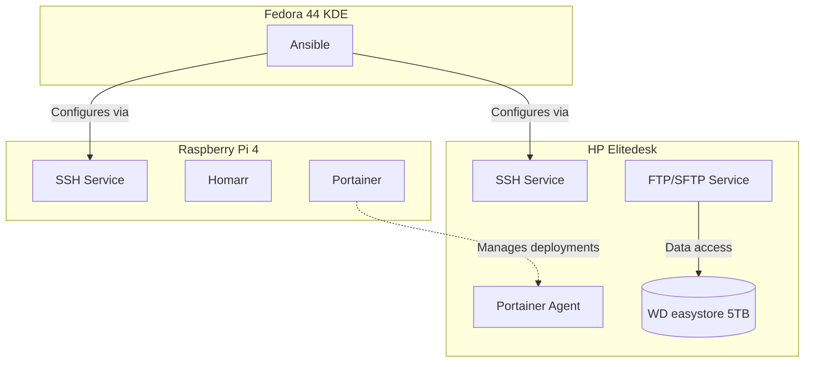

import TerminalWindow from '../../../components/TerminalWindow.astro';
import CodeBlockWindow from '../../../components/CodeBlockWindow.astro';

## Introduction
After looking at the services I use to manage the logical network in previous posts, it is now time to see how I manage the entire infrastructure. When I speak of management, I refer to server administration, monitoring the status of each service, container monitoring, independent system health, etc. In this first part of the management block, I will show you how I manage each server individually, as well as how I unify the Docker containers under a single console.

The logical diagram for this block is as follows:

Here, we no longer follow a strict order; each service acts on different tasks and has its own job.

If this is your first time reading this blog, I invite you to check out the other entries here:

- [**Introduction to my HomeLab - Setup and First Steps**](/en/blog/introduccion-al-homelab/)
- [**Networking Block I - Domains**](/en/blog/bloque-de-red-I)
- [**Networking Block II - Services**](/en/blog/bloque-de-red-ii-servicios/)
- [**Management Block I - Administration**](/en/blog/bloque-de-gestion-i-administracion/)
- **Management Block II - Monitoring**
- **Services Block**
- **Tweaks, Backups, and Extras**

> The *compose* files published here will be adapted to be deployed independently, without necessarily being in the same network *stack*.

## Portainer
### What is Portainer?
It is a lightweight graphical user interface tool that allows you to manage and deploy containers without needing to use the command line. It acts as a centralized web dashboard for container platforms like Docker, Docker Swarm, and Kubernetes.

### What is a container?
It is a lightweight, standardized software unit that packages an application's code, its tools, and all of its dependencies. This allows the application to run quickly, isolated, and smoothly in any environment, whether on a laptop or a cloud server. The main advantages of using containers are:
- **Portability**: Containers eliminate the "it works on my machine but not in production" problem. They run exactly the same regardless of the host operating system.
- **Isolation**: They allow you to package an application and run it autonomously. You can have multiple containers running on the same machine without them interfering with each other.
- **Efficiency**: Unlike traditional virtual machines, containers share the host's kernel, making them incredibly fast and requiring fewer system resources.

### If you can monitor from here, why is it in administration?
While it is true that Portainer allows you to monitor the status of containers and the nodes themselves, the tool was created to simplify container deployment, especially for users who are not as accustomed to using the terminal or still find it intimidating. I use the terminal a lot and can assure you I am not afraid of it, but managing Docker containers via CLI on a tablet or mobile phone is tedious and highly suboptimal. Therefore, I use Portainer instead.

### Deployment
The Portainer infrastructure consists of a main server and one or more agents. The main server serves the administration console and manages everything centrally, while these agents are installed on each available node to send the required information to the main server (acting as connecting bridges). For Portainer, we optionally map a directory to store the configuration at `/data`. We will keep using the `docker` directory we set up previously, creating a `portainer` subdirectory within it, and a `data` folder inside that.
```bash
mkdir ~/docker/portainer && mkdir ~/docker/portainer/data
```

### Docker Compose
<CodeBlockWindow title="docker-compose.yaml">
```yaml
services:
  portainer:
    image: portainer/portainer-ce:latest # Community Edition image, we could use portainer-ee for Business Edition
    container_name: portainer # Container name
    restart: unless-stopped
    ports:
      - "9000:9000" # Ports to map: one for the web interface, one for communication with agents
      - "8000:8000"
    volumes:
      - /var/run/docker.sock:/var/run/docker.sock:ro # Important: we map the docker socket to the container with read-only permissions
      - ~/docker/portainer/data:/data # Configuration data directory created earlier
```
</CodeBlockWindow>

Once deployed, we access the web interface at `http://SERVER_IP:9000`, where we will be prompted to create an administrator user. From there, we can add the nodes we want to manage. In my setup, the Raspberry Pi serves as the main server and the HP Elitedesk acts as the agent node.

## Homarr
### What is Homarr?
It is a customizable, open-source dashboard that serves as a centralized control panel for all services deployed in the homelab. It is essentially the homepage of the entire infrastructure, providing one-click access to each service.

Homarr's philosophy is to provide a general overview of everything deployed, its status, and quick access. It acts like a virtual desktop for your homelab.

### Why do I use Homarr?
Before Homarr, I used a simple HTML page with links, but updating it manually every time I deployed a new service became tedious. Homarr makes it easy to add cards and, most importantly, displays the real-time status of each service, letting me know if something is down without having to check each application individually.

### Deployment
For Homarr, we create the configuration folder inside the `docker` directory:
```bash
mkdir ~/docker/homarr && mkdir ~/docker/homarr/appdata
```

### Docker Compose
<CodeBlockWindow title="docker-compose.yaml">
```yaml
services:
  homarr:
    container_name: homarr
    image: ghcr.io/homarr-labs/homarr:latest
    restart: unless-stopped
    volumes:
      - /var/run/docker.sock:/var/run/docker.sock # Allows Homarr to read the status of other containers
      - ./homarr/appdata:/appdata # Local configuration persistence
    environment:
      - SECRET_ENCRYPTION_KEY=YOUR_KEY_HERE
    ports:
      - '7575:7575' # Exposes port 7575 of the container on port 7575 of your host
```
</CodeBlockWindow>

To generate the *SECRET_ENCRYPTION_KEY*, we can run `openssl rand -hex 32`:

<TerminalWindow title="jrodriiguezg@rpi4:~/docker/homarr">
  ```text
  jrodriiguezg@rpi4:~/docker/homarr$ docker compose up -d
  [+] Running 2/2
   ✔ homarr Pulled                                                                                              12.3s
   ✔ Container homarr Started                                                                                    0.3s
  jrodriiguezg@rpi4:~/docker/homarr$
  ```
</TerminalWindow>

Once it is running, we access `http://SERVER_IP:7575`, and the Homarr interface will appear, allowing us to start adding cards for each deployed service.

## SSH
### What is SSH?
**SSH** (Secure Shell) is a cryptographic network protocol that allows you to execute commands remotely on a system securely. It is the tool I use to manage all my servers, enabling remote administration from anywhere on the local network.

### Why is it important in a homelab?
Without SSH, administering servers comfortably would be impossible. All configuration, package updates, log reviews, and nearly every administrative task are done over an SSH connection. It is the foundational tool of any system administrator.

### Configuration
SSH comes pre-installed on most Linux distributions, but doing a basic configuration to improve security is highly recommended. The first step is to change the default port (22) and disable root login:
<TerminalWindow title="SSH config">
```bash
sudo nano /etc/ssh/sshd_config

# Find and modify the following lines:

Port 2222                    # Custom port
PermitRootLogin no           # Do not allow root login
PasswordAuthentication no    # Authenticate via key only

# Then restart the service:
sudo systemctl restart sshd

# Connecting from a client
# To connect from another Linux or macOS machine:

ssh -p 2222 user@SERVER_IP


# If using Windows, we can use PuTTY or the built-in PowerShell terminal:
ssh -p 2222 user@SERVER_IP
```
</TerminalWindow>


## Ansible
### What is Ansible?
It is an infrastructure automation and configuration management tool. It allows you to define the desired state of your servers using *playbooks* written in **YAML** and execute them remotely across multiple machines simultaneously.

### What do I use it for?
In my setup, I use it for repetitive tasks like system updates, package installations, user creation, or any configuration that needs to be applied uniformly across all servers. Instead of connecting to each server individually and running the same commands, I write a playbook and execute it against all of them at once.

### What is a playbook?
It is a **YAML** file that defines a set of tasks that Ansible should execute on specified hosts (servers). Each task uses a *module* responsible for carrying out a specific action, such as installing a package, copying a file, or running a command.

### Installation
Ansible can be installed with:
```bash
sudo apt install ansible
```

### Basic Structure
To organize playbooks, it is standard practice to create a folder structure:
```bash
mkdir ~/ansible/{playbooks,inventory,roles}
```

The **inventory** file defines the servers we will manage:
<CodeBlockWindow title="inventory">
```ini
[servers]
rpi4 ansible_host=192.168.1.100 ansible_user=jrodriiguezg
hp ansible_host=192.168.1.101 ansible_user=jrodriiguezg
```
</CodeBlockWindow>

### Example Playbook
A basic playbook to update all servers:
<CodeBlockWindow title="actualizar.yaml">
```yaml
---
- name: Update all servers
  hosts: servers
  become: yes
  tasks:
    - name: Update package cache
      apt:
        update_cache: yes
        cache_valid_time: 3600

    - name: Upgrade packages
      apt:
        upgrade: dist

    - name: Clean up package cache
      apt:
        autoremove: yes
```
</CodeBlockWindow>

To run it:
```bash
ansible-playbook -i inventory/hosts playbooks/actualizar.yaml
```

### Advantages
- No agent required on target servers (it uses SSH).
- Playbooks are declarative; you describe the desired state, and Ansible takes care of achieving it.
- It is idempotent: running the same playbook multiple times does not cause issues, as it only applies necessary changes.

## FTP/SFTP
### What is FTP/SFTP?
**FTP** (File Transfer Protocol) is a protocol designed for transferring files between a client and a server. **SFTP** (SSH File Transfer Protocol) is a secure variant that encrypts both commands and data, operating over an SSH connection.

In my lab, I use SFTP to access files on my 5TB external hard drive from other devices on the network—for example, to transfer movies or music without needing to connect via SSH CLI.

### Why SFTP instead of FTP?
FTP transmits data (including usernames and passwords) in plain text, making it insecure on any network. SFTP encrypts all communication, making it the recommended option whenever possible.

### Deployment
For the FTP/SFTP service, I use `vsftpd`, which is one of the most widely used FTP servers in Linux due to its stability and security. Unlike the other services, I do not run this in a Docker container, but rather install it directly on the host system.

Installation on Debian is straightforward:
```bash
sudo apt install vsftpd
```

### Configuration
We edit the configuration file:
<TerminalWindow title="FTP Conf">
```bash
sudo nano /etc/vsftpd.conf


# The most important configurations are:

listen=YES                    # Listen on IPv4
listen_ipv6=NO                # Disable IPv6
anonymous_enable=NO           # Do not allow anonymous access
local_enable=YES              # Allow local users
write_enable=YES              # Allow write operations
chroot_local_user=YES         # Isolate local users in their home directory
allow_writeable_chroot=YES    # Allow writing inside the user root directory
pasv_enable=YES               # Enable passive mode
pasv_min_port=40000           # Minimum port range for passive mode
pasv_max_port=40100           # Maximum port range for passive mode


# Then restart the service:

sudo systemctl restart vsftpd
sudo systemctl enable vsftpd

# Connecting from a client:
sftp -P 22 user@192.168.1.101
```
</TerminalWindow>

From the FileZilla graphical user interface, you just need to fill in the fields for IP, user, password, and port **22**.

## Conclusion
That's it for the first part of the management block. We've seen how I manage each server individually: from **Portainer** for container management and **Homarr** as a centralized dashboard, to **SSH** for remote access, **Ansible** for automating tasks, and **SFTP** for file transfers.

In the next post, we will cover monitoring, explaining how I monitor the state of services, containers, and servers in real-time.

If you have any questions or suggestions, feel free to leave them in the comments.
