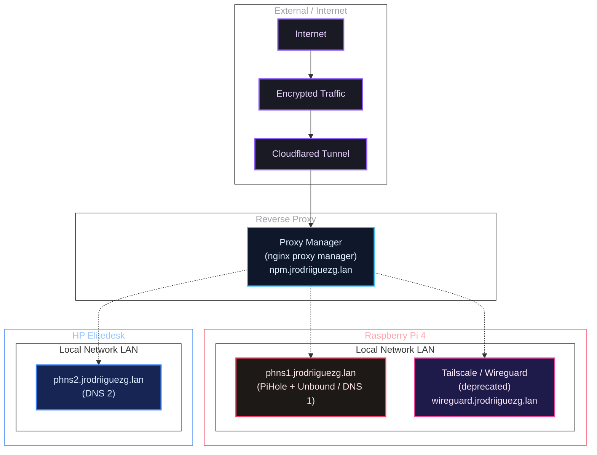
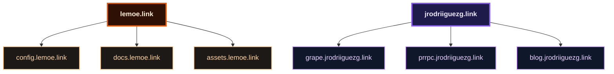

# Introduction
Well, as I mentioned in the previous post, I was going to split presenting my **HomeLab** into different *posts* to avoid making it too long. This is the second publication of all those to come. I could have grouped the entire network block together, but this part contains a lot of details and would have been too long.

This is the network block referring to all the **Internet** parts that I do not manage directly.

If this is your first time reading this blog, I invite you to check out the other entries here:
- [**Introduction to my HomeLab - Startup and First Steps**](/en/blog/introduccion-al-homelab/)
- [**Network Block I - Domains**](/en/blog/bloque-de-red-I)
- **Network Block II - Services**
- **Management Block I - Administration**
- **Management Block II - Monitoring**
- **Services Block**
- **Tweaks, Backups, and Extras**

Below, I show you the **logical** network diagram representing only the parts I will cover in this block:

## A Little Theory
Before starting to talk about the network block and, specifically, about this first part (domains), I will comment on some **theory** in case the person reading this is not familiar with the **terms** I use. First of all:

### What is a domain?
It is a **unique** and exclusive address that identifies a website on **Internet**, allowing a user to find it easily. It is the digital name or mailing address that avoids having to remember numerical IP addresses. An example of this is this very domain: [docs.jrodriiguezg.link](https://docs.jrodriiguezg.link).

Now the next one,

### DNS?
The **DNS** (Domain Name System) is like the **phone book** of the **Internet**. Its sole purpose is to map a domain to the IP address where it is located. Thus, when someone types a domain in the browser, this system **automatically** redirects them to the hosting server.

Now that we know what a **domain** and **DNS** are, let's look at the provider I chose: **Cloudflare**.

And why **Cloudflare**? After looking at several options (Ionos, Hostinger, etc.), **Cloudflare** was the one that offered the most for the lowest price. The base plan has many interesting features, is **fast** and **secure**, and the analytics panel is wonderful.

Now I will explain the domains I have: I have two **public** ones and one **private** one, which then branch into subdomains.

## The Domains
At an **internal level**, I have a domain ending in `.lan`, which resolves to 12 subdomains for each service deployed, which we can see in the following diagram:

```mermaid
flowchart TD
    %% Definition of Styles (Premium Dark Mode)
    classDef rootNode fill:#1e1b4b,stroke:#d97706,stroke-width:3px,color:#fef3c7,font-weight:bold;
    classDef categoryNode fill:#0f172a,stroke:#94a3b8,stroke-width:2px,color:#f1f5f9,font-weight:bold;
    classDef rpiNode fill:#1c1917,stroke:#f43f5e,stroke-width:1.5px,color:#ffe4e6;
    classDef eliteNode fill:#172554,stroke:#3b82f6,stroke-width:1.5px,color:#dbeafe;
    classDef proxyNode fill:#061f2d,stroke:#06b6d4,stroke-width:1.5px,color:#cffafe;

    %% Root Node
    Root["jrodriiguezg.lan"]:::rootNode

    %% Categories / Hosts
    CatProxy["Infrastructure / Proxy"]:::categoryNode
    CatRPi4["Raspberry Pi 4"]:::categoryNode
    CatHP["HP Elitedesk"]:::categoryNode

    %% Connections Root to Branches
    Root --> CatProxy
    Root --> CatRPi4
    Root --> CatHP

    %% Proxy Subdomains
    npm["npm.jrodriiguezg.lan<br>(Nginx Proxy Manager)"]:::proxyNode
    CatProxy --> npm

    %% Subdomains on Raspberry Pi 4
    hmr["hmr.jrodriiguezg.lan<br>(Homarr)"]:::rpiNode
    phns1["phns1.jrodriiguezg.lan<br>(DNS 1 / PiHole)"]:::rpiNode
    uptime["uptime-kuma.jrodriiguezg.lan<br>(Uptime Kuma)"]:::rpiNode
    gitea["gitea.jrodriiguezg.lan<br>(Gitea Server)"]:::rpiNode
    wg["wireguard.jrodriiguezg.lan<br>(VPN)"]:::rpiNode
    portainer1["portainer.jrodriiguezg.lan<br>(Portainer)"]:::rpiNode

    CatRPi4 --> hmr
    CatRPi4 --> phns1
    CatRPi4 --> uptime
    CatRPi4 --> gitea
    CatRPi4 --> wg
    CatRPi4 --> portainer1

    %% Subdomains on HP Elitedesk
    jelly["jellyfin.jrodriiguezg.lan<br>(Jellyfin Media)"]:::eliteNode
    navi["navidrome.jrodriiguezg.lan<br>(Navidrome)"]:::eliteNode
    qbtt["qbtt.jrodriiguezg.lan<br>(qBittorrent)"]:::eliteNode
    phns2["phns2.jrodriiguezg.lan<br>(DNS 2)"]:::eliteNode
    zabbix["zabbix.jrodriiguezg.lan<br>(Zabbix)"]:::eliteNode

    CatHP --> jelly
    CatHP --> navi
    CatHP --> qbtt
    CatHP --> phns2
    CatHP --> zabbix

    %% Subgraph styles (Transparent Background)
    style Root font-size:16px;
    style CatProxy fill:none,stroke:#27272a,stroke-width:1px;
    style CatRPi4 fill:none,stroke:#f43f5e,stroke-width:1px;
    style CatHP fill:none,stroke:#3b82f6,stroke-width:1px;
```

> These are not accessible from the **Internet**

At an **external level**, that is, facing the **public**, I have two domains, both purchased from **Cloudflare**. These are [jrodriiguezg.link](https://jrodriiguezg.link) and [lemoe.link](https://lemoe.link), which host several subdomains as shown below:

As I think you have realized because I mentioned it, I use **Cloudflare** for the **management** of the parts exposed to the **Internet**, as well as the domains. Because of this, and so that you can see a bit of the **Cloudflare** dashboard ([dash.cloudflare.com](https://dash.cloudflare.com)), I am going to show some of the most **important** configurations and highlighted sections of the console.

## A Tour of the Dash
As I mentioned half a **paragraph** ago, I'm now going to show the **Cloudflare** dashboard, some of the configurations I have applied (just some, it has a thousand things!), as well as interesting parts.

### Basic Configurations and Interesting Sections
The first thing I'm going to highlight are the **buckets**, which are storage instances that **Cloudflare** provides for free (up to 10 GB free). The **images** you see here are stored there.

Another **interesting** thing is the ability to block certain **crawlers**. These are the bots used by AI services and some search engines to scan web **pages** and analyze their content; I have them **blocked** (only some).

The next one is the **most basic** screen, the web **traffic** dashboard, which shows real-time **traffic** of the domain or both (depending on the **configuration**).

From the security settings, you can block certain things or activate security measures. Some of these include the AI crawler shield or blocking **DDoS** attacks.

**Cloudflare** does not offer email inboxes (at least I haven't found them); what it **does** offer is **email routing** using the domain.

And, **finally**, the **workers** and **pages**. This is storage for **static** websites; **here**, for example, this very blog is hosted.

The tour was short because looking at all the options in the *dash* would **make** this *post* very long. If you are looking for a domain, I encourage you to use **Cloudflare** as it works very well.

I haven't mentioned this, but there are two domains at the external level that serve content from my local **infrastructure**, using an official Cloudflare service called `cloudflared`, which we will look at now.

## Connection with the Local Infrastructure
As **mentioned** before, I have two domains that are served from the local **infrastructure** (I'm not going to say **which ones**, but **they are there**). To serve these domains, I used a Cloudflare service called `cloudflared` that creates a **tunnel** between my infrastructure and Cloudflare's.

The part of the dashboard where we find this is called **Cloudflare Zero Trust** or **Cloudflare One**.

In this case, we go to the connectors where we have the created connector; from **here**, the domains we want to expose are managed.

Thanks to this service, I don't need to open ports on my router or expose my infrastructure. Now I will **explain how** to install it, which is quite simple:

To install the **tunnel**, we go to the console, to the connectors section, and click on *Create a tunnel*.

**Next**, it will **ask** us for the type of **tunnel** we want to use; for now, I've only tried `cloudflared`.

We assign it a name.

And we will **get** a list of deployment options; I use **Docker** for everything.

This will **give us back** a command with a token; this is just copy and paste in the terminal and it configures itself. After a few seconds, it will **appear** in the connectors console.

## Conclusion
This entry **may** have been somewhat short. The next one, I assure you, is a bit **longer**, but it is better to offer small **bites** with quality **information** than a giant text that no one will read. So, up to here we have seen everything that connects my infrastructure facing the outside. Now we **make** a pause until the next *post*, in which we will start looking at the infrastructure at the local level.
