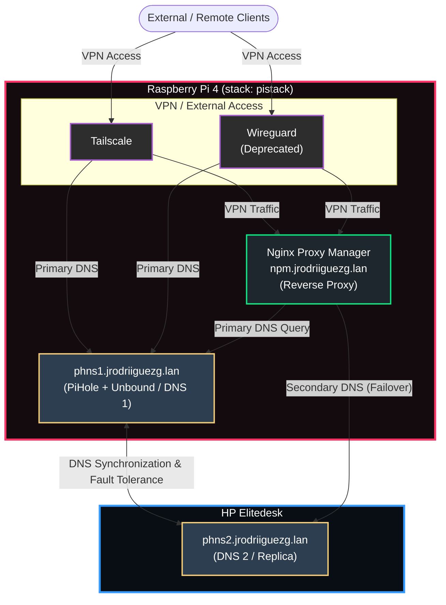

import TerminalWindow from '../../../components/TerminalWindow.astro';


## Introduction
Well, this is a continuation of my previous post in which I explained how the network block is configured facing the *Internet*, leaving as a separate point the *cloudflared* service, which is the connector between my local infrastructure and the *Cloudflare* servers that face the outside (*Internet*).

As you will see, this block is composed of several services that I have ordered from least to most internal (by least to most, I mean from furthest outside the network to furthest inside), although this order is relative and also goes from most important to least.

In the first post of this series, I showed my complete logical diagram. Today we are going to focus on these services:



You can see in the diagram the services that correspond to the network block. Since everything has been deployed using *Docker*, I will put all the files here along with their explanations of what each thing does in case you want to replicate the deployment.

If this is your first time reading this blog, I invite you to see the rest of the entries here:

- [**Introduction to my HomeLab - Startup and First Steps**](/en/blog/introduccion-al-homelab/)
- [**Network Block I - Domains**](/en/blog/bloque-de-red-I)
- [**Network Block II - Services**](/en/blog/bloque-de-red-ii-servicios/)
- **Management Block I - Administration**
- **Management Block II - Monitoring**
- **Services Block**
- **Tweaks, Backups, and Extras**

> The *compose* files published here will be adapted to be deployed independently without being on the same network *stack*

## Nginx Proxy Manager
This is the second service if we follow the order from most external to most internal, and it is also of vital importance to avoid depending on or remembering all the ports of all the services (it also acts as a filter for requests from the outside).

#### What is NPM?
It is a tool that provides a graphical interface to configure and manage a reverse proxy, more precisely *Nginx*.
We can think of it as the gatekeeper of my *homelab*: it receives a request and silently routes it to the container hosting the service.


#### What is a proxy?
It is a computer program that acts as an intermediary between a device and an end server. When a request is sent for content, it first goes to the *proxy*, which processes and routes the request to the destination.
It allows hiding the client's IP, filtering access to certain content, improving speed through *caching*, etc.

#### How is it deployed?
For the deployment of this and all the services we will be seeing, I recommend creating a directory that unifies all the **docker-compose.yaml** files and all configuration folders in an organized manner. For example, I use a **docker** folder in the root of the *home* directory of my *homelab*'s user, but this decision is up to everyone; then, for each service I create a folder inside the previous one to separate its files.

In this deployment, two folders are mapped, one for *data* and another for *certificates*. It is recommended to create the folders before deploying the container; we can use the following command:
```bash 
mkdir docker/npm && mkdir -p docker/npm/{data,letsencrypt}
```
*This command will create the **npm** folder inside **docker** and then the two folders that are mapped from the container.*


#### Docker Compose
All the files used in the deployments are unified, both the adapted ones and the originals that I used; although here they are presented in the same way, but with the explanation:
```yaml
nginx-proxy-manager: 
    image: jc21/nginx-proxy-manager:latest # Deployment image
    container_name: nginx-proxy-manager # Container name
    restart: unless-stopped # This indicates that the container should always restart unless it is stopped
    network_mode: "host" # We use host network mode to avoid having to map ports
    volumes:
      - ./docker/npm/data:/data # We map the data folder to the folder we created earlier
      - ./docker/npm/letsencrypt:/letsencrypt # We map the letsencrypt folder to the folder we created earlier
```

This is the content of the **docker-compose.yaml** file. Once we have it, we only need to run the command `docker compose up -d` and we can check if it has started with `docker ps`.

#### Configurations and use


## Pi-hole and Unbound
These two services are the third most important, especially at the level of internal network resolution; because without them (especially Pi-hole), as it is responsible for resolving the domains specified in NPM.
#### What is Pi-hole?

It is an ad and tracker blocker at the network level. It functions as a "gatekeeper" that filters all Internet traffic before ads load, improving the speed, privacy, and security of the home network.

#### How do its blocklists work?
They work like an access control blacklist. Instead of filtering the content of a web page when it is already downloading, Pi-hole intercepts traffic at the DNS level.

Blocklists are simple text files containing thousands of web addresses (domains) known to serve advertising, trackers, malware, or scams.

When a web page requests the IP address of a domain, Pi-hole checks if that domain is in its lists and, if it is, stops the request.


#### Where can I find blocklists?
They are found in web repositories managed by the community, usually *GitHub*, although there are others such as:

- **The Firebog**
- **OISD**
- **HaGeZi DNS Blocklists**

#### Small tour of the interface
Although I have quite a few blocklists, they don't usually block much because I either don't visit the pages where this kind of malicious content is found, or I block them using browser extensions. The interface has quite a few features, so I will only show the ones that seem most important to me; a complete tour is something you can ask for in the comments.


The first thing is the main panel (*dashboard*), which shows a summary of all the requests that have been made, those that have been blocked, the total number of domains on lists, and activity graphs by hour.


Then we have the *queries* tab, where we can see the DNS queries that have been made and to which domain, as well as whether they were blocked or not.


In the lists tab, we have the *hosts* lists we have configured, and this is where more lists are configured and activated or deactivated.


And finally, my most used feature: DNS (Local DNS Settings). Here I declare the internal domain and the IP where it is located, although everything points to NPM since it is the one doing the redirection.


### unbound
#### What is Unbound?
It is a validating, recursive, and high-performance DNS server. In the context of home networks and servers like Pi-hole, it is used to completely eliminate the need to rely on third-party DNS servers (such as Google 8.8.8.8 or Cloudflare 1.1.1.1), increasing privacy and security.


#### Recursive DNS?
It is a server that acts as an intermediary responsible for finding the IP address of a web page when we try to access it. It works like a relay race: when we make a DNS query, for example, in a browser, it follows a series of steps performed by the DNS server, asking different servers to find where the server's IP is.


#### Deployment of Pi-hole and Unbound
These services can be deployed separately, but since they go together in my case, the *compose* file will deploy both. Folder mapping for these services is not necessary, as their files are not touched much; but if we wanted to map them, we would do it like in the previous service inside a **docker** folder:
```bash 
mkdir docker/pihole && mkdir -p docker/pihole/{unbound,etc,dnsmasq.d}
```

#### Docker Compose
```yaml
version: '3.8'

services:
  unbound:
    image: mvance/unbound-rpi:latest
    container_name: unbound
    restart: unless-stopped
    network_mode: host
    volumes:
      - /pihole/unbound:/opt/unbound/etc/unbound

  pihole:
    image: pihole/pihole:latest
    container_name: pihole
    restart: unless-stopped
    network_mode: host
    depends_on:
      - unbound
    environment:
      TZ: Europe/Madrid
      WEBPASSWORD: "CLAVE_SEGURA" # Change this to your password
      PIHOLE_DNS_: "127.0.0.1#5335" # We point to unbound here
      DNSSEC: "true"
      DNSMASQ_LISTENING: "all"
      WEB_PORT: "8080"
    volumes:
      - /etc:/etc/pihole
      - /dnsmasq:/etc/dnsmasq.d
    cap_add:
      - NET_ADMIN
```

#### Configurations
The only configuration here, which is actually optional but ensures everything works better, would be downloading the **root.hints** file, which saves the location of the **root** servers:
```bash 
sudo wget https://www.internic.net/domain/named.root -O /pihole/unbound/root.hints
```

To check that everything is working, we can do a `dig` to the port where *unbound* is listening to see if it resolves, or to the port where *Pi-hole* is listening:
```bash 
# Dig to Unbound
dig @127.0.0.1 -p 5335 jrodriiguezg.link

# Dig to Pi-hole
dig @127.0.0.1 -p 53 jrodriiguezg.link
```
*(Do this from the server hosting these services, not from the client).*

#### Replication (phns2)
I have a second *Pi-hole* server on a different host so that if the first one stops responding, the second one takes over. I did this with a tool that automatically clones the database via *cron*; the tool is: [Gravity Sync](https://github.com/vmstan/gravity-sync).


## Tailscale / Wireguard
These two services do not affect the operation of the network; they are simply to have access to the infrastructure from outside the local network, but as if you were in it. In the case of *Wireguard*, today it is no longer used, so I am not going to explain much and will only give you the *docker-compose* file. Jumping straight to explaining *Tailscale*.

### Wireguard
I did not use *Wireguard* directly, but rather *wg-easy*, which gives us a web interface to create *Wireguard* clients.

#### Docker Compose
```yaml
version: '3.8'

services:
  wireguard:
    image: ghcr.io/wg-easy/wg-easy:latest
    container_name: wireguard
    restart: unless-stopped
    # Works directly on the host network
    network_mode: host
    environment:
      WG_HOST: "AQUI_IP_PUBLICA" # If we do not have a public IP, Wireguard will not work
      PASSWORD_HASH: 'HASH_DE_CONTRASEÑA'
      WG_DEFAULT_DNS: "127.0.0.1" # DNS that Wireguard will use
      WG_DEFAULT_ADDRESS: "10.8.0.x" # Range of IPs for Wireguard
      PORT: 51821
      WG_PORT: 51820 # This port must be opened in the router
    volumes:
      - /docker/wireguard:/etc/wireguard
      - /lib/modules:/lib/modules:ro 
    cap_add:
      - NET_ADMIN
      - SYS_MODULE
    sysctls:
      - net.ipv4.ip_forward=1
      - net.ipv4.conf.all.src_valid_mark=1
```
> To generate the password hash we need *bcrypt*; we can generate it with a *Docker* image and the following command: `docker run --rm -it python:alpine sh -c "pip install bcrypt && python -c \"import bcrypt; print(bcrypt.hashpw(b'AQUI_LA_CONTRASEÑA', bcrypt.gensalt(12)).decode())\""`, replacing **AQUI_LA_CONTRASEÑA** with the password.


### Tailscale
#### What is it?
It is a tool that allows us to easily create mesh VPNs. Unlike traditional VPN protocols that require a server, with *Tailscale* devices connect directly to each other without depending on a server. Under the hood, it uses the *Wireguard* protocol for encryption and data transmission.

#### What is a VPN?
It is a technology that allows creating a secure and encrypted connection between multiple devices, creating a private network among them.

#### Configuration and Deployment
The deployment is quite simple since it is one of the few packages that are installed at the system level without using *Docker*. We need to head over to the *Tailscale* *dashboard* and create an account at [login.tailscale.com](https://login.tailscale.com/); once there, we click on *Add Device* to add a server or a client.


If we click on **Server**, it will ask us for a series of details, such as:
- **Ephemeral**: If we want the server to disappear from the network when it disconnects.
- **Use as exit node**: If we want all network traffic to exit through this node.
- **Reusable**: To allow the API key to be used on more devices.
- **Auth Key Expiration**: This is to set an expiration for the API key (if it expires, the device keeps working).

After that, we just click on **Generate Install Script**:


And it will return a script like the following, which we need to copy and paste into our terminal:


#### Client Configuration
For clients, the process is pretty much the same, but we will click on **Client device** instead of **Linux server**.
Depending on the OS to be used, the page will provide a download link and the installation and configuration guide.


And that's it for this third post, greetings to whoever is reading.

Soon we will enter the administration block
