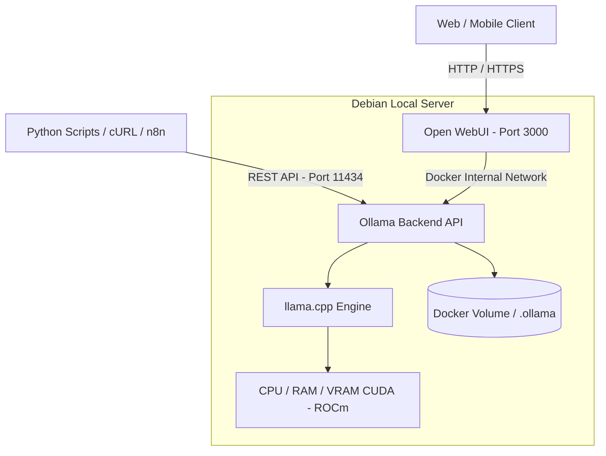

import TerminalWindow from '../../../components/TerminalWindow.astro';
import CodeBlockWindow from '../../../components/CodeBlockWindow.astro';

## Introduction

In recent years, generative Artificial Intelligence tools have become fully integrated into our daily workflows, whether for answering system administration questions, drafting automation scripts, or analyzing code. However, the vast majority of users rely out of habit on third-party cloud solutions such as OpenAI (ChatGPT) or Anthropic (Claude).

While these cloud platforms are convenient, relying exclusively on their external APIs introduces serious drawbacks that we must rethink in a HomeLab environment:

1. **Data privacy**: Any code snippet, system log, or personal file we send travels to third-party servers over which we have no control.
2. **Usage costs**: If we integrate models into automated monitoring scripts or daily text processing pipelines, the token consumption bill can skyrocket.
3. **Network dependency and availability**: If the API experiences outages, service degradation, or policy changes, our local tools stop working.
4. **Rate limits and query filtering**: Restrictions on requests per minute and arbitrary alignment on allowed content.

In this post, I am going to explain how I set up a complete self-hosted generative AI ecosystem on my own server. We will use **Ollama** as the inference engine and **Open WebUI** as the centralized graphical interface, all packaged in **Docker** containers running on Debian.

---

## What is Ollama and why is it the standard in self-hosted environments?

For those unfamiliar with it, **Ollama** is an open-source tool designed to package, manage, and run Large Language Models (LLMs) locally. Under the hood, it uses the `llama.cpp` architecture, allowing it to quantize models (reduce their memory footprint using formats like GGUF) and leverage CPU instructions (AVX2, AVX-512) or GPU acceleration (NVIDIA CUDA or AMD ROCm).

The key advantage of Ollama lies in its simplicity: it abstracts away all the complexity of compiling C++ libraries or configuring Python virtual environments. It exposes a clean REST API on port `11434` that mirrors OpenAI's native API specification, allowing us to connect any existing client or script without rewriting code.

---

## Hardware Requirements and Model Selection

A common myth is that you need a multi-thousand-dollar GPU cluster to run a local LLM. The reality is that it depends entirely on the model size (measured in billions of parameters, such as 3B, 8B, or 14B) and the amount of memory (RAM or VRAM) available in our hardware.

In my case, for light testing on the Raspberry Pi 4B we can run tiny models on CPU, while on the main **HP Elitedesk** server we can move 7B or 8B parameter models quite smoothly.

Below is a comparison table based on available hardware:

| Model Size | Typical Parameters | Recommended VRAM (GPU) | Minimum RAM (CPU) | Representative Models | Recommended Use Cases |
| :--- | :--- | :--- | :--- | :--- | :--- |
| **Ultra-light** | 1B - 3B | 2 GB - 4 GB | 8 GB | Llama 3.2 1B/3B, Qwen 2.5 1.5B | SBCs (Raspberry Pi), simple text tasks, translation |
| **Medium** | 7B - 8B | 6 GB - 8 GB | 16 GB | Llama 3.1 8B, DeepSeek R1 8B, Mistral 7B | Coding assistance, log summarization, text agents |
| **Advanced** | 14B - 32B | 16 GB - 24 GB | 32 GB | Qwen 2.5 14B, DeepSeek R1 14B/32B | Complex reasoning, extensive code refactoring |
| **Professional** | 70B+ | > 40 GB | > 64 GB | Llama 3.3 70B, Qwen 2.5 72B | Dedicated multi-GPU servers |

> **Quantization note:** The default models downloaded via Ollama use `Q4_K_M` (4-bit) quantization. This means an 8-billion-parameter model only takes up about 4.7 GB of memory, retaining over 95% of the accuracy compared to the original 16-bit model.

---

## Infrastructure Architecture

The logical flow we will configure separates the inference engine (Ollama) from the user interface (Open WebUI), making the Ollama API available to both the web UI and automation scripts on the local network.



---

## Step-by-Step Deployment with Docker Compose

Following the same approach as in the rest of the HomeLab series, we will deploy the service using Docker Compose to keep all data isolated in the `~/docker` directory.

### 1. Creating the working directory

Connect to the server via SSH and prepare the persistent storage folders:

<TerminalWindow title="jrodriiguezg@elitedesk:~$">
```bash
jrodriiguezg@elitedesk:~$ mkdir -p ~/docker/ollama/data
jrodriiguezg@elitedesk:~$ mkdir -p ~/docker/open-webui/data
jrodriiguezg@elitedesk:~$ cd ~/docker/ollama
```
</TerminalWindow>

### 2. Configuring docker-compose.yaml

Create the `docker-compose.yaml` file inside `~/docker/ollama/`:

<CodeBlockWindow title="docker-compose.yaml">
```yaml
services:
  ollama:
    image: ollama/ollama:latest
    container_name: ollama
    restart: unless-stopped
    ports:
      - "11434:11434"
    volumes:
      - ~/docker/ollama/data:/root/.ollama
    # If you have an NVIDIA GPU or AMD ROCm GPU, refer to the section below to enable hardware passthrough.

  open-webui:
    image: ghcr.io/open-webui/open-webui:main
    container_name: open-webui
    restart: unless-stopped
    ports:
      - "3000:8080"
    environment:
      - OLLAMA_BASE_URL=http://ollama:11434
      - WEBUI_SECRET_KEY=secret_key_for_sessions
    volumes:
      - ~/docker/open-webui/data:/app/backend/data
    depends_on:
      - ollama
```
</CodeBlockWindow>

---

## GPU Acceleration: NVIDIA (CUDA) vs AMD (ROCm)

If your server has a dedicated graphics card, configuring GPU passthrough to the Ollama container is essential to boost inference speed (tokens per second generation) by up to 10x.

### Option A: NVIDIA GPU with CUDA

Requires `nvidia-container-toolkit` to be installed on the host OS (Debian). Add the `deploy` block to the Ollama service in `docker-compose.yaml`:

<CodeBlockWindow title="NVIDIA CUDA Support">
```yaml
  ollama:
    image: ollama/ollama:latest
    container_name: ollama
    # ...
    deploy:
      resources:
        reservations:
          devices:
            - driver: nvidia
              count: all
              capabilities: [gpu]
```
</CodeBlockWindow>

### Option B: AMD GPU with ROCm

If you use an AMD Radeon graphics card (such as RX 6000/7000 series or AMD workstation GPUs), Ollama has native support for **ROCm**.

Unlike NVIDIA, AMD GPU passthrough in Docker does not require a proprietary container toolkit. Instead, you mount the kernel render devices directly (`/dev/kfd` and `/dev/dri`) and pass the system groups (`video` and `render`):

<CodeBlockWindow title="AMD ROCm Support">
```yaml
  ollama:
    image: ollama/ollama:rocm # Or standard image ollama/ollama:latest
    container_name: ollama
    # ...
    devices:
      - "/dev/kfd:/dev/kfd"
      - "/dev/dri:/dev/dri"
    group_add:
      - "video"
      - "render"
    # Optional for consumer AMD cards not officially listed (e.g., RX 6600/6700):
    # environment:
    #   - HSA_OVERRIDE_GFX_VERSION=10.3.0 # Use 10.3.0 for RDNA2 or 11.0.0 for RDNA3
```
</CodeBlockWindow>

> **Trick for consumer AMD GPUs:** If your AMD Radeon card is a consumer model and Ollama does not detect ROCm acceleration by default, setting `HSA_OVERRIDE_GFX_VERSION=10.3.0` (for RDNA2 architectures) or `HSA_OVERRIDE_GFX_VERSION=11.0.0` (for RDNA3) forces the ROCm layer to treat the GPU as a compatible enterprise model.

---

### 3. Starting the containers

Once `docker-compose.yaml` is configured for your hardware, bring up the stack:

<TerminalWindow title="jrodriiguezg@elitedesk:~/docker/ollama">
```bash
jrodriiguezg@elitedesk:~/docker/ollama$ docker compose up -d
[+] Running 3/3
 ✔ Network ollama_default     Created                                                                    0.1s
 ✔ Container ollama           Started                                                                    0.4s
 ✔ Container open-webui       Started                                                                    0.6s
```
</TerminalWindow>

---

## Managing and Downloading Models

With the containers running, the Ollama engine is active but has no models downloaded in its local library yet. We can pull models via the CLI or directly inside Open WebUI.

### Management commands via CLI

To download models via terminal, run `docker exec`:

- **Pull a balanced general-purpose model (Llama 3.2)**:
<TerminalWindow title="Pulling Llama 3.2">
```bash
docker exec -it ollama ollama pull llama3.2
```
</TerminalWindow>

- **Pull a reasoning-focused model (DeepSeek R1 8B)**:
<TerminalWindow title="Pulling DeepSeek R1">
```bash
docker exec -it ollama ollama pull deepseek-r1:8b
```
</TerminalWindow>

- **List models stored on disk**:
<TerminalWindow title="jrodriiguezg@elitedesk:~$ docker exec -it ollama ollama ls">
```text
NAME             ID           SIZE     MODIFIED
llama3.2:latest  a80c4f17acd5 2.0 GB   2 hours ago
deepseek-r1:8b   0a8c26691341 4.9 GB   1 hour ago
```
</TerminalWindow>

- **Test a quick prompt interactively**:
<TerminalWindow title="Interactive Test">
```bash
docker exec -it ollama ollama run llama3.2 "Write a Bash script to back up /etc"
```
</TerminalWindow>

---

## API Integration and Automation Scripts

One of the biggest advantages of running Ollama on your server is consuming it from Python scripts or local automation workflows.

Since Ollama exposes an OpenAI-compatible endpoint at `http://YOUR_SERVER_IP:11434/v1`, we can reuse any existing library.

Here is a Python example for automating queries from your workstation:

<CodeBlockWindow title="test_ollama.py">
```python
from openai import OpenAI

# Connect to the local Ollama endpoint on our server
client = OpenAI(
    base_url="http://192.168.1.101:11434/v1",
    api_key="ollama" # API key is required by the client SDK but ignored by Ollama
)

response = client.chat.completions.create(
    model="deepseek-r1:8b",
    messages=[
        {
            "role": "system", 
            "content": "You are a technical assistant specializing in Linux and Debian server administration."
        },
        {
            "role": "user", 
            "content": "What are the recommended commands to diagnose a disk I/O bottleneck?"
        }
    ]
)

print(response.choices[0].message.content)
```
</CodeBlockWindow>

---

## Model Proxy: Smart Routing with Lemoe (l3mcore)

If you already have Ollama and Open WebUI up and running, you can supercharge your infrastructure by adding my own tool **Lemoe** (powered by `l3mcore`).

Lemoe does not replace Ollama. Instead, it acts as an **intelligent intermediary proxy**. It receives requests from Open WebUI or any other client and automatically routes them to the most suitable local model at any given time based on the type of task.

Lemoe automatically creates a secure Python virtual environment and manages dependencies without polluting your server's packages. For more details, check out the [official documentation](https://lemoe.link/) or the [GitHub repository](https://github.com/lemoelink/l3mcore).

### Quick Start (Recommended)

The auto-installer will download the repository and set up the environment in a single step (requires Python 3.10 or higher). You can use `wget` or `curl`:

<CodeBlockWindow title="Using wget">
```bash
wget -qO- https://raw.githubusercontent.com/lemoelink/l3mcore/refs/heads/master/setup.sh | bash
```
</CodeBlockWindow>

<CodeBlockWindow title="Using curl">
```bash
curl -sSL https://raw.githubusercontent.com/lemoelink/l3mcore/refs/heads/master/setup.sh | bash
```
</CodeBlockWindow>

Once the setup finishes, the script will have prepared an isolated `venv` environment. To start the server, just enter the directory and run the start script:

<TerminalWindow title="Start Lemoe">
```bash
cd LeMoE
./start.sh
```
</TerminalWindow>

The server will be available on your network via port `11435` (`http://SERVER_IP:11435`).

### Classic Git Clone

If you prefer to have more control and clone the repository manually:

<TerminalWindow title="Manual clone">
```bash
git clone https://github.com/lemoelink/l3mcore.git
cd l3mcore
./setup.sh
./start.sh
```
</TerminalWindow>

Both methods will leave your Lemoe server up and running, ready to serve local models on your network.

---

## Secure Remote Access with Tailscale

As explained in previous entries of the HomeLab series, we should never expose our server's internal ports directly to the public Internet through router port forwarding.

To access **Open WebUI** (`http://LOCAL_IP:3000`) from your laptop when away from home or from your mobile device, use **Tailscale**:

1. Ensure the Tailscale daemon is running on your Debian server:
<TerminalWindow title="jrodriiguezg@elitedesk:~$ tailscale status">
```text
100.115.20.45   elitedesk            jrodriiguezg@ linux   -
```
</TerminalWindow>
2. Access Open WebUI directly using the server's private Tailnet IP: `http://100.115.20.45:3000`.

This keeps your entire infrastructure private, end-to-end encrypted, and safe from unauthorized access.

---

## Conclusion

Deploying Ollama and Open WebUI in our HomeLab proves that it is entirely possible to leverage cutting-edge Artificial Intelligence tools without giving away our data or relying on monthly cloud subscriptions.

Decoupling the architecture into separate Docker containers allows us to upgrade models or switch frontends in the future without breaking system configurations.

In upcoming posts, we will explore how to connect this Ollama stack to a **RAG (Retrieval-Augmented Generation)** system so the LLM can query documentation directly from our own HomeLab server.

If you have any questions regarding RAM/VRAM requirements or `docker-compose.yaml` setup (whether with NVIDIA CUDA or AMD ROCm), feel free to leave a comment below.
