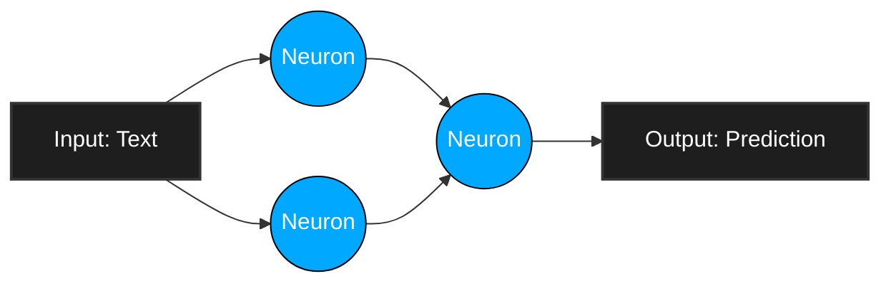
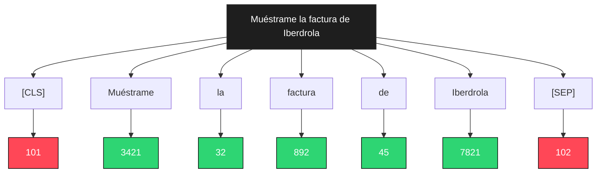
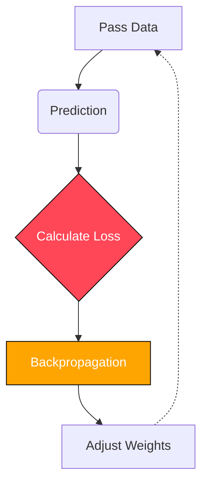

# Introduction

In recent years, **Artificial Intelligence** has transitioned from a science fiction concept to an everyday tool. However, for most people, the process of "training an AI" is still perceived as complex and only within the reach of tech giants.

In this article, I am going to explain step-by-step how I trained the AI models that form the core of the **LEMoE** (Light Easy Mix Of Experts) project. And I will do so in a technical, deep, yet accessible way for everyone. Whether you are an experienced software engineer or simply curious about how a machine learns to understand human language, this article is for you.

---

## 1. What is AI anyway?

Before diving into code and mathematics, we must understand the most important thing: **what an Artificial Intelligence model actually is**. When we read the news or internet forums, we are often told that AI "thinks" or "understands". The reality is much more fascinating (and mathematical).

A **Natural Language Processing** (NLP) model is nothing more than a giant mathematical function. It receives numbers as input, performs millions of matrix calculations, and returns numbers as output. The "magic" lies in how we structure that function and, above all, in how we adjust its internal numbers (called **weights**) so that the output makes sense.



### 1.1. Base Architectures: We don't build from scratch, we only train

For LEMoE, I did not build a neural network from absolute scratch. That would require millions of dollars in budget and server farms full of GPUs running for months. Instead, we use a technique called **Transfer Learning**.

We start with existing open-source models, specifically those based on the **Transformer** architecture (like BERT or DeBERTa). These models have already been trained by tech giants (like Google or Microsoft) by reading terabytes of text from the Internet. As a result, these "base models" already know grammar, syntax, and human vocabulary. Our job is not to teach them how to speak, but to teach them to perform a very specific task: **understand and classify queries in the LEMoE ecosystem**.

We call this process of "specialization" **Fine-Tuning**.

---

## 2. The Gold of the 21st Century: DATA

There is a saying in data science that is an immutable law: **Garbage In, Garbage Out**. If we try to train the most advanced AI model in the world with low-quality data, we will get a useless model.

AI does not magically "learn by itself" by watching YouTube videos. It learns thanks to well-structured human examples.

### 2.1. Collection and Annotation

In order for the **LEMoE PPC** (Pipeline for Classification) model to know exactly what to do, I had to create a **Dataset**. This involves hours of human labor. I compiled hundreds, even thousands, of phrases representing typical interactions a user would have with the system.

### 2.2. The JSONL Format

Machines do not easily read Excel sheets at runtime. The industry standard for training language models is the **JSONL** (JSON Lines) format.

In a JSONL file, each line of text is a standalone JSON object. This is crucial because it allows the computer to process very large files line by line, without having to load gigabytes of data into RAM simultaneously.

An example from our dataset looks like this:

```json
{"text": "Enséñame la factura de Iberdrola", "label": "1"}
{"text": "¿Va a llover mañana en Madrid?", "label": "0"}
{"text": "Muéstrame la factura con el proveedor de internet", "label": "1"}
```

*Note: We keep the example queries in Spanish in the JSON snippet as they refer to the actual training dataset used in the project.*
This dataset aims to filter the user's input intent to determine whether they are requesting the system to search for a document. Therefore, it has been trained with pairs of numbers, **0** or **1**, where `0` means it is not a document search and `1` means it is.

For the **LEMoE Query Distiller** model (which is responsible for extracting keywords instead of classifying the entire sentence), the data format is even more complex. It uses what is called **Token Classification**, where each individual word in the sentence receives its own label, where `1` is a valid keyword and `0` is invalid. For example: 

| Muéstrame | la | factura | de | Iberdrola | de | marzo | del | año | 2022 |
| :---: | :---: | :---: | :---: | :---: | :---: | :---: | :---: | :---: | :---: |
| 0 | 0 | 1 | 0 | 1 | 0 | 1 | 0 | 1 | 1 |

---

## 3. The Language of Machines: Tokenization

This is where many people get lost, but it is fundamental. Neural networks do not know what an "A" or a "B" is. **They only understand numbers.**

Therefore, we cannot pass the sentence *"Muéstrame la factura de Iberdrola"* (Show me the Iberdrola invoice) directly to the model. We have to translate it into its language using a process called **Tokenization**.

### 3.1. Breaking Down Words

A "Tokenizer" takes a sentence and splits it into small fragments called **tokens**. Sometimes a token is an entire word, sometimes it is the root of a word, and sometimes it is just a single letter.

For example, the Spanish word "incomprensible" (incomprehensible) could be divided into three tokens: `["in", "comprens", "ible"]`. 
This is done using algorithms like **BPE** (Byte-Pair Encoding) or **WordPiece**, which learn statistically what the most common word fragments in a language are.

### 3.2. From Tokens to Numbers (IDs)

Once the sentence is split, the Tokenizer looks up each fragment in its internal dictionary (vocabulary) and replaces it with an identification number (ID).

Thus, our phrase *"Muéstrame la factura de Iberdrola"* could be converted into the numerical sequence: `[101, 3421, 32, 892, 45, 7821, 102]`



The numbers `101` and `102` are typically special invisible tokens that tell the model where the sentence starts (`[CLS]`) and ends (`[SEP]`).

### 3.3. Padding and Attention Masks

Graphics cards (GPUs) are like mathematical factories that love working in parallel. To be efficient, they process sentences in "blocks" or "batches". 
But what happens if in one batch we have a sentence of 5 tokens and another of 20 tokens? Matrix mathematics requires all sentences to have the **same amount of tokens**.

The solution is **Padding**. We add padding tokens (usually the number `0`) to short sentences so they all have the same length. 
And to prevent the AI from getting confused and trying to understand these padding zeros, we pass a second list called the **Attention Mask**: a list of `1`s and `0`s that tells the AI: *"pay attention to these numbers, but ignore these others because they are just for padding"*.

---

## 4. Training Begins: Fine-Tuning

Now we have our data in mathematical format. It's time to start the engine.

The core of the model is a Transformer neural network. Imagine a box full of millions of dials (the parameters). For our LEMoE models, we are talking about more than 100 million of these dials.

### 4.1. Forward Pass

During training, we take a batch of sentences (already converted to numbers) and pass them through the neural network. This is called the **Forward Pass**.
In the first iterations, the dials are configured almost randomly. The neural network processes the numbers and provides an answer. At first, the answer is completely incorrect. It might say that the phrase *"¿Qué hora es?"* (What time is it?) is a 1.

### 4.2. Loss Function

This is where the "teacher" comes in. We compare the response given by the AI with the correct response (the label we manually wrote in the JSONL file).
We use a mathematical formula called the **Loss Function** to calculate exactly how wrong the AI was. If the prediction is very poor, the Loss will be a high number. If it is almost perfect, the Loss will be a number very close to zero.

Our goal throughout the entire training process is to drive this number down.




### 4.3. Backpropagation (Learning from the Error)

This is where the real magic of Machine Learning happens: **Backpropagation**.

**The Orchestra Analogy:**
Imagine you are the conductor of an orchestra of 100 million musicians (parameters or "dials") who are playing a symphony, but at first, they play randomly and it sounds terrible. That terrible sound is your *Loss* or Error. How do you know exactly who played a flat note to ask them to correct it if 100 million people are playing at the same time?

Using differential calculus (derivatives and the mathematical chain rule), the algorithm traces the error backward, from the final sound to each musician's instrument. This allows us to calculate mathematically **how much blame** EACH ONE of the 100 million dials has for the final error. This calculation of blame is called computing the **Gradient**.

**Gradient Descent:**
Once we know who made the mistake and in what proportion, we use the **Gradient Descent** algorithm.

Imagine you are on a mountain covered in dense fog and want to reach the lowest valley (where the error is zero). You can only feel the slope of the ground under your feet. If you feel the ground sloping down to your right, you take a small step to the right. The algorithm does this mathematically in 100 million dimensions.

In combination with an advanced Optimizer (like **AdamW**), the model tells each dial: *"You were largely to blame for the error and you were too high, turn left by 2%. You had little blame, move right by 0.05%"*.

We turn each dial by a fraction of a millimeter in the right direction. The exact size of this "step" we take on the mountain is the **Learning Rate** we mentioned earlier. If we take a huge step, we might skip the valley; if we take ant-sized steps, it will take years to learn.

### 4.4. Epochs

This process (Take an example -> Try to guess -> Calculate error -> Adjust dials) occurs **millones de veces**.

When the model has seen the entire dataset once, we say it has completed one **Epoch**. For LEMoE models, we typically train for 3 to 5 epochs. If we train for too many epochs, we risk **Overfitting**, which is when the model memorizes the exact answers of the dataset but loses the ability to understand new sentences it has never seen before.

---

## 5. Hardware Reality and Mathematics

In the actual code, thanks to **HuggingFace's** `transformers` library, all this monumental mathematical complexity is summarized in a few lines of code.

```python
from transformers import Trainer, TrainingArguments

# Configure how our model will learn
training_args = TrainingArguments(
    output_dir="./results",             # Where the model will be saved after training
    num_train_epochs=5,                 # Number of times the model will read the full dataset
    per_device_train_batch_size=16,     # Sentences processed at once (batch size)
    learning_rate=2e-5,                 # Size of mathematical "steps" during learning (0.00002)
    fp16=True,                          # Enables 16-bit mixed precision (faster)
)

# Combine model, data, and learning rules
trainer = Trainer(
    model=my_transformer_model,         # Base architecture (e.g., DeBERTa or BERT)
    args=training_args,                 # Training rules defined above
    train_dataset=tokenized_dataset,    # The data (sentences converted to numbers/tokens)
)

# Start the engine and run massive calculations!
trainer.train()
```

Seems easy, right? But the execution requires **computational brute force**.

### 5.1. Training on an RTX 5070

For this project, training was performed locally on a laptop equipped with an **NVIDIA RTX 5070** GPU. While this is a powerful card for gaming, in the AI world it is modest hardware (companies use clusters of NVIDIA H100 cards that cost tens of thousands of dollars each).

To train a model with over **100 million parameters** on a laptop graphics card without running out of video memory (*VRAM Out of Memory*), I had to use several optimization techniques:

1. **FP16 (16-bit Mixed Precision) and Alternatives:** Normally, computer calculations are done in 32-bit floating-point format (**FP32**). This means that each number occupies a lot of memory and is excessively precise (e.g., 0.123456789). For training AI models, I found that I do not need such high decimal precision. By setting `fp16=True`, the graphics card performs calculations using 16-bit numbers. This halves the consumption of video RAM (VRAM) and doubles the speed of mathematical calculations, as the *Tensor Cores* in modern NVIDIA graphics cards are specifically designed to fly under FP16.

    **Other possible configurations:**
    *   **BF16 (Bfloat16):** Created by Google ("Brain Float"), BF16 is similar to FP16 but with a wider dynamic range. It is less prone to mathematical underflow/overflow errors. Latest-generation GPUs (like the RTX 3000/4000 series) support it natively with `bf16=True`. It is the current gold standard for training.
    *   **FP32 (32-bit):** Traditional full precision. Today, it is rarely used to train massive NLP models because it is very slow and consumes twice the VRAM without yielding noticeable improvements in final model accuracy.
    *   **INT8 (8-bit):** Pure integer usage from 0 to 255. Although traditionally used only to run already trained models (Inference), modern techniques like *QLoRA* allow training models directly using 8-bit mathematics, allowing giant models to fit on inexpensive graphics cards.

2.  **Gradient Accumulation:** For an AI to learn stably, we need to pass a significant "global batch size" of examples at each step. For example, suppose our optimal model training requires us to process **32 sentences at once**. The problem is that if we try to load 32 sentences and all their matrix multiplications simultaneously into a modest 8GB RTX 5070, memory will collapse and the program will crash.

    **La solución matemática:** If our card only has physical memory to process very small batches, say **4 sentences at a time** (`per_device_train_batch_size=4`), we process those 4 sentences and calculate their mathematical errors (gradients), but we do **NOT** update the model's "dials" yet. We simply accumulate those errors. 
    
    We repeat this process **8 times** (`gradient_accumulation_steps=8`).
    
    *The math works out to:* `4 sentences x 8 iterations = 32 sentences in total`.
    Once we have accumulated the errors from the 8 repetitions, we then perform the update and turn the AI's dials. Mathematically, the result is **identical** to having a giant server capable of processing 32 sentences in one go, allowing us to train massive models while completely bypassing VRAM limitations.

---

## 6. Pure Engineering: From Research to Production

Once `trainer.train()` finishes, we have a smart model. But there is a catch: it is a **heavy, giant monster**.

The final model saved with PyTorch is a huge file (often over 400 MB) that requires installing heavy libraries and, preferably, a graphics card to run fast enough when a user speaks to the LEMoE system.

For a system intended to run in real-time and deployable on modest servers or even locally without powerful GPUs, we need to apply optimization engineering. And this is where things get really interesting.

### 6.1. ONNX Export: Freezing the Brain

PyTorch is fantastic for training because it is a dynamic environment. The computational graph (the path numbers follow through the neural network) is built on the fly at each iteration. But for "Inference" (using the model), this dynamism is slow and consumes unnecessary resources.

The first step is to export the model to **ONNX** (Open Neural Network Exchange). By exporting to ONNX, we take the dynamic neural network and "bake" it into a completely static mathematical graph. The computer now has an exact, pre-calculated map of the operations it must perform, without having to think about how to build them. This step alone drastically speeds up the model.

```python
from optimum.onnxruntime import ORTModelForSequenceClassification

# Exporting the model to static ONNX format
ort_model = ORTModelForSequenceClassification.from_pretrained(
    "./my_pytorch_model", 
    export=True
)
ort_model.save_pretrained("./onnx_model")
```

### 6.2. INT8 Quantization: Squashing the Neural Network

Even in ONNX format, the "dials" or parameters of the model are still floating-point decimal numbers (for example, `0.45321`). Processing mathematics with decimals is expensive for normal processors (CPUs).

The ultimate technique I used for LEMoE is **INT8 Quantization**.

What does this mean? We take those millions of floating-point decimal parameters (FP32) and force them, using statistical clustering algorithms, to fit into simple integers from 0 to 255 (8-bit integers or INT8).

Essentially, we are compressing the mathematical "resolution" of the AI's brain.

```python
from optimum.onnxruntime.configuration import AutoQuantizationConfig
from optimum.onnxruntime import ORTQuantizer

# 1. Prepare the tool that will squash the static model
quantizer = ORTQuantizer.from_pretrained(ort_model)

# 2. Define the mathematical compression settings
# (We use AVX2 so it flies on normal Intel/AMD processors)
qconfig = AutoQuantizationConfig.avx2(is_static=False)

# 3. Execute the massive INT8 Quantization!
quantizer.quantize(
    save_dir="./onnx_model_quantized",    # Target folder for the ultra-light model
    quantization_config=qconfig           # Pass the defined mathematical rules
)
```

**The results of this quantization are staggering:**
1.  **File Size:** The model weight is divided by four. We go from a 400 MB file to barely 100 MB.
2.  **RAM Usage:** When running, it consumes significantly less system memory.
3.  **Inference Speed:** Modern CPUs have special instructions (like AVX2) that can perform massive multiplications of INT8 integers much faster than floating-point decimals.

Is there a downside? By losing decimal precision, the model loses a tiny percentage of accuracy in its predictions. However, for LEMoE's tasks (sequence classification and token extraction), the loss in precision is typically under 1% or 2%—a more than acceptable trade-off for multiplying execution speed and allowing it to run without specialized hardware.

---

## 7. Evaluation: How Do We Know It Works?

Once the model is trained, we feed it sentences it has never seen before. If the model is able to classify them correctly, we know that it has truly "learned" the underlying concepts and has not simply memorized the training file.

We use industry-standard metrics:
- **Accuracy:** The raw percentage of times the model got it right (e.g., 95%).
- **F1-Score:** Accuracy on its own can be highly misleading. Imagine that in our test dataset of 100 sentences, 99 are light control commands and only 1 is an alarm. If the model gets "lazy" and decides to ALWAYS predict "light command" without analyzing the sentence, it will be correct 99 out of 100 times, achieving a 99% Accuracy. It would look like a genius, but in reality, it is a useless model because it will never, ever detect an alarm!

    This is where the **F1-Score** comes in. It is a strict metric (mathematically, the harmonic mean between *Precision* and *Recall*) that severely penalizes lazy models. For the F1-Score to be high (e.g., 95%), the model is forced to predict correctly across **all** categories, regardless of how few examples there are for one of them. A good F1-Score guarantees that the model truly understands the difference between all commands, solving the dangerous problem of "unbalanced classes".

---

## Conclusion

Training an **Artificial Intelligence** model for the LEMoE project was a fascinating journey from theory to production optimization. We went from gathering raw data, to transforming it into mathematical matrices, squeezing graphic hardware through differential calculus, and finally applying extreme optimization engineering (ONNX and Quantization) so that the resulting model is lightweight, agile, and deployable anywhere.

It is not magic. It is applied statistics, multivariable calculus, linear algebra, and a whole lot of software and hardware engineering working in perfect synchrony.

If you have made it this far and your curiosity is piqued, I have good news for you: I haven't kept anything secret. 
I have published all the source code, the step-by-step Jupyter Notebooks I used, and detailed instructions in my GitHub repository so that you can replicate this process yourself on Google Colab or your own computer for free.

I invite you to explore the code, break it, experiment with it, and start training your own models!

**[Visit my GitHub repository](https://github.com/jrodriiguezg/train-notebooks)**

*Do you have any questions or did you like the article? Leave me a comment on Instagram or connect with me on LinkedIn!*

---

## Understanding the Attention Mechanism

For those who want to dive even deeper, it is impossible to talk about Transformers without talking about the "Attention" mechanism.
In previous generation models (such as RNNs or LSTMs), the computer read sentences from left to right, word by word. The problem was that by the time it reached the end of a long sentence, the neural network "forgot" the context from the beginning.

Google's paper *"Attention Is All You Need"* (2017) changed the world. It introduced the **Self-Attention** mechanism.
Instead of reading sequentially, the Transformer analyzes all words in the sentence at the same time. For each word, it mathematically calculates a "relevance score" with respect to ALL other words in the sentence.

For example, take the Spanish sentence: *"El banco del parque estaba mojado porque llovía sobre él"* (The park bench was wet because it was raining on it).
When the model processes the word "él" (it), the attention mechanism assigns a massive mathematical score to "banco" (bench), understanding the grammatical context instantly through matrix multiplications of Queries, Keys, and Values.

### Mathematics of Attention:

`Attention(Q, K, V) = softmax((Q * K^T) / sqrt(d_k)) * V`

1.  **Q (Queries):** What I am looking for.
2.  **K (Keys):** What I offer.
3.  **V (Values):** The actual meaning I convey.

It is this mechanism that allows our LEMoE models to understand the exact context of a command, differentiating complex commands almost like a human.

## How to Choose Batch Size and Learning Rate

The dark art of *Fine-Tuning* often boils down to choosing hyperparameters.
- **Batch Size:** Defines how many examples we pass at once before adjusting the weights. Large batches stabilize learning but require immense VRAM. Small batches fit into memory but can cause the model to "bounce" erratically during training. We use 16 or 32 through gradient accumulation.
- **Learning Rate:** The most critical factor. It defines the size of the "step" we take when adjusting the dials (Backpropagation). If it is too large (e.g., `1e-2`), we will take giant steps and the model will never find the optimal point (the minimum of the loss function). If it is too small (e.g., `1e-6`), the model will take eons to learn. For Fine-Tuning models based on DeBERTa, a learning rate around `2e-5` to `5e-5` is the magic "sweet spot". Using **Weight Decay** (0.01) along with the AdamW optimizer was also vital to avoid overfitting.

## Named Entity Recognition (NER)

While the PPC model classifies entire sequences, the Query Distiller uses **NER** (*Named Entity Recognition*).
At the code level, this changes the final layer (the head) of the neural network. Instead of a layer that squashes all tokens into a single probability vector, the NER model maintains the dimensionality of each individual token and applies a Softmax function or binary classification over EACH token separately.

That is, if the sentence has 10 tokens, the model outputs 10 independent predictions at the same time. During the training of the LEMoE Query Distiller, we faced the problem of sub-tokens (when the Tokenizer breaks a word into two pieces). We had to write label alignment functions that assigned the value `-100` to secondary fragments so that the loss function (*Cross-Entropy Loss*) would mathematically ignore them and not penalize the network for them.

## Why ONNX Runtime and Not TensorRT?

Multiple optimized inference frameworks exist, with NVIDIA's TensorRT being one of the kings in terms of raw speed on GPUs. However, for LEMoE, the goal was universality. **ONNX Runtime** allows running the model not only on NVIDIA GPUs, but also on x86 processors (Intel/AMD) using AVX2 instructions, on ARM chips (like Apple Silicon or Raspberry Pi), and even on specialized accelerators (NPUs). This flexibility makes the LEMoE ecosystem hardware-agnostic.

## Real Training Log

To illustrate in a practical way how this looks on a Machine Learning engineer's screen, here is a simplified dump of what the console outputs during a 5-epoch training run, showcasing the convergence of the Loss function.

```text
=========================================================================================
[INFO] Loading dccuchile/bert-base-spanish-wwm-cased
[INFO] Tokenizer loaded successfully. Vocab size: 31002
[INFO] Initializing Trainer with mixed precision (fp16=True)
=========================================================================================
Epoch 1/5
-----------------------------------------------------------------------------------------
Step   10 / 1500 | Loss: 2.1450 | Learning Rate: 1.95e-5 | Time: 00:00:15
Step   50 / 1500 | Loss: 1.8321 | Learning Rate: 1.80e-5 | Time: 00:01:10
Step  100 / 1500 | Loss: 1.4023 | Learning Rate: 1.65e-5 | Time: 00:02:15
Step  200 / 1500 | Loss: 0.9512 | Learning Rate: 1.40e-5 | Time: 00:04:30
Step  300 / 1500 | Loss: 0.6105 | Learning Rate: 1.15e-5 | Time: 00:06:45
[Eval] Epoch 1 Validation - Loss: 0.5892 | Accuracy: 0.812 | F1: 0.795
-----------------------------------------------------------------------------------------
Epoch 2/5
-----------------------------------------------------------------------------------------
Step  400 / 1500 | Loss: 0.4501 | Learning Rate: 1.05e-5 | Time: 00:08:50
Step  500 / 1500 | Loss: 0.3204 | Learning Rate: 9.50e-6 | Time: 00:10:55
Step  600 / 1500 | Loss: 0.2815 | Learning Rate: 8.00e-6 | Time: 00:13:00
[Eval] Epoch 2 Validation - Loss: 0.3012 | Accuracy: 0.915 | F1: 0.908
-----------------------------------------------------------------------------------------
Epoch 3/5
-----------------------------------------------------------------------------------------
Step  700 / 1500 | Loss: 0.2105 | Learning Rate: 6.50e-6 | Time: 00:15:15
Step  800 / 1500 | Loss: 0.1802 | Learning Rate: 5.50e-6 | Time: 00:17:20
Step  900 / 1500 | Loss: 0.1555 | Learning Rate: 4.50e-6 | Time: 00:19:25
[Eval] Epoch 3 Validation - Loss: 0.1985 | Accuracy: 0.952 | F1: 0.949
-----------------------------------------------------------------------------------------
Epoch 4/5
-----------------------------------------------------------------------------------------
Step 1000 / 1500 | Loss: 0.1205 | Learning Rate: 3.50e-6 | Time: 00:21:40
Step 1100 / 1500 | Loss: 0.1052 | Learning Rate: 2.50e-6 | Time: 00:23:45
Step 1200 / 1500 | Loss: 0.0985 | Learning Rate: 1.50e-6 | Time: 00:25:50
[Eval] Epoch 4 Validation - Loss: 0.1520 | Accuracy: 0.965 | F1: 0.963
-----------------------------------------------------------------------------------------
Epoch 5/5
-----------------------------------------------------------------------------------------
Step 1300 / 1500 | Loss: 0.0805 | Learning Rate: 1.00e-6 | Time: 00:28:05
Step 1400 / 1500 | Loss: 0.0752 | Learning Rate: 5.00e-7 | Time: 00:30:10
Step 1500 / 1500 | Loss: 0.0710 | Learning Rate: 0.00e+0 | Time: 00:32:15
[Eval] Epoch 5 Validation - Loss: 0.1405 | Accuracy: 0.968 | F1: 0.967
-----------------------------------------------------------------------------------------
[INFO] Training completed. Best validation metric found at Epoch 4.
[INFO] Saving model to ./lemoeppc_1
=========================================================================================
```

Observe how the `Loss` value starts high (2.14) and steadily decreases as the model adjusts its parameters and learns from its errors. Simultaneously, Validation metrics (Evaluation on unseen data) such as `Accuracy` rise from an initial 81% to an impressive 96.8% at the end.

It is imperative to note that in Epoch 5, the training loss continued to drop to `0.0710`, but the Validation Loss plateaued or slightly increased compared to Epoch 4. This is an early sign of **Overfitting**, which is why modern training systems save the checkpoint of Epoch 4 as the definitive model to be used in production.
