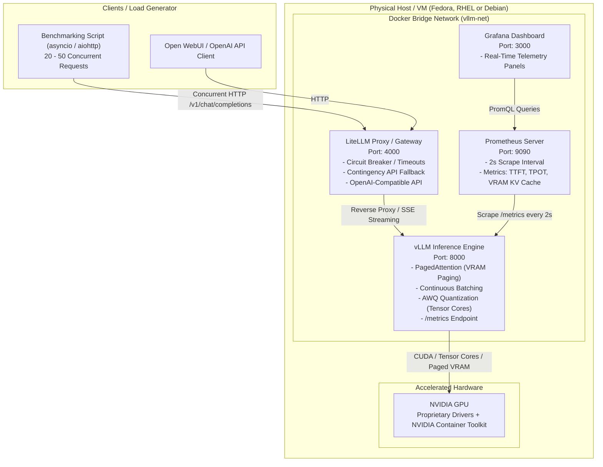

import TerminalWindow from '../../../components/TerminalWindow.astro';
import CodeBlockWindow from '../../../components/CodeBlockWindow.astro';

# Introduction

## The Bottleneck of Ollama in Concurrent Environments

Ollama (and its underlying engine `llama.cpp`) is a fantastic tool for single-user scenarios, local workstations, and rapid prototyping.
However, in an enterprise setup or shared infrastructure where tens of simultaneous HTTP requests hit the server, this approach quickly becomes a bottleneck due to three critical architectural limitations:

1. **Sequential or Rigid Pseudo-Concurrent Scheduling:** Ollama either queues requests or processes them using static batching. If one user requests a long 1,000-token completion while another asks for a concise 50-token summary, the second user is forced to wait in the queue until slots free up or the scheduler times out.
2. **VRAM Memory Fragmentation:** Traditional inference engines allocate static, contiguous GPU memory for the **KV Cache** (Key-Value Cache) of each chat session. This leads to wasting 60–80% of VRAM due to preemptive over-allocation, often triggering premature *Out Of Memory* (CUDA OOM) errors.
3. **GGUF vs. AWQ/GPTQ Quantization:** The `.gguf` format was primarily designed for CPU execution and fast local loading, frequently dequantizing weights in general-purpose CPU registers. In production environments equipped with dedicated GPUs, we rely on server-grade quantization like **AWQ (Activation-aware Weight Quantization)** or **GPTQ**, engineered to accelerate matrix multiplications (GEMM) directly on NVIDIA **Tensor Cores** without sacrificing throughput during concurrent batches.

---

## The Solution: vLLM and its Two Core Pillars

vLLM has become the industry-standard inference engine (adopted by AWS, Anyscale, Red Hat, and major cloud providers) thanks to two foundational innovations:

### 1. PagedAttention: Eliminating VRAM Fragmentation

In Transformer models, every generated token needs to store its key and value projection vectors (Key-Value Cache) so subsequent tokens can attend to the entire preceding context.

- **The Traditional Approach:** Allocates a contiguous, maximum-sized chunk of GPU memory (for instance, 4,096 tokens) per request right from the start. If the final output is only 120 tokens long, the remaining reserved VRAM is locked and wasted. With 10 concurrent users, an 8 GB or 16 GB GPU quickly triggers an OOM crash.
- **The PagedAttention Innovation:** Adopts the exact principle of **virtual memory paging in the Linux kernel**: it splits the KV Cache into discrete, non-contiguous page blocks (typically 16 tokens per block). The GPU dynamically allocates blocks as generation progresses.
  - **Memory fragmentation dropped to under 4%**.
  - **Prefix Caching:** When multiple users share the same system prompt or a long context document, vLLM physically shares the identical VRAM memory blocks across requests using *Copy-on-Write* mechanisms.

```text
Traditional Allocation (Contiguous Static Block):
[ Token 1..120 ] [ Reserved empty and wasted VRAM (90%) ] -> OOM crash with minimal concurrent users

vLLM PagedAttention (Dynamic Non-Contiguous Pages):
[ Page 1: 16 tok ] -> [ Page 7: 16 tok ] -> [ Page 3: 16 tok ] (Shared Global Physical Pool)
```

### 2. Continuous Batching: Iteration-Level Scheduling

- **Traditional Batching:** Acts like a bus: it waits at the stop until all seats are taken, and no passenger can get on or off until the entire route finishes. Short queries are held hostage by long-running queries.
- **Continuous Batching:** Acts like a high-speed smart elevator. At each token generation step (*forward pass*), vLLM checks which sequences have finished to instantly release their VRAM pages and schedule new arriving requests without dead wait times.

---

# Lab Architecture



For this deployment, I will be using my daily driver OS, **Fedora**, which shares its foundation with RHEL (Red Hat Enterprise Linux). Running the containerized stack directly on the baremetal host provides 100% native GPU throughput and clean isolation without the overhead and complexity of configuring PCI GPU Passthrough (VFIO) in hypervisors. I have also included step-by-step instructions for Debian and its derivatives.

---

# Preparing the Operating System

## Initial Steps

### System Updates and Essential Dependencies
First, update the base system and install the required development tools and headers to compile kernel modules and manage containerized workloads:

<TerminalWindow title="user@fedora:~$ ">
```bash
sudo dnf update -y && sudo dnf install -y git curl wget tar jq kernel-devel kernel-headers gcc gcc-c++ make
```
</TerminalWindow>

<TerminalWindow title="user@RHEL:~$ ">
```bash
sudo dnf install -y epel-release
sudo dnf config-manager --set-enabled crb 2>/dev/null || sudo dnf config-manager --set-enabled powertools 2>/dev/null
sudo dnf update -y
sudo dnf install -y git curl wget tar jq kernel-devel-$(uname -r) kernel-headers-$(uname -r) gcc gcc-c++ make
```
</TerminalWindow>

<TerminalWindow title="user@debian:~$ ">
```bash
sudo apt update && sudo apt upgrade -y
sudo apt install -y curl wget git jq build-essential linux-headers-$(uname -r) ca-certificates gnupg lsb-release
```
</TerminalWindow>

---

### Installing NVIDIA Proprietary Drivers
Once dependencies are in place, install the official NVIDIA proprietary drivers:

<TerminalWindow title="user@fedora:~$ ">
```bash
# On Fedora, RPM Fusion ensures smooth kernel updates and maximum stability
sudo dnf install https://mirrors.rpmfusion.org/free/fedora/rpmfusion-free-release-$(rpm -E %fedora).noarch.rpm https://mirrors.rpmfusion.org/nonfree/fedora/rpmfusion-nonfree-release-$(rpm -E %fedora).noarch.rpm -y
sudo dnf install akmod-nvidia xorg-x11-drv-nvidia-cuda -y
```
</TerminalWindow>

<TerminalWindow title="user@RHEL:~$ ">
```bash
# On RHEL / Rocky Linux / AlmaLinux, add the official NVIDIA CUDA repository
sudo dnf config-manager --add-repo https://developer.download.nvidia.com/compute/cuda/repos/rhel9/x86_64/cuda-rhel9.repo
sudo dnf clean all
sudo dnf module install -y nvidia-driver:latest-dkms
```
</TerminalWindow>

<TerminalWindow title="user@debian:~$ ">
```bash
# On Debian 12 (requires 'contrib' and 'non-free-firmware' in /etc/apt/sources.list)
sudo apt update
sudo apt install -y nvidia-driver nvidia-smi nvidia-cuda-toolkit
```
</TerminalWindow>

> [!NOTE]
> DKMS/akmod builds the kernel module in the background. Wait 3 to 5 minutes before rebooting to ensure the module compilation has completed cleanly.

After rebooting, confirm that your GPU is detected and operational with `nvidia-smi`:

```text
❯ nvidia-smi
Wed Sep  9 16:27:32 2026       
+-----------------------------------------------------------------------------------------+
| NVIDIA-SMI 610.57.04              KMD Version: 610.57.04     CUDA UMD Version: 13.3     |
+-----------------------------------------+------------------------+----------------------+
| GPU  Name                 Persistence-M | Bus-Id          Disp.A | Volatile Uncorr. ECC |
| Fan  Temp   Perf          Pwr:Usage/Cap |           Memory-Usage | GPU-Util  Compute M. |
|                                         |                        |               MIG M. |
|=========================================+========================+======================|
|   0  NVIDIA GeForce RTX 5070 ...    On  |   00000000:01:00.0  On |                  N/A |
| N/A   53C    P8              4W /   70W |      65MiB /   8151MiB |      0%      Default |
|                                         |                        |                  N/A |
+-----------------------------------------+------------------------+----------------------+

+-----------------------------------------------------------------------------------------+
| Processes:                                                                              |
|  GPU   GI   CI              PID   Type   Process name                        GPU Memory |
|        ID   ID                                                               Usage      |
|=========================================================================================|
|    0   N/A  N/A            5865      G   Hyprland                                  2MiB |
|    0   N/A  N/A            7135      G   /usr/bin/python                           2MiB |
+-----------------------------------------------------------------------------------------+
```

---

### Installing Docker Engine
While the Red Hat ecosystem strongly encourages rootless Podman, **Docker Engine** remains the most friction-free industry standard for complex MLOps deployments involving direct CDI device reservations and Compose orchestration.

Install Docker using the official setup script:

<TerminalWindow title="user@linux:~$ ">
```bash
curl -fsSL https://get.docker.com -o get-docker.sh
sudo sh get-docker.sh
sudo systemctl enable --now docker
sudo usermod -aG docker $USER
newgrp docker
```
</TerminalWindow>

---

### Installing the NVIDIA Container Toolkit
The **NVIDIA Container Toolkit** exposes GPU devices, CUDA runtime libraries, and Tensor Core acceleration primitives directly inside Docker containers.

<TerminalWindow title="user@fedora:~$ ">
```bash
# Valid for Fedora, RHEL, CentOS, and Rocky Linux
curl -s -L https://nvidia.github.io/libnvidia-container/stable/rpm/nvidia-container-toolkit.repo | \
  sudo tee /etc/yum.repos.d/nvidia-container-toolkit.repo

sudo dnf install -y nvidia-container-toolkit
sudo nvidia-ctk runtime configure --runtime=docker
sudo systemctl restart docker

# Verify GPU access inside an ephemeral test container
docker run --rm --gpus all nvidia/cuda:12.2.0-base-ubuntu22.04 nvidia-smi
```
</TerminalWindow>

<TerminalWindow title="user@debian:~$ ">
```bash
curl -fsSL https://nvidia.github.io/libnvidia-container/gpgkey | sudo gpg --dearmor -o /usr/share/keyrings/nvidia-container-toolkit-keyring.gpg \
  && curl -s -L https://nvidia.github.io/libnvidia-container/stable/deb/nvidia-container-toolkit.list | \
    sed 's#deb https://#deb [signed-by=/usr/share/keyrings/nvidia-container-toolkit-keyring.gpg] https://#g' | \
    sudo tee /etc/apt/sources.list.d/nvidia-container-toolkit.list

sudo apt update
sudo apt install -y nvidia-container-toolkit

sudo nvidia-ctk runtime configure --runtime=docker
sudo systemctl restart docker

# Verify GPU access
docker run --rm --gpus all nvidia/cuda:12.2.0-base-ubuntu22.04 nvidia-smi
```
</TerminalWindow>

---

### SELinux and Firewall Configuration
> [!IMPORTANT]
> This step is specific to **Fedora**, **RHEL**, and **Rocky Linux**, where SELinux operates in *Enforcing* mode by default.

<TerminalWindow title="user@fedora:~$ ">
```bash
# Allow container engines to manage cgroups (required for the NVIDIA runtime)
sudo setsebool -P container_manage_cgroup 1

# Open designated firewall ports for local and remote access:
sudo firewall-cmd --permanent --add-port=4000/tcp # Gateway / LiteLLM Proxy
sudo firewall-cmd --permanent --add-port=8000/tcp # Direct vLLM API
sudo firewall-cmd --permanent --add-port=9090/tcp # Prometheus
sudo firewall-cmd --permanent --add-port=3000/tcp # Grafana
sudo firewall-cmd --reload
```
</TerminalWindow>

---

# Project File Structure

We organize our production stack inside an isolated directory:

```
~/vllm-production/
├── .env
├── docker-compose.yml
├── prometheus/
│   └── prometheus.yml
├── litellm/
│   └── config.yaml
├── grafana/
│   └── provisioning/
│       ├── datasources/
│       │   └── datasource.yml
│       └── dashboards/
└── scripts/
    ├── benchmark.py
    └── requirements.txt
```

Create this directory tree with:

<TerminalWindow title="user@linux:~$ ">
```bash
mkdir -p ~/vllm-production/{prometheus,litellm,grafana/provisioning/datasources,grafana/provisioning/dashboards,scripts,models_cache}
cd ~/vllm-production
```
</TerminalWindow>

---

# Configuration Files

### Environment Variables (`~/vllm-production/.env`)

<CodeBlockWindow title=".env">
```bash
MODEL_ID=Qwen/Qwen2.5-3B-Instruct-AWQ

# Hugging Face Token (optional, only required for gated models like official Llama 3)
HF_TOKEN=""

# vLLM Inference Parameters
MAX_MODEL_LEN=4096            # Maximum context window length
GPU_MEMORY_UTILIZATION=0.90   # VRAM percentage reserved for model weights + KV Cache (90%)
MAX_NUM_SEQS=64               # Maximum concurrent sequences in Continuous Batching
```
</CodeBlockWindow>

> [!TIP]
> **Pro-Tip regarding `GPU_MEMORY_UTILIZATION`:** If running vLLM on your everyday workstation (where Wayland/X11 desktop compositors and web browsers consume 500 MB to 1.5 GB of VRAM), lower this ratio to `0.80` or `0.85` to maintain headroom and prevent CUDA memory collisions with your graphical environment.

Below is a reference guide for choosing AWQ-quantized models based on available VRAM:

| Available VRAM | Recommended AWQ Models | Typical Use Case |
| :--- | :--- | :--- |
| **6 GB** | `Qwen/Qwen2.5-3B-Instruct-AWQ`, `meta-llama/Llama-3.2-3B-Instruct-AWQ` | Entry-level laptops / budget servers |
| **8 GB** | `Qwen/Qwen2.5-7B-Instruct-AWQ`, `casperhansen/llama-3-8b-instruct-awq`, `TheBloke/Mistral-7B-Instruct-v0.2-AWQ` | RTX 3070 / 4060 / 5070 |
| **12 GB** | `Qwen/Qwen2.5-7B-Instruct-AWQ` (extended context), `google/gemma-2-9b-it-AWQ` | RTX 3060 / 4070 |
| **16 GB** | `Qwen/Qwen2.5-14B-Instruct-AWQ`, `TheBloke/deepseek-coder-6.7B-instruct-AWQ` | Mid-tier servers / Tesla T4 |
| **24 GB** | `Qwen/Qwen2.5-32B-Instruct-AWQ`, `CohereForAI/c4ai-command-r-v01-4bit` | RTX 3090 / 4090 / A10G |
| **32 GB – 48 GB** | `casperhansen/llama-3.3-70b-instruct-awq`, `Qwen/Qwen2.5-72B-Instruct-AWQ` | Dual-GPU setups / RTX A6000 |
| **80 GB+** | `meta-llama/Llama-3.1-70B-Instruct` (high concurrency), massive MoE models | Datacenter GPUs (A100 / H100) |

---

### Prometheus Configuration (`~/vllm-production/prometheus/prometheus.yml`)

vLLM natively serves an OpenMetrics/Prometheus endpoint on port 8000. We configure a short 2-second scrape interval to capture bursty latency spikes:

<CodeBlockWindow title="prometheus.yml">
```yaml
global:
  scrape_interval: 2s     # Short interval to capture micro-spikes in latency & VRAM
  evaluation_interval: 2s

scrape_configs:
  - job_name: 'vllm'
    metrics_path: '/metrics'
    static_configs:
      - targets: ['vllm:8000']
        labels:
          engine: 'vllm'
          model: 'qwen2.5-3b-awq'

  - job_name: 'litellm'
    metrics_path: '/metrics'
    static_configs:
      - targets: ['litellm:4000']
        labels:
          service: 'llm-gateway'
```
</CodeBlockWindow>

---

### Resilience Gateway & Fallback: LiteLLM Proxy (`~/vllm-production/litellm/config.yaml`)

Exposing a raw inference engine directly in production is not recommended. **LiteLLM Proxy** sits in front as an intelligent reverse proxy providing:
- Strict OpenAI API compatibility.
- Configurable **circuit breakers** and request timeouts to prevent orphaned connections.
- **Silent Fallback:** If vLLM experiences an outage or temporary overload, requests are transparently redirected to a backup instance or cloud provider.

<CodeBlockWindow title="config.yaml">
```yaml
model_list:
  # Primary model pointing to our local vLLM engine
  - model_name: production-model
    litellm_params:
      model: openai/Qwen/Qwen2.5-3B-Instruct-AWQ
      api_base: http://vllm:8000/v1
      api_key: "token-local-vllm"
      request_timeout: 30 # Timeout in seconds to shield client connections

  # Optional fallback model (uncomment for cloud or backup node routing)
  # - model_name: fallback-backup
  #   litellm_params:
  #     model: openai/gpt-4o-mini
  #     api_key: "your-backup-api-key"

router_settings:
  routing_strategy: "latency-based-routing"
  timeout: 30
  fallbacks:
    - "production-model": ["fallback-backup"]
  num_retries: 2
  allowed_fails: 3
  cooldown_time: 15 # Seconds before re-testing the primary model after an outage

general_settings:
  master_key: "sk-production-admin-key"
```
</CodeBlockWindow>

---

### Grafana DataSource Provisioning (`~/vllm-production/grafana/provisioning/datasources/datasource.yml`)

Enables Grafana to automatically discover and connect to Prometheus on boot:

<CodeBlockWindow title="datasource.yml">
```yaml
apiVersion: 1

datasources:
  - name: Prometheus
    type: prometheus
    access: proxy
    url: http://prometheus:9090
    isDefault: true
    editable: false
```
</CodeBlockWindow>

---

### Docker Compose Orchestrator (`~/vllm-production/docker-compose.yml`)

<CodeBlockWindow title="docker-compose.yml">
```yaml
services:
  # 1. PRODUCTION INFERENCE ENGINE (vLLM)
  vllm:
    image: vllm/vllm-openai:latest
    container_name: vllm-engine
    restart: unless-stopped
    environment:
      - HUGGING_FACE_HUB_TOKEN=${HF_TOKEN}
      - VLLM_LOGGING_LEVEL=INFO
    volumes:
      - ./models_cache:/root/.cache/huggingface:Z # :Z flag is mandatory for SELinux on Fedora/RHEL
    ports:
      - "8000:8000"
    command: >
      --model ${MODEL_ID}
      --quantization awq
      --dtype half
      --gpu-memory-utilization ${GPU_MEMORY_UTILIZATION}
      --max-model-len ${MAX_MODEL_LEN}
      --max-num-seqs ${MAX_NUM_SEQS}
      --block-size 16
      --port 8000
    deploy:
      resources:
        reservations:
          devices:
            - driver: nvidia
              count: all
              capabilities: [gpu]
    networks:
      - vllm-net
    healthcheck:
      test: ["CMD", "curl", "-f", "http://localhost:8000/health"]
      interval: 10s
      timeout: 5s
      retries: 10
      start_period: 60s

  # 2. NETWORK GATEWAY, RESILIENCE & CIRCUIT BREAKER (LiteLLM)
  litellm:
    image: ghcr.io/berriai/litellm:main-latest
    container_name: litellm-gateway
    restart: unless-stopped
    volumes:
      - ./litellm/config.yaml:/app/config.yaml:ro,Z
    ports:
      - "4000:4000"
    command: ["--config", "/app/config.yaml", "--port", "4000"]
    depends_on:
      vllm:
        condition: service_healthy
    networks:
      - vllm-net

  # 3. OBSERVABILITY: METRICS SCRAPER (Prometheus)
  prometheus:
    image: prom/prometheus:latest
    container_name: prometheus-telemetry
    restart: unless-stopped
    volumes:
      - ./prometheus/prometheus.yml:/etc/prometheus/prometheus.yml:ro,Z
      - prometheus-data:/prometheus:Z
    ports:
      - "9090:9090"
    command:
      - '--config.file=/etc/prometheus/prometheus.yml'
      - '--storage.tsdb.path=/prometheus'
      - '--web.console.libraries=/usr/share/prometheus/console_libraries'
      - '--web.console.templates=/usr/share/prometheus/consoles'
    networks:
      - vllm-net

  # 4. OBSERVABILITY: REAL-TIME DASHBOARD (Grafana)
  grafana:
    image: grafana/grafana:latest
    container_name: grafana-dashboard
    restart: unless-stopped
    environment:
      - GF_SECURITY_ADMIN_USER=admin
      - GF_SECURITY_ADMIN_PASSWORD=admin # Change in production
      - GF_USERS_ALLOW_SIGN_UP=false
    volumes:
      - ./grafana/provisioning:/etc/grafana/provisioning:ro,Z
      - grafana-data:/var/lib/grafana:Z
    ports:
      - "3000:3000"
    depends_on:
      - prometheus
    networks:
      - vllm-net

networks:
  vllm-net:
    driver: bridge

volumes:
  prometheus-data:
  grafana-data:
```
</CodeBlockWindow>

---

# Deploying the Stack

With all configuration files ready, launch the entire stack:

<TerminalWindow title="user@linux:~$ ">
```bash
cd ~/vllm-production
sudo docker compose up -d
```
</TerminalWindow>

Verify container health statuses from Docker's output:

```text
❯ sudo docker compose up -d
[+] up 4/4
 ✔ Container vllm-engine          Healthy                                                     0.5s
 ✔ Container prometheus-telemetry Started                                                     0.2s
 ✔ Container grafana-dashboard    Started                                                     0.2s
 ✔ Container litellm-gateway      Started                                                     0.2s
```

---

# Concurrent Load & Stress Testing

Now comes the critical moment: testing how the system handles concurrent bursts. We use an asynchronous Python script leveraging `asyncio` and `aiohttp` to dispatch concurrent requests (code available on [GitHub](https://github.com/jrodriiguezg/vllm-production) and on my self-hosted [Gitea](https://git.jrodriiguezg.link/jrodriiguezg/vllm-production) instance).

<CodeBlockWindow title="benchmark.py">
```python
#!/usr/bin/env python3
"""
Concurrency Benchmark for LLM Inference Servers
Compares throughput and latency under concurrent load spikes.
"""

import asyncio
import time
import aiohttp
import statistics
import argparse

PROMPT = "Explain in three technical paragraphs what virtual memory is and how memory pages are managed in the Linux kernel."

async def send_request(session, url, model, headers, req_id):
    # Dispatches a single request and measures individual latency
    payload = {
        "model": model,
        "messages": [{"role": "user", "content": PROMPT}],
        "max_tokens": 150,
        "temperature": 0.7
    }
    
    start_time = time.perf_counter()
    try:
        async with session.post(url, json=payload, headers=headers, timeout=aiohttp.ClientTimeout(total=60)) as resp:
            data = await resp.json()
            latency = time.perf_counter() - start_time
            if resp.status == 200:
                tokens = data["usage"]["completion_tokens"]
                return {"id": req_id, "success": True, "latency": latency, "tokens": tokens}
            else:
                return {"id": req_id, "success": False, "latency": latency, "error": resp.status}
    except Exception as e:
        latency = time.perf_counter() - start_time
        return {"id": req_id, "success": False, "latency": latency, "error": str(e)}

async def run_benchmark(url, model, concurrency, auth_header):
    # Runs concurrent requests and calculates performance metrics
    headers = {"Content-Type": "application/json"}
    if auth_header:
        headers["Authorization"] = f"Bearer {auth_header}"

    print("\n=======================================================")
    print(f"Starting Benchmark: {concurrency} CONCURRENT requests")
    print(f"Target: {url} | Model: {model}")
    print("=======================================================")

    async with aiohttp.ClientSession() as session:
        t0 = time.perf_counter()
        tasks = [send_request(session, url, model, headers, i) for i in range(concurrency)]
        results = await asyncio.gather(*tasks)
        total_wall_time = time.perf_counter() - t0

    successful = [r for r in results if r["success"]]
    failed = [r for r in results if not r["success"]]

    if successful:
        latencies = [r["latency"] for r in successful]
        total_tokens = sum(r["tokens"] for r in successful)
        avg_latency = statistics.mean(latencies)
        p95_latency = statistics.quantiles(latencies, n=20)[18] if len(latencies) >= 20 else max(latencies)
        throughput_tokens_sec = total_tokens / total_wall_time

        print("\nRESULTS:")
        print(f" - Successful requests:   {len(successful)}/{concurrency}")
        print(f" - Failed / Timed out:    {len(failed)}")
        print(f" - Total test duration:   {total_wall_time:.2f} s")
        print(f" - Global throughput:     {throughput_tokens_sec:.2f} tokens/second")
        print(f" - Average latency:       {avg_latency:.2f} s")
        print(f" - P95 latency:           {p95_latency:.2f} s")
    else:
        print(f"\nAll requests failed. Errors: {[r.get('error') for r in failed]}")

if __name__ == "__main__":
    # Command-line argument parser
    parser = argparse.ArgumentParser()
    parser.add_argument("--url", default="http://localhost:4000/v1/chat/completions", help="OpenAI-compatible endpoint")
    parser.add_argument("--model", default="production-model", help="Target model name")
    parser.add_argument("--concurrency", type=int, default=20, help="Number of concurrent requests")
    parser.add_argument("--key", default="sk-production-admin-key", help="API Key if applicable")
    args = parser.parse_args()

    asyncio.run(run_benchmark(args.url, args.model, args.concurrency, args.key))
```
</CodeBlockWindow>

---

### Test 1: vLLM with Continuous Batching (20 Concurrent Requests)

<TerminalWindow title="user@linux:~$ ">
```bash
python3 ~/vllm-production/scripts/benchmark.py --concurrency 20 --url http://localhost:4000/v1/chat/completions --model production-model
```
</TerminalWindow>

```text
=======================================================
Starting Benchmark: 20 CONCURRENT requests
Target: http://localhost:4000/v1/chat/completions | Model: production-model
=======================================================

RESULTS:
 - Successful requests:   20/20 (100%)
 - Failed / Timeout:      0
 - Total test duration:   1.94 s
 - Global throughput:     1545.99 tokens/sec
 - Average latency:       1.93 s
 - P95 latency:           1.94 s
```

In just **1.94 seconds**, vLLM processed and resolved all 20 requests concurrently by grouping tokens on-the-fly using *Continuous Batching*.

---

### Test 2: Ollama (Same Model, 20 Concurrent Requests)

We then run the exact same workload against an Ollama instance serving the identical model architecture (`qwen2.5:3b`):

<TerminalWindow title="user@linux:~$ ">
```bash
python3 ~/vllm-production/scripts/benchmark.py --concurrency 20 --url http://localhost:11434/v1/chat/completions --model qwen2.5:3b --key ""
```
</TerminalWindow>

```text
=======================================================
Starting Benchmark: 20 CONCURRENT requests
Target: http://localhost:11434/v1/chat/completions | Model: qwen2.5:3b
=======================================================

RESULTS:
 - Successful requests:   4/20 (20%)
 - Failed / Timeout:      16
 - Total test duration:   60.55 s
 - Global throughput:     9.91 tokens/sec
 - Average latency:       43.32 s
 - P95 latency:           53.78 s
```

---

### Stress Test Benchmark Comparison

| Metric | vLLM (Production / Continuous Batching) | Ollama (Default / Sequential Queue) | Architecture Impact |
| :--- | :--- | :--- | :--- |
| **Success Rate** | **20 / 20** (100%) | **4 / 20** (20%) | vLLM handles all concurrent callers |
| **Timed-Out Requests** | **0** | **16** | Ollama queues collapse past the 60s mark |
| **Total Test Duration** | **1.94 s** | **60.55 s** | **~31x faster** clearing the burst |
| **Global Throughput** | **1545.99 tok/s** | **9.91 tok/s** | **~156x higher generation capacity** |
| **Average Latency** | **1.93 s** | **43.32 s** | Drastic reduction in user wait times |
| **P95 Latency** | **1.94 s** | **53.78 s** | Total stability under sustained pressure |

---

# Observability: Real-Time Telemetry with Prometheus & Grafana

The true differentiator of an enterprise deployment is deep observability. During testing, I exposed the vLLM engine to bursts between 100 and 1,000 requests to inspect real-time metrics:


### Key PromQL Queries for Your Grafana Dashboard:

1. **TTFT (Time To First Token - 95th Percentile):**
   ```promql
   histogram_quantile(0.95, sum(rate(vllm:time_to_first_token_seconds_bucket[2m])) by (le))
   ```
   Measures system responsiveness: the time required by the GPU to process the input prompt (*Prefill* phase) and generate the first token.

2. **TPOT / Inter-Token Latency (95th Percentile):**
   ```promql
   histogram_quantile(0.95, sum(rate(vllm:request_time_per_output_token_seconds_bucket[2m])) by (le))
   ```
   The steady generation speed between subsequent tokens during the *Decode* phase. With vLLM, this remains predictable even as concurrent requests surge.

3. **KV Cache Memory Utilization (PagedAttention):**
   ```promql
   vllm:kv_cache_usage_perc * 100
   ```
   The actual percentage of allocated VRAM blocks currently housing active context tokens.

4. **Real-Time Request Concurrency:**
   - **Active batches executing on GPU:** `vllm:num_requests_running`
   - **Requests waiting in scheduler queue:** `vllm:num_requests_waiting`

5. **End-to-End Latency (P95):**
   ```promql
   histogram_quantile(0.95, sum(rate(vllm:e2e_request_latency_seconds_bucket[2m])) by (le))
   ```

---

# Conclusion: Which Engine Should You Choose?

- **Ollama remains the top choice for:** Single-user local assistants, developer workstations, laptop-based CPU/Apple Silicon testing, and effortless offline setups.
- **vLLM is the mandatory standard for:** Multi-user services, production web apps, autonomous agent pipelines with concurrent tool execution, and enterprise microservices where predictable latency and request density per GPU govern infrastructure viability.

The preconfigured Grafana dashboard definition (`panel.yaml`), Compose manifests, and the benchmark script are available on [GitHub](https://github.com/jrodriiguezg/vllm-production) and mirrored on my self-hosted [Gitea](https://git.jrodriiguezg.link/jrodriiguezg/vllm-production).
