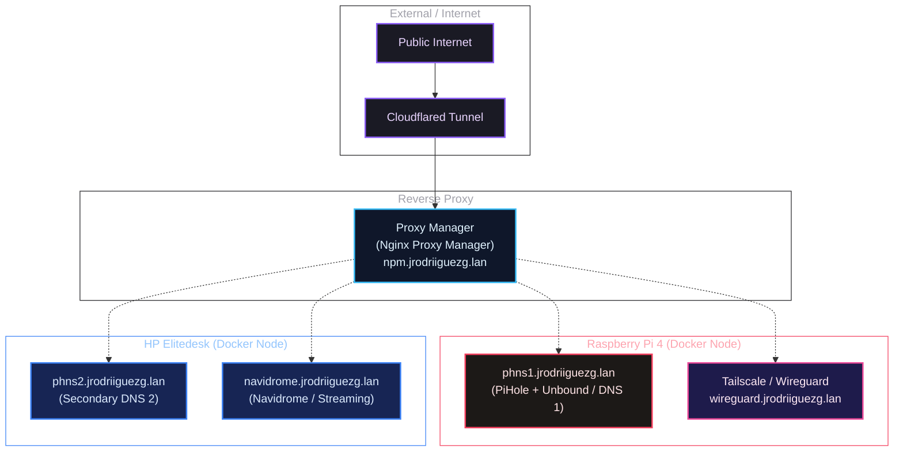

import TerminalWindow from '../../../components/TerminalWindow.astro';
import NodesSpecs from '../../../components/NodesSpecs.astro';
import InteractiveNetworkDiagram from '../../../components/InteractiveNetworkDiagram.astro';
import ServicesCatalog from '../../../components/ServicesCatalog.astro';

# Introduction

As I have mentioned in previous posts, a **HomeLab** does not require thousands of dollars in rack servers or industrial hardware to be robust and highly functional. With a bit of skill, second-hand parts, and stable operating systems, we can build a great infrastructure at home.

This entry serves as a **unified control panel and spec sheet** for my entire lab. Here you will find the detailed hardware specs of each machine, the updated logical network diagram, and an interactive catalog with a built-in search filter to explore the services I have running in real-time.

If you want to see the step-by-step details of how I configured the parts of this network, here are the links to the full series:
- [**Introduction to my HomeLab - Setup and First Steps**](/en/blog/introduccion-al-homelab/)
- [**Networking Block I - Domains**](/en/blog/bloque-de-red-I)
- [**Networking Block II - Services**](/en/blog/bloque-de-red-ii-servicios/)
- **Management Block I - Administration**
- **Management Block II - Monitoring**
- **Services Block**
- **Tweaks, Backups, and Extras**

---

## Hardware Specifications

Currently, my lab is composed of two main physical nodes. Each serves a different and complementary role: the **Raspberry Pi 4B** acts as the node for essential services and low-power local networking, while the **HP Elitedesk 705 G3** (bought on Wallapop and upgraded with extra storage) handles the services with higher read, write, and multimedia computing demands.

<NodesSpecs lang="en" />

---

## Interactive Logical Network Diagram

This logical diagram represents the connections in the lab. All incoming external traffic accesses securely through the **Cloudflared Tunnel** and is routed to the **Nginx Proxy Manager**, which filters and redirects internal requests to the corresponding node and port.

*(You can click and drag to move the diagram, or use your scroll wheel/touchpad pinch gestures to zoom into complex structures)*

<InteractiveNetworkDiagram lang="en">

</InteractiveNetworkDiagram>

---

## Active Catalog of Self-Hosted Services

All services in the lab run isolated using **Docker** containers. Below I show the list of active services, specifying the physical node where they run, their internal/external visibility status, and their corresponding technical descriptions.

	

		
		<h4>Live Status Dashboard</h4>
	

	

		The health, availability, and response times of all my self-hosted services are monitored in real-time using <strong>Uptime Kuma</strong>. Due to standard browser iframe security restrictions, please view the complete dashboard directly in its dedicated window.
	

	<a href="https://internal-status.jrodriiguezg.link/status/pb-status" target="_blank" rel="noopener noreferrer" class="status-link-btn">
		View HomeLab Status
		<svg width="16" height="16" viewBox="0 0 24 24" fill="none" stroke="currentColor" stroke-width="2.5" stroke-linecap="round" stroke-linejoin="round"><path d="M18 13v6a2 2 0 0 1-2 2H5a2 2 0 0 1-2-2V8a2 2 0 0 1 2-2h6"></path><polyline points="15 3 21 3 21 9"></polyline><line x1="10" y1="14" x2="21" y2="3"></line></svg>
	</a>

<ServicesCatalog />

