```mermaid
%%{init: {"theme": "base", "themeVariables": { "darkMode": true, "fontFamily": "sans-serif" }, "flowchart": {"curve": "basis"}}}%%
flowchart LR
    %% Bordes redondeados para todos los nodos
    classDef default rx:8,ry:8
    
    %% Paleta de colores para los nodos según su entorno
    classDef proxyColor fill:#0f3460,stroke:#64ffda,stroke-width:2px,color:#fff
    classDef rpiColor fill:#1a4d2e,stroke:#52c41a,stroke-width:2px,color:#fff
    classDef hpColor fill:#3b185f,stroke:#b37feb,stroke-width:2px,color:#fff
    classDef dbColor fill:#5c3a21,stroke:#ffb300,stroke-width:2px,color:#fff

    %% Grupo del Proxy Reverso (Tonos azules)
    subgraph Proxy [Proxy Reverso]
        direction TB
        internet[Internet] -->|Tráfico cifrado| cloudflared[Cloudflared Tunnel]
        cloudflared --> npm[Nginx Proxy Manager<br>npm.jrodriiguezg.lan]
    end

    %% Grupo de la Raspberry Pi 4 (Tonos verdes)
    subgraph RPI [Raspberry Pi 4]
        direction TB
        subgraph RPI_PUB [Servicios Publicados]
            homarr[Homarr<br>hmr.jrodriiguezg.lan]
        end
        subgraph RPI_LAN [Red Local LAN]
            direction TB
            zagent[Zabbix Agent]
            dns1[phns1.jrodriiguezg.lan<br>PiHole + Unbound / DNS 1]
            uptime[Uptime Kuma<br>uptime-kuma.jrodriiguezg.lan]
            gitea[Gitea<br>gitea.jrodriiguezg.lan]
            wireguard[Tailscale / Wireguard<br>deprecado<br>wireguard.jrodriiguezg.lan]
            portainer[Portainer<br>portainer.jrodriiguezg.lan]
        end
    end

    %% Grupo del HP Elitedesk (Tonos violetas)
    subgraph HP [HP Elitedesk]
        direction TB
        disco[(WD easystore 5TB<br>Disco de Copias común)]
        subgraph HP_PUB [Servicios Publicados]
            direction TB
            jellyfin[Jellyfin<br>jellyfin.jrodriiguezg.lan]
            navidrome[Navidrome<br>navidrome.jrodriiguezg.lan]
        end
        subgraph HP_LAN [Red Local LAN]
            direction TB
            pagent[Portainer Agent]
            qb[qBittorrent<br>qbtt.jrodriiguezg.lan]
            dns2[phns2.jrodriiguezg.lan<br>DNS 2]
            zserver[Zabbix Server<br>zabbix.jrodriiguezg.lan]
        end
    end

    %% Enlaces de trafico web (Cian)
    npm --> homarr
    npm --> jellyfin
    npm --> navidrome

    %% Enlaces de orquestacion de contenedores (Naranja)
    portainer -.->|Orquesta contenedores| npm
    portainer -.->|Orquesta contenedores| pagent
    
    %% Enlace de recoleccion de metricas (Rosa)
    zserver -.->|Recolecta métricas| zagent

    %% Asignacion de clases de color a los nodos individuales
    class internet,cloudflared,npm proxyColor
    class homarr,zagent,dns1,uptime,gitea,wireguard,portainer rpiColor
    class jellyfin,navidrome,pagent,qb,dns2,zserver hpColor
    class disco dbColor

    %% Estilos de fondo para los contenedores principales
    style Proxy fill:#0a192f,stroke:#64ffda,stroke-width:2px
    style RPI fill:#0d2319,stroke:#52c41a,stroke-width:2px
    style HP fill:#1d0b2e,stroke:#b37feb,stroke-width:2px
    
    %% Estilos de fondo para las subredes internas
    style RPI_PUB fill:#133324,stroke:#52c41a
    style RPI_LAN fill:#133324,stroke:#52c41a
    style HP_PUB fill:#291142,stroke:#b37feb
    style HP_LAN fill:#291142,stroke:#b37feb

    %% Colores de las flechas (0-1: trafico inicial, 2-4: peticiones web, 5-6: Docker, 7: Zabbix)
    linkStyle 0,1 stroke:#64ffda,stroke-width:2px;
    linkStyle 2,3,4 stroke:#00e5ff,stroke-width:2px;
    linkStyle 5,6 stroke:#ffb300,stroke-width:2px;
    linkStyle 7 stroke:#ff4081,stroke-width:2px;
```

# Introducción

> Esta pagina es experimental para probar y aprender a hacer ciertas cosas, se ira mejorando y agregando cosas poco a poco

Bueno, como he comentado en las entradas anteriores, un **HomeLab** no requiere de servidores en rack de miles de euros ni de hardware industrial para ser robusto y altamente funcional. Con un poco de maña, piezas de segunda mano y sistemas operativos estables, podemos levantar una infraestructura excelente en casa.

Esta entrada sirve como **panel de control y ficha técnica unificada** de todo mi laboratorio. Aquí encontraréis el hardware detallado de cada máquina, el diagrama lógico actualizado de la red y un catálogo interactivo con buscador integrado para explorar los servicios que tengo corriendo en tiempo real.

Si queréis ver los detalles paso a paso de cómo configuré las piezas de esta red, os dejo los enlaces de la serie completa:
- [**Introducción a mi HomeLab - Puesta en marcha y primeros pasos**](/blog/introduccion-al-homelab/)
- [**Bloque de Red I - Dominios**](/blog/bloque-de-red-I)
- [**Bloque de Red II - Servicios**](/blog/bloque-de-red-ii-servicios/)
- **Bloque de Gestión I - Administración**
- **Bloque de Gestión II - Monitorización**
- **Bloque de Servicios**
- **Retoques, copias de seguridad y extras**

---

## Especificaciones de Hardware

Actualmente mi laboratorio está compuesto por dos nodos físicos principales. Cada uno cumple un rol diferente y complementario: la **Raspberry Pi 4B** actúa como nodo de servicios esenciales y de red local de bajo consumo, mientras que el **HP Elitedesk 705 G3** (comprado en Wallapop y mejorado con almacenamiento extra) se encarga de los servicios con mayor demanda de lectura, escritura y computación multimedia.

<h3 class="node-title">Raspberry Pi 4B (4GB)</h3>

Servicios esenciales y DNS primario

<table class="specs-table">
<tr>
<td><strong>CPU</strong></td>
<td>Broadcom BCM2711 4 x 1,50Ghz (ARM)</td>
</tr>
<tr>
<td><strong>RAM</strong></td>
<td>4GB LPDDR4-3200</td>
</tr>
<tr>
<td><strong>S.O.</strong></td>
<td>Debian 12 Bookworm (RaspberryPiOS Lite)</td>
</tr>
<tr>
<td><strong>Almacenamiento</strong></td>
<td>MicroSD Lexar 64GB (SO y configuración)</td>
</tr>
<tr>
<td><strong>Consumo medio</strong></td>
<td>~4W (Perfecto para 24/7 ininterrumpido)</td>
</tr>
</table>

<h3 class="node-title">HP Elitedesk 705 G3</h3>

Cargas de trabajo intensivas y multimedia

<table class="specs-table">
<tr>
<td><strong>CPU</strong></td>
<td>AMD PRO A10-8770E 4 x 3,08Ghz (x86_64)</td>
</tr>
<tr>
<td><strong>RAM</strong></td>
<td>16GB DDR4-SODIMM</td>
</tr>
<tr>
<td><strong>S.O.</strong></td>
<td>Debian 12 Bookworm (Stable Netinst)</td>
</tr>
<tr>
<td><strong>Almacenamiento</strong></td>
<td> Kingston SSD 128GB (Sistema Operativo) 
WD Blue NVMe 1TB (Películas y series) 
Aliexpress NVMe 512GB (Navidrome / Música) 
WD easystore 5TB (Almacén de Backups)</td>
</tr>
<tr>
<td><strong>Consumo medio</strong></td>
<td>~15W - 25W (Excelente balance rendimiento/costo)</td>
</tr>
</table>

---

## Diagrama de Red Lógico e Interactivo

El diagrama lógico representa las conexiones del laboratorio. Todo el tráfico que viene del exterior accede de manera encriptada a través del **Cloudflared Tunnel** y pasa al **Nginx Proxy Manager**, encargado de filtrar y redirigir las peticiones internas hacia el nodo y puerto correspondientes. 

*(Puedes hacer clic y arrastrar para mover el diagrama, o utilizar la rueda del ratón/gestos táctiles para hacer zoom en arquitecturas complejas)*

<button id="btn-zoom-in" title="Acercar">＋</button>
<button id="btn-zoom-out" title="Alejar">－</button>
<button id="btn-zoom-reset" title="Restaurar escala">⊙</button>

---

## Catálogo Activo de Servicios Autohospedados

Todos los servicios del laboratorio corren de manera aislada utilizando contenedores de **Docker**. A continuación muestro la lista de servicios activos, especificando el nodo físico donde se ejecutan, su tipo de visibilidad interna/externa y sus descripciones técnicas correspondientes.

	

		
		<h4>Panel de Monitorización en Vivo</h4>
	

	

		El estado de salud, disponibilidad y tiempos de respuesta de todos mis servicios autohospedados se monitorizan en tiempo real a través de <strong>Uptime Kuma</strong>. Debido a restricciones de seguridad del navegador, te invito a consultar el panel completo directamente en su ventana dedicada.
	

	<a href="https://internal-status.jrodriiguezg.link/status/pb-status" target="_blank" rel="noopener noreferrer" class="status-link-btn">
		Ver Estado del HomeLab
		<svg width="16" height="16" viewBox="0 0 24 24" fill="none" stroke="currentColor" stroke-width="2.5" stroke-linecap="round" stroke-linejoin="round"><path d="M18 13v6a2 2 0 0 1-2 2H5a2 2 0 0 1-2-2V8a2 2 0 0 1 2-2h6"></path><polyline points="15 3 21 3 21 9"></polyline><line x1="10" y1="14" x2="21" y2="3"></line></svg>
	</a>

